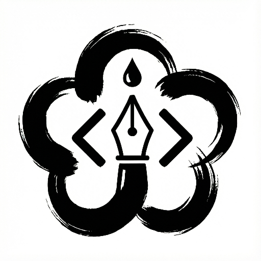

<h1 align="center">
  
  <br />
  墨梅博客
</h1>
<p align="center">
  
  <a href="https://hub.docker.com/r/caomeiyouren/momei" target="_blank">
    
  </a>
  <a href="https://app.codecov.io/gh/CaoMeiYouRen/momei" target="_blank">
    
  </a>
  <a href="https://github.com/CaoMeiYouRen/momei/actions?query=workflow%3ARelease" target="_blank">
    
  </a>
  
  <a href="https://docs.momei.app/zh-TW/" target="_blank">
    
  </a>
  <a href="https://github.com/CaoMeiYouRen/momei/graphs/commit-activity" target="_blank">
    
  </a>
  <a href="https://github.com/CaoMeiYouRen/momei/blob/master/LICENSE" target="_blank">
    
  </a>
  <a href="https://creativecommons.org/licenses/by-nc-sa/4.0/" target="_blank">
    
  </a>
</p>

<p align="center">
  <a href="./README.md">简体中文</a> | <a href="./README.zh-TW.md">繁體中文</a> | <a href="./README.en-US.md">English</a> | <a href="./README.ko-KR.md">한국어</a> | <a href="./README.ja-JP.md">日本語</a>
</p>

<p align="center">
  <a href="https://momei.app/"><strong>🌐 主站</strong></a> &nbsp;|&nbsp;
  <a href="https://docs.momei.app/zh-TW/"><strong>📚 文件站</strong></a>
</p>

> **墨梅部落格 - AI 驅動、原生國際化的開發者部落格平台。**
>
> **AI 賦能，全球創作。**

## 📖 簡介

墨梅是一個基於 **Nuxt** 建構的現代化部落格平台。它透過 AI 與深度國際化支援，為技術開發者與跨境內容創作者提供高效率、智慧化的創作體驗。無論是智慧翻譯、自動摘要，還是多語言路由管理，墨梅都能協助你更自然地連結全球讀者。

## ✨ 核心特色

- **AI 驅動創作**：深度整合 AI 助手，支援自動翻譯、智慧標題、摘要生成等能力。
- **多模態內容工作流**：支援 AI 配圖、ASR、可重用語音輸入、Memos / WechatSync 手動分發與定時任務自動化。
- **原生國際化**：從 UI 到內容管理的多語言支持皆為內建能力。
- **現代技術棧**：基於 Nuxt（Vue 3 + TypeScript），支援 SSG / SSR 混合渲染。
- **平滑遷移**：支援自訂 URL Slug，降低從舊部落格遷移時的 SEO 損耗。
- **Markdown 創作**：提供簡潔高效的 Markdown 編輯體驗。
- **內容編排與品牌語義**：首頁「最新文章 + 熱門文章」雙區塊、文章置頂與頁腳版權設定鏈路均已收口。
- **多層級訂閱**：支援全站、分類與標籤的多維度 RSS / Feed。
- **可配置治理能力**：設定中心、環境變數鎖定與部署說明互相打通。
- **雲端資產交付**：支援 S3 / R2 直傳與公共資產路徑治理。

## 🏠 線上體驗

- **Demo 站點**：https://demo.momei.app/
  - 可使用郵箱 `admin@example.com` 與密碼 `momei123456` 登入演示管理員帳號。
- **正式站點**：https://momei.app/
  - 你可以註冊自己的帳號體驗一般使用者視角。
- **文件站**：https://docs.momei.app/zh-TW/
- **反饋與社群**：
  - QQ 群：807530287
  - Discord：https://discord.gg/6bfPevfyr6

## 🛠️ 技術棧

- **核心框架**：Nuxt
- **UI 框架**：Vue 3
- **語言**：TypeScript
- **樣式**：SCSS
- **套件管理器**：PNPM
- **規範工具**：ESLint + Stylelint + Conventional Commits

## 📂 專案結構

- `components/`：可重用 Vue 組件
- `pages/`：基於檔案的路由頁面
- `layouts/`：版面配置
- `server/`：Nitro API 與伺服器端能力
- `database/`：資料庫初始化腳本與資源
- `i18n/`：多語言資源檔
- `utils/`：共享工具函數
- `styles/`：全域 SCSS 樣式
- `types/`：TypeScript 型別定義
- `docs/`：設計、規範與指南文檔
- `packages/cli/`：Hexo 遷移 CLI

## 🤖 AI 協同開發

- **對人類開發者**：可參考 [AI 協同開發指南](https://docs.momei.app/zh-TW/guide/ai-development) 與 [開發指南](https://docs.momei.app/zh-TW/guide/development)。
- **對 AI 代理**：請先閱讀 [AGENTS.md](./AGENTS.md) 與專案文檔，並遵循 PDTFC+ 工作流。

## 📚 文檔

詳細的開發與設計文檔請訪問：https://docs.momei.app/zh-TW/

主要入口：

- [快速開始](https://docs.momei.app/zh-TW/guide/quick-start)
- [方案比較](https://docs.momei.app/zh-TW/guide/comparison)
- [部署指南](https://docs.momei.app/zh-TW/guide/deploy)
- [環境變數與設定映射](https://docs.momei.app/zh-TW/guide/variables)
- [開發指南](https://docs.momei.app/zh-TW/guide/development)
- [API 設計](https://docs.momei.app/zh-TW/design/api)
- [資料庫設計](https://docs.momei.app/zh-TW/design/database)

## 📦 依賴要求

- Node.js >= 20
- PNPM（推薦）

## ☁️ 部署說明

建議使用 Vercel、Netlify、Docker 或自託管 Node 環境進行部署。若你需要接入 Cloudflare，當前僅建議用於 R2 物件儲存與 Scheduled Events 等外圍能力。受 TypeORM 與 Node 執行時依賴限制，現版本暫不支援將應用主體完整部署到 Cloudflare Pages / Workers。當前版本的部署方式以環境變數為主，建議先閱讀 [部署指南](https://docs.momei.app/zh-TW/guide/deploy) 與 [環境變數映射](https://docs.momei.app/zh-TW/guide/variables)，先補齊核心變數，再按需啟用 AI、物件儲存、ASR、Webhook 定時任務等能力。

### 資料庫支持

- **SQLite**：預設選項，適合個人部落格。
- **MySQL / PostgreSQL**：適合更高資料管理需求。
- **Cloudflare D1**：仍在規劃中。這不代表目前已支援 Cloudflare 執行時整站部署；現階段仍建議使用外部資料庫，並將應用主體部署在 Vercel、Docker 或自託管 Node 環境。

## 🔄 Hexo 遷移工具

墨梅提供獨立 CLI，協助從 Hexo 快速遷移內容。

### 功能

- 遞迴掃描 Markdown 檔案
- 解析 Hexo Front-matter
- 保留分類、標籤、發佈時間等元資料
- 支援 API Key 批量匯入
- 支援 Dry Run 與並發匯入

### 快速使用

```bash
cd packages/cli
pnpm install
pnpm build
pnpm start import ./hexo-blog/source/_posts --dry-run --verbose
```

## 🚀 快速開始

```bash
pnpm install
pnpm dev
```

常用命令：

- `pnpm build`
- `pnpm test`
- `pnpm lint`

## 👤 作者

**CaoMeiYouRen**

- Website: https://blog.cmyr.ltd/
- GitHub: https://github.com/CaoMeiYouRen

## 🤝 貢獻

歡迎提交 Issue、PR 與新功能建議。若要參與開發，請先閱讀 [CONTRIBUTING.md](./CONTRIBUTING.md)。

## 💰 支持

如果這個專案對你有幫助，歡迎給一顆星星。

## 📝 License

- 代碼部分：採用 [MIT](./LICENSE)
- 文檔部分：採用 [CC BY-NC-SA 4.0](https://creativecommons.org/licenses/by-nc-sa/4.0/deed.zh-hant)
