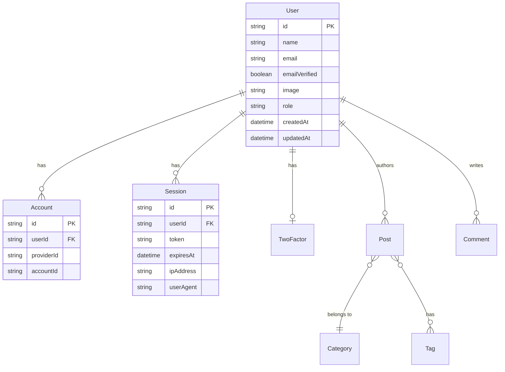

# 墨梅 (Momei) 数据库设计文档

## 1. 概述 (Overview)

本文档详细描述了墨梅博客的数据库架构。项目使用 **TypeORM** 作为 ORM 框架，支持多数据库适配。

## 2. 实体关系图 (ER Diagram)

## 3. 表结构定义 (Table Definitions)

### 3.1 用户系统 (User System)

基于 `better-auth` 的标准结构进行扩展。

#### User (用户表)

| 字段名          | 类型     | 必填 | 唯一 | 默认值      | 说明                               |
| :-------------- | :------- | :--- | :--- | :---------- | :--------------------------------- |
| `id`            | varchar  | Yes  | Yes  | (Snowflake) | 主键                               |
| `name`          | text     | Yes  | No   | -           | 显示名称                           |
| `email`         | varchar  | Yes  | Yes  | -           | 邮箱地址                           |
| `emailVerified` | boolean  | Yes  | No   | false       | 邮箱是否验证                       |
| `image`         | text     | No   | No   | -           | 头像 URL                           |
| `username`      | varchar  | No   | Yes  | -           | 用户名 (唯一标识)                  |
| `role`          | varchar  | No   | No   | 'user'      | 角色: admin, author, user, visitor |
| `banned`        | boolean  | No   | No   | false       | 是否被封禁                         |
| `createdAt`     | datetime | Yes  | No   | now()       | 创建时间                           |
| `updatedAt`     | datetime | Yes  | No   | now()       | 更新时间                           |

#### Account (第三方账户表)

用于存储 OAuth 登录信息 (如 GitHub)。

| 字段名         | 类型     | 必填 | 说明                    |
| :------------- | :------- | :--- | :---------------------- |
| `id`           | varchar  | Yes  | 主键                    |
| `userId`       | varchar  | Yes  | 关联 User ID            |
| `accountId`    | text     | Yes  | 第三方平台的用户 ID     |
| `providerId`   | text     | Yes  | 提供商 ID (如 'github') |
| `accessToken`  | text     | No   | 访问令牌                |
| `refreshToken` | text     | No   | 刷新令牌                |
| `expiresAt`    | datetime | No   | 令牌过期时间            |
| `password`     | text     | No   | 密码 (仅用于凭证账号)   |

#### Session (会话表)

| 字段名      | 类型     | 必填 | 说明                              |
| :---------- | :------- | :--- | :-------------------------------- |
| `id`        | varchar  | Yes  | 主键                              |
| `userId`    | varchar  | Yes  | 关联 User ID                      |
| `token`     | text     | Yes  | Session Token (Cookie 中存储的值) |
| `expiresAt` | datetime | Yes  | 过期时间                          |
| `ipAddress` | text     | No   | IP 地址                           |
| `userAgent` | text     | No   | 用户代理字符串                    |

#### Verification (验证码表)

用于邮箱验证、密码重置等。

| 字段名       | 类型     | 必填 | 说明                    |
| :----------- | :------- | :--- | :---------------------- |
| `id`         | varchar  | Yes  | 主键                    |
| `identifier` | text     | Yes  | 标识符 (如邮箱、手机号) |
| `value`      | text     | Yes  | 验证码/Token 值         |
| `expiresAt`  | datetime | Yes  | 过期时间                |

### 3.2 内容系统 (Content System)

_(待完善，后续迭代补充)_

#### Post (文章表)

| 字段名          | 类型     | 必填 | 说明                            |
| :-------------- | :------- | :--- | :------------------------------ |
| `id`            | varchar  | Yes  | 主键                            |
| `title`         | varchar  | Yes  | 标题                            |
| `slug`          | varchar  | Yes  | URL 别名 (唯一)                 |
| `content`       | text     | Yes  | Markdown 内容                   |
| `summary`       | text     | No   | 摘要/SEO 描述                   |
| `coverImage`    | text     | No   | 封面图片 URL                    |
| `language`      | varchar  | Yes  | 语言代码 (默认 'zh')            |
| `translationId` | varchar  | No   | 翻译组 ID (用于关联多语言版本)  |
| `authorId`      | varchar  | Yes  | 作者 ID                         |
| `categoryId`    | varchar  | No   | 分类 ID                         |
| `status`        | varchar  | Yes  | 状态: published, draft, pending |
| `views`         | integer  | No   | 阅读量 (默认 0)                 |
| `publishedAt`   | datetime | No   | 发布时间                        |
| `createdAt`     | datetime | Yes  | 创建时间                        |
| `updatedAt`     | datetime | Yes  | 更新时间                        |

#### Category (分类表)

| 字段名          | 类型     | 必填 | 唯一 | 说明                           |
| :-------------- | :------- | :--- | :--- | :----------------------------- |
| `id`            | varchar  | Yes  | Yes  | 主键                           |
| `name`          | varchar  | Yes  | No   | 分类名称                       |
| `slug`          | varchar  | Yes  | Yes  | URL 别名                       |
| `description`   | text     | No   | No   | 描述                           |
| `parentId`      | varchar  | No   | No   | 父分类 ID (层级关系)           |
| `language`      | varchar  | Yes  | No   | 语言代码 (默认 'zh')           |
| `translationId` | varchar  | No   | No   | 翻译组 ID (用于关联多语言版本) |
| `createdAt`     | datetime | Yes  | No   | 创建时间                       |
| `updatedAt`     | datetime | Yes  | No   | 更新时间                       |

#### Tag (标签表)

| 字段名          | 类型     | 必填 | 唯一 | 说明                           |
| :-------------- | :------- | :--- | :--- | :----------------------------- |
| `id`            | varchar  | Yes  | Yes  | 主键                           |
| `name`          | varchar  | Yes  | Yes  | 标签名称                       |
| `slug`          | varchar  | Yes  | Yes  | URL 别名                       |
| `language`      | varchar  | Yes  | No   | 语言代码 (默认 'zh')           |
| `translationId` | varchar  | No   | No   | 翻译组 ID (用于关联多语言版本) |
| `createdAt`     | datetime | Yes  | No   | 创建时间                       |
| `updatedAt`     | datetime | Yes  | No   | 更新时间                       |

## 4. 索引策略 (Indexing Strategy)

-   **User**: `email` (Unique), `username` (Unique)
-   **Session**: `token` (Unique), `userId`
-   **Post**: `slug` (Unique), `authorId`, `createdAt` (用于排序)
-   **Category**: `slug` (Unique), `parentId`
-   **Tag**: `slug` (Unique), `name` (Unique)
-   **Post**: `slug` (Unique), `authorId`, `createdAt` (用于排序)

## 5. 设计说明 (Design Notes)

### 5.1 国际化实现 (Internationalization)

-   **translationId**: 用于关联同一内容的不同语言版本。
    -   所有共享同一个 `translationId` 的记录（文章、分类或标签）被视为同一个内容的变体。
    -   当用户请求的语言版本不存在时，系统可以根据 `translationId` 查找其他可用语言版本（通常是默认语言，如中文或英文）。
    -   **优势**: 解耦、灵活、独立性（每个语言版本的 `slug`、`title`、`content` 都是独立的，有利于 SEO）。
    -   **独立字段**:
        -   **views**: 独立计数。不同语言版本的受众不同，合并计数会混淆数据。
        -   **status**: 独立状态。翻译进度可能不同步（如中文已发布，英文仍在草稿中）。
        -   **publishedAt**: 独立时间。翻译版本通常晚于原版发布。
        -   **coverImage**: 独立设置。允许针对不同语言使用包含不同文字的图片。

### 5.2 阅读量统计 (View Count)

-   **PV (Page View)**: 采用 PV 模式统计阅读量。
    -   **原因**: 博客文章是内容消费型产品，每一次阅读都代表了内容的价值被消费了一次。PV 能直观反映内容的热度和被访问频率。
    -   **实现**: 在文章加载时执行 `UPDATE post SET views = views + 1 WHERE id = ?`。
    -   **防刷**: 应用层做轻量级的防刷处理（如：同一 IP 在 10 分钟内只计 1 次）。
