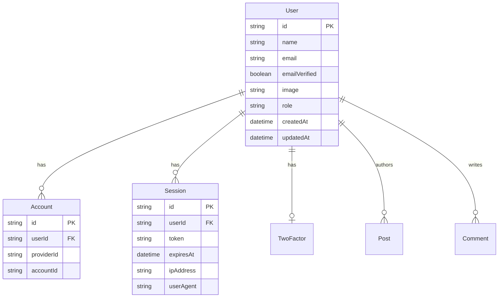

# 墨梅 (Momei) 数据库设计文档

## 1. 概述 (Overview)

本文档详细描述了墨梅博客的数据库架构。项目使用 **TypeORM** 作为 ORM 框架，支持多数据库适配。

## 2. 实体关系图 (ER Diagram)

## 3. 表结构定义 (Table Definitions)

### 3.1 用户系统 (User System)

基于 `better-auth` 的标准结构进行扩展。

#### User (用户表)

| 字段名          | 类型     | 必填 | 唯一 | 默认值 | 说明                               |
| :-------------- | :------- | :--- | :--- | :----- | :--------------------------------- |
| `id`            | varchar  | Yes  | Yes  | (UUID) | 主键                               |
| `name`          | text     | Yes  | No   | -      | 显示名称                           |
| `email`         | varchar  | Yes  | Yes  | -      | 邮箱地址                           |
| `emailVerified` | boolean  | Yes  | No   | false  | 邮箱是否验证                       |
| `image`         | text     | No   | No   | -      | 头像 URL                           |
| `username`      | varchar  | No   | Yes  | -      | 用户名 (唯一标识)                  |
| `role`          | varchar  | No   | No   | 'user' | 角色: admin, author, user, visitor |
| `banned`        | boolean  | No   | No   | false  | 是否被封禁                         |
| `createdAt`     | datetime | Yes  | No   | now()  | 创建时间                           |
| `updatedAt`     | datetime | Yes  | No   | now()  | 更新时间                           |

#### Account (第三方账户表)

用于存储 OAuth 登录信息 (如 GitHub)。

| 字段名         | 类型     | 必填 | 说明                    |
| :------------- | :------- | :--- | :---------------------- |
| `id`           | varchar  | Yes  | 主键                    |
| `userId`       | varchar  | Yes  | 关联 User ID            |
| `accountId`    | text     | Yes  | 第三方平台的用户 ID     |
| `providerId`   | text     | Yes  | 提供商 ID (如 'github') |
| `accessToken`  | text     | No   | 访问令牌                |
| `refreshToken` | text     | No   | 刷新令牌                |
| `expiresAt`    | datetime | No   | 令牌过期时间            |
| `password`     | text     | No   | 密码 (仅用于凭证账号)   |

#### Session (会话表)

| 字段名      | 类型     | 必填 | 说明                              |
| :---------- | :------- | :--- | :-------------------------------- |
| `id`        | varchar  | Yes  | 主键                              |
| `userId`    | varchar  | Yes  | 关联 User ID                      |
| `token`     | text     | Yes  | Session Token (Cookie 中存储的值) |
| `expiresAt` | datetime | Yes  | 过期时间                          |
| `ipAddress` | text     | No   | IP 地址                           |
| `userAgent` | text     | No   | 用户代理字符串                    |

#### Verification (验证码表)

用于邮箱验证、密码重置等。

| 字段名       | 类型     | 必填 | 说明                    |
| :----------- | :------- | :--- | :---------------------- |
| `id`         | varchar  | Yes  | 主键                    |
| `identifier` | text     | Yes  | 标识符 (如邮箱、手机号) |
| `value`      | text     | Yes  | 验证码/Token 值         |
| `expiresAt`  | datetime | Yes  | 过期时间                |

### 3.2 内容系统 (Content System)

_(待完善，后续迭代补充)_

#### Post (文章表)

| 字段名     | 类型    | 必填 | 说明                            |
| :--------- | :------ | :--- | :------------------------------ |
| `id`       | varchar | Yes  | 主键                            |
| `title`    | varchar | Yes  | 标题                            |
| `slug`     | varchar | Yes  | URL 别名 (唯一)                 |
| `content`  | text    | Yes  | Markdown 内容                   |
| `authorId` | varchar | Yes  | 作者 ID                         |
| `status`   | varchar | Yes  | 状态: published, draft, pending |

## 4. 索引策略 (Indexing Strategy)

-   **User**: `email` (Unique), `username` (Unique)
-   **Session**: `token` (Unique), `userId`
-   **Post**: `slug` (Unique), `authorId`, `createdAt` (用于排序)
