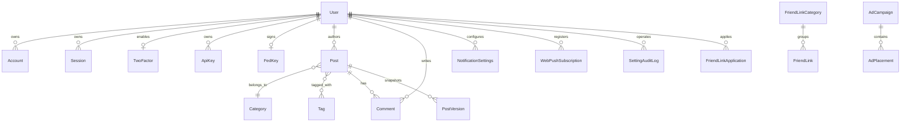

# 墨梅博客 数据库设计文档

## 1. 概述

本文档说明墨梅当前数据库模型、初始化脚本边界以及与 TypeORM 实体之间的同步约束。

- ORM 事实源：server/entities 下的实体定义。
- 初始化脚本：database/sqlite/init.sql、database/mysql/init.sql、database/postgres/init.sql。
- 物理表命名：初始化脚本统一使用 momei_ 前缀，如 momei_post；实体内部仍使用无前缀逻辑表名，如 post。
- 适用场景：init.sql 用于新实例首轮初始化，不承担在线迁移职责。

## 2. 事实源与同步边界

### 2.1 唯一事实源

数据库结构以 server/entities 下的实体为准，文档和 init.sql 都属于派生物，必须跟随实体同步。

当前约束如下：

- 新增、删除或重命名实体字段后，必须同步更新三套 init.sql。
- 影响部署或排障理解的结构变更，必须同步更新本文档。
- 不允许在 init.sql 中长期保留实体已删除的遗留字段，除非文档明确标注为兼容保留列。

### 2.2 初始化脚本适用边界

三套 init.sql 只覆盖“当前新实例应直接创建出的结构”。

- SQLite：开发、轻量部署或本地演示。
- MySQL：兼容 MySQL / MariaDB 的生产部署。
- PostgreSQL：推荐生产环境使用，时间字段统一使用 timestamptz(6)。

### 2.3 类型约定

- 布尔：SQLite 使用 boolean + 0/1 默认值；MySQL 使用 tinyint(1)；PostgreSQL 使用 boolean。
- 时间：SQLite 使用 datetime；MySQL 使用 datetime(6)；PostgreSQL 使用 timestamptz(6)。
- simple-json：初始化脚本统一落为 text；json：MySQL / PostgreSQL 使用 json，SQLite 使用 text。

## 3. 当前结构总览

```mermaid
erDiagram
    User ||--o{ Account : owns
    User ||--o{ Session : owns
    User ||--o| TwoFactor : enables
    User ||--o{ ApiKey : owns
    User ||--o| FedKey : signs
    User ||--o{ Post : authors
    User ||--o{ Comment : writes
    User ||--o{ NotificationSettings : configures
    User ||--o{ WebPushSubscription : registers
    User ||--o{ SettingAuditLog : operates
    User ||--o{ FriendLinkApplication : applies
    Post }o--|| Category : belongs_to
    Post }o--o{ Tag : tagged_with
    Post ||--o{ Comment : has
    Post ||--o{ PostVersion : snapshots
    FriendLinkCategory ||--o{ FriendLink : groups
    AdCampaign ||--o{ AdPlacement : contains
```

### 3.1 模块与表覆盖

| 模块 | 逻辑表 | 初始化物理表 | 说明 |
| :--- | :--- | :--- | :--- |
| 认证与用户 | user, account, session, verification, two_factor, api_key, jwks, fed_keys | momei_user 等 | 账号、会话、2FA、API Key、联邦签名密钥 |
| 内容与多语言 | post, post_version, category, tag, comment, snippet, submission | momei_post 等 | 文章正文、翻译簇、版本快照、评论、灵感片段、投稿 |
| 订阅与通知 | subscriber, marketing_campaign, admin_notification_settings, notification_settings, in_app_notification, notification_delivery_logs, web_push_subscriptions | momei_subscriber 等 | 订阅者、营销活动、通知偏好、投递审计、Web Push |
| 系统配置 | setting, setting_audit_logs, agreement_content, ai_tasks, theme_config | momei_setting 等 | 设置中心、设置审计、协议版本、AI 异步任务、主题方案 |
| 站外连接治理 | external_links, friend_link_categories, friend_links, friend_link_applications, link_governance_report | momei_external_links 等 | 短链跳转、友链管理、友链申请、链接治理报告 |
| 商业化 | ad_campaigns, ad_placements | momei_ad_campaigns, momei_ad_placements | 广告活动与广告位配置 |

## 4. 核心表设计

### 4.1 User

| 字段 | 类型 | 约束/默认值 | 说明 |
| :--- | :--- | :--- | :--- |
| id | varchar(36) | PK | Snowflake 主键 |
| email | varchar(255) | unique, not null | 用户邮箱 |
| username | varchar(128) | unique, nullable | 规范化用户名 |
| displayUsername | varchar(128) | nullable | 原始展示用户名 |
| phoneNumber | varchar(64) | unique, nullable | 手机号 |
| socialLinks | text | nullable | simple-json 社交链接 |
| donationLinks | text | nullable | simple-json 打赏链接 |
| twoFactorEnabled | boolean | default false | 两步验证开关 |

说明：当前 init.sql 已与实体同步，包含 display_username、phone_number、social_links、donation_links、two_factor_enabled 等字段。

### 4.2 Post

| 字段 | 类型 | 约束/默认值 | 说明 |
| :--- | :--- | :--- | :--- |
| id | varchar(36) | PK | 文章主键 |
| slug | varchar(255) | unique with language | 同语言唯一别名 |
| language | varchar(10) | default zh-CN | 语言代码 |
| translationId | varchar(255) | indexed, nullable | 翻译簇标识 |
| authorId | varchar(36) | FK, indexed | 作者 |
| categoryId | varchar(36) | FK, indexed, nullable | 分类 |
| status | varchar(20) | default draft | 发布状态 |
| visibility | varchar(20) | default public | 可见性 |
| views | integer | default 0 | 阅读量 |
| isPinned | boolean | default false | 置顶标记 |
| metaVersion | integer | default 1 | 元数据版本 |
| metadata | json/text | nullable | 统一元数据容器 |
| publishedAt | datetime/timestamptz | indexed, nullable | 发布时间 |

说明：

- post 已改为以 metadata 作为统一扩展容器。
- init.sql 不再额外创建旧式 audio_url、audio_duration、tts_*、publish_intent、memos_id 等遗留列。
- 文章标签关联表为 momei_post_tags_tag_posts。

### 4.3 PostVersion

| 字段 | 类型 | 约束/默认值 | 说明 |
| :--- | :--- | :--- | :--- |
| postId | varchar(36) | FK, indexed | 对应文章 |
| sequence | integer | unique with postId, nullable | 文章内线性版本号 |
| parentVersionId | varchar(36) | indexed, nullable | 前序版本 |
| restoredFromVersionId | varchar(36) | indexed, nullable | 恢复来源版本 |
| source | varchar(32) | default edit | 版本来源 |
| commitSummary | varchar(255) | nullable | 变更摘要 |
| changedFields | json/text | nullable | 本次变更字段 |
| snapshotHash | varchar(64) | indexed, nullable | 快照哈希 |
| snapshot | json/text | nullable | 结构化版本快照 |
| ipAddress | varchar(64) | nullable | 请求 IP |
| userAgent | varchar(512) | nullable | 请求 User-Agent |

说明：三套 init.sql 已从旧版 reason 模型升级到当前版本快照模型，并补齐复合索引 (post_id, sequence) 与 (post_id, created_at)。

### 4.4 Setting 与 SettingAuditLog

Setting 使用 key-value 模型保存运行时配置，SettingAuditLog 记录后台修改审计。

| 表 | 关键字段 | 说明 |
| :--- | :--- | :--- |
| setting | key, value, description, mask_type, level, updated_at | 配置值、脱敏策略与可见级别 |
| setting_audit_logs | setting_key, action, old_value, new_value, mask_type, effective_source, is_overridden_by_env, source, operator_id | 记录配置修改来源、脱敏值和操作者 |

### 4.5 NotificationDeliveryLog 与 WebPushSubscription

| 表 | 关键字段 | 说明 |
| :--- | :--- | :--- |
| notification_delivery_logs | channel, status, notification_type, recipient, sent_at | 统一记录邮件、浏览器推送、第三方通道的投递结果 |
| web_push_subscriptions | user_id, endpoint, subscription, permission, locale | 浏览器订阅端点与 payload，目标语义为 `(user_id, endpoint)` 唯一；MySQL 初始化脚本使用 `endpoint_sha256` 生成列避免长 URL 唯一索引被前缀截断 |

### 4.6 Friend Links 与 External Links

| 表 | 关键字段 | 说明 |
| :--- | :--- | :--- |
| friend_link_categories | slug, is_enabled, sort_order | 友情链接分类 |
| friend_links | url, category_id, status, is_pinned, is_featured, health_status | 友情链接主体与健康检查状态 |
| friend_link_applications | url, status, applicant_id, reviewed_by_id, friend_link_id | 友情链接申请流程 |
| external_links | original_url, short_code, status, created_by_id | 外链短链与跳转治理 |
| link_governance_report | mode, status, requested_by_user_id, summary, statistics | 链接治理审计结果 |

### 4.7 AdCampaign 与 AdPlacement

| 表 | 关键字段 | 说明 |
| :--- | :--- | :--- |
| ad_campaigns | name, status, start_date, end_date, targeting, impressions, clicks, revenue | 广告活动 |
| ad_placements | format, location, adapter_id, enabled, targeting, priority, campaign_id | 广告位与投放配置 |

## 5. 关键约束与索引

当前应重点保证以下约束存在且与实体一致：

- user.email、user.username、user.phone_number 唯一。
- post.slug + post.language 唯一。
- category.slug + language、category.name + language、category.translation_id + language 唯一。
- tag.slug + language、tag.name + language、tag.translation_id + language 唯一。
- notification_settings.user_id + type + channel 唯一。
- web_push_subscriptions.user_id + endpoint 唯一。
    - MySQL init.sql 通过 `endpoint_sha256 = sha2(endpoint, 256)` 生成列实现等价唯一约束，避免 `endpoint(255)` 前缀唯一带来的语义漂移。
- post_version.post_id + sequence 唯一。

关键索引包括但不限于：

- post：title、language、translation_id、author_id、category_id、status、visibility、views、is_pinned、published_at。
- post_version：post_id、sequence、parent_version_id、restored_from_version_id、snapshot_hash、author_id，以及 (post_id, created_at)。
- friend_links：category_id、status、is_pinned、is_featured、health_status、application_id、created_by_id、updated_by_id。
- notification_delivery_logs：notification_type、channel、status、sent_at、recipient。
- setting_audit_logs：setting_key、operator_id。
- ad_placements：location、adapter_id、enabled，以及 (location, enabled)。

## 6. 初始化脚本同步约束

后续数据库变更必须遵守以下规则：

1. 先改实体，再同步三套 init.sql，再更新本文档。
2. 新增 simple-json 或 json 字段时，必须明确三种数据库的落盘类型。
3. 若实体新增 index: true、@Index 或 @Unique，init.sql 必须同步新增索引或唯一约束。
4. 若实体删除字段，init.sql 与文档不得继续把它当作当前事实结构描述。
5. 若存在历史兼容列，必须在文档中显式标注“兼容保留”，不能与当前实体字段混写。

## 7. 本次同步结论

本轮已完成以下基线收敛：

- 三套 init.sql 补齐 ad_campaigns、ad_placements、external_links、fed_keys、friend_link_categories、friend_links、friend_link_applications、link_governance_report、notification_delivery_logs、setting_audit_logs、web_push_subscriptions。
- post 表删除旧遗留列定义，改为与当前 Post 实体一致的 metadata 模型，并补齐 is_pinned。
- post_version 表从旧版简化结构升级到当前快照型版本模型。
- 本文档改为明确“实体为事实源、init.sql 为初始化派生物”的同步约束，避免再次漂移。
