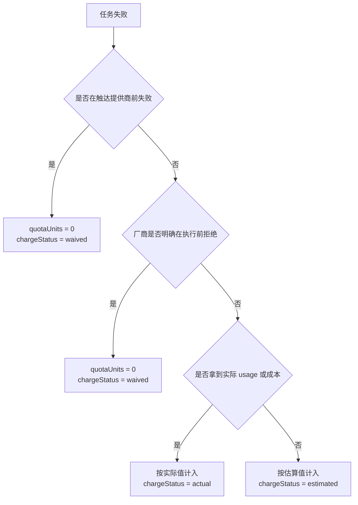

# AI 成本治理与多用户配额 (AI Cost Governance & Multi-user Quotas)

## 1. 概述 (Overview)

本文档定义墨梅博客在现有 AI 能力之上的统一成本治理与多用户配额方案，覆盖文本生成、图像生成、语音识别 (ASR)、语音合成 (TTS) 以及后续 AI 播客等高消耗能力。

本阶段的目标不是引入复杂的钱包、充值或财务对账系统，而是基于现有 `AITask` 能力，建立一套可审计、可解释、可配置的治理模型，用于回答以下问题：

- 当前到底消耗了多少 AI 资源。
- 不同类型任务之间如何体现成本差异。
- 管理员、作者、普通用户或低信任用户应如何配置不同额度。
- 失败任务在什么条件下算消耗，什么条件下不算。
- 后台应如何展示审计视图与异常告警。

## 2. 现状与约束 (Current State & Constraints)

### 2.1 已有能力

当前项目已经具备统一治理的基础设施：

- `AITask` 已作为 AI 异步任务和审计记录的核心实体。
- 文本生成、图像生成、TTS、ASR 已经会在不同程度上写入 `AITask`。
- 后台已有 AI 管理页，可展示基础统计和任务列表。
- TTS 已支持 `estimatedCost` 预估成本写入，说明系统已经存在“预估成本”这一概念。
- ASR 异步任务已经接入实时通知链路，可作为后续告警复用基础。

### 2.2 当前缺口

虽然 `AITask` 已经包含 `estimatedCost`、`actualCost`、`startedAt`、`completedAt` 等字段，但目前仍存在以下问题：

- 文本、图像、ASR、TTS 的计量口径不统一。
- TTS provider 的预估成本接口契约存在命名不一致问题，容易导致部分厂商预估值失效或直接回落为零。
- 后台统计仍以“任务数量”维度为主，缺少成本、时长、失败阶段和配额消耗维度。
- 不同厂商返回的 usage 结构不一致，尚未沉淀成统一字段。
- 失败任务只有 `failed` 状态，没有“失败发生在哪个阶段”的归因。
- 还没有真正意义上的多用户配额策略解析层。
- 后台与业务弹窗同时存在美元和人民币符号，且 `Quota Units` 尚未稳定映射为管理员可解释的展示成本，容易形成两套价值体系。

### 2.3 设计约束

本方案必须遵守以下约束：

- 以现有 `AITask` 为唯一事实来源，不额外引入第二套并行审计主表。
- 第一阶段优先支持治理与限额，不引入充值、余额、预扣费退款流水等复杂财务能力。
- 优先兼容当前后台 AI 管理页，而不是重做一套完全独立的管理入口。
- 允许“成本估算”与“配额消耗”分离，避免把厂商价格波动直接暴露给用户侧额度模型。

## 3. 设计目标与非目标 (Goals & Non-goals)

### 3.1 目标

- 基于 `AITask` 统一收敛文本、图像、ASR、TTS、播客等任务的审计模型。
- 建立一套“配额单位 (Quota Units)”模型，体现不同任务的成本差异。
- 支持按全局、角色、信任等级、用户级别进行策略覆盖。
- 明确失败任务的计费/计额口径，保证后台可解释。
- 提供后台审计视图、策略配置入口与告警方案。

### 3.2 非目标

- 不在本阶段实现充值、余额、订单、发票或财务对账。
- 不追求与每个厂商账单 100% 精确逐笔一致。
- 不在本阶段引入复杂的预扣费、冻结额度和退款流水系统。

## 4. 核心术语 (Terminology)

| 术语 | 定义 |
| :--- | :--- |
| `Estimated Cost` | 任务发起前或执行中推导出的预估货币成本，用于后台运营观察。 |
| `Actual Cost` | 任务结束后按厂商返回 usage 或本地推导得到的实际货币成本。 |
| `Quota Units` | 平台内部的统一额度单位，用于限额，不直接等价于真实货币。 |
| `Failure Stage` | 任务失败发生的阶段，用于决定是否记入消耗。 |
| `Charge Status` | 该任务是否计入额度，以及采用估算还是实算。 |

设计上必须把“货币成本”和“配额消耗”拆开：

- 货币成本服务于管理员和审计运营。
- 配额消耗服务于限额、风控和多用户治理。

### 4.1 统一展示货币原则

为了避免后台同时出现多种货币符号、不同提供商各自报价导致的认知偏差，首版展示侧采用“管理员统一指定展示货币”的策略：

- `Quota Units` 仍然是平台内部治理单位，不直接暴露为最终展示金额。
- `Estimated Cost` 与 `Actual Cost` 面向管理员展示时，必须先换算为同一种展示货币。
- 管理端、AI 统计、任务详情、TTS 预估弹窗等入口必须消费同一套货币代码、符号与换算规则。
- 若厂商提供原始报价，则先按配置汇率换算到展示货币；若厂商未提供报价，则回退到额度映射成本。

该策略追求“统一、可解释、可配置”，而不是追求和厂商账单逐笔完全一致。

## 5. 统一用量审计模型 (Unified Usage Audit Model)

### 5.1 `AITask` 作为唯一事实来源

本阶段不新增平行主表，统一以 `AITask` 为事实来源。

现有字段中可直接复用：

- 任务身份：`id`、`type`、`provider`、`model`、`userId`
- 任务状态：`status`、`error`、`progress`
- 成本相关：`estimatedCost`、`actualCost`
- 媒体与文本：`audioDuration`、`audioSize`、`textLength`、`language`
- 时间信息：`createdAt`、`updatedAt`、`startedAt`、`completedAt`

### 5.2 建议补齐的标准化字段

为了把现有任务记录升级为“治理可用”的审计底座，建议在 `AITask` 上补齐以下标准化字段：

| 字段 | 类型建议 | 作用 |
| :--- | :--- | :--- |
| `category` | `varchar(20)` | 统一归类为 `text`、`image`、`asr`、`tts`、`podcast`。 |
| `usageSnapshot` | `text/json` | 保存标准化 usage 快照，如 tokens、imageCount、audioSeconds。 |
| `quotaUnits` | `decimal(10,2)` | 本次任务最终消耗的统一额度单位。 |
| `estimatedQuotaUnits` | `decimal(10,2)` | 任务发起时估算的额度。 |
| `chargeStatus` | `varchar(20)` | `none`、`estimated`、`actual`、`waived`。 |
| `failureStage` | `varchar(30)` | 失败阶段，例如 `preflight`、`provider_rejected`、`provider_processing`、`post_process`。 |
| `durationMs` | `integer` | 统一的执行耗时，避免完全依赖前端或日志计算。 |

说明：

- `usageSnapshot` 保存标准化结果，不直接暴露厂商原始响应结构。
- 厂商原始响应仍可保留在 `result` 或 `payload` 中，供排障使用。
- `quotaUnits` 与 `actualCost` 必须允许独立存在，二者不是同一个概念。

### 5.3 标准化 usage 结构

建议后台内部统一使用如下审计视图结构：

```ts
interface AIUsageSnapshot {
  promptTokens?: number
  completionTokens?: number
  totalTokens?: number
  imageCount?: number
  imageResolution?: string
  audioSeconds?: number
  audioBytes?: number
  textChars?: number
  outputChars?: number
  requestCount?: number
}
```

不同任务只填充自己关心的字段，不要求所有字段同时存在。

### 5.4 任务分类与计量基准

| 类别 | 当前典型任务 | 主要计量基准 | 治理定位 |
| :--- | :--- | :--- | :--- |
| `text` | `suggest_titles`、`summarize`、`translate`、`recommend_tags`、`suggest_image_prompt` | Token 数，缺失时回退到文本长度 | 低成本高频 |
| `image` | `image_generation` | 图片张数、分辨率、模型倍率 | 高成本低频 |
| `asr` | `transcription`、`async_transcription` | 音频秒数、文件大小 | 中成本 |
| `tts` | `tts` | 输入字符数，或输出音频时长 | 中成本 |
| `podcast` | 播客合成任务 | 角色数、脚本长度、音频时长 | 中高成本 |

## 6. 配额单位设计 (Quota Units Design)

### 6.1 为什么不直接按“请求次数”限额

单纯按请求次数计量会掩盖不同任务的真实成本差异：

- 一次标题建议和一次图像生成显然不应算同等消耗。
- 一次 20 秒的 ASR 和一次 30 分钟的 ASR 也不应使用同一额度。

因此，本方案采用“统一额度单位 + 分类倍率”的方式。

### 6.2 统一公式

建议统一使用如下计算方式：

$$
QuotaUnits = BaseMeasure \times CategoryWeight \times ProviderFactor \times ModelFactor
$$

其中：

- `BaseMeasure`：任务的基础度量值。
- `CategoryWeight`：类别基础权重，用于体现文本、图像、ASR、TTS 的成本差异。
- `ProviderFactor`：厂商倍率，用于兼容不同服务商的价格差异。
- `ModelFactor`：模型倍率，用于兼容高阶模型或高规格分辨率。

### 6.3 基础度量建议

| 类别 | `BaseMeasure` 建议 |
| :--- | :--- |
| `text` | `max(1, ceil(totalTokens / 1000))`，若缺失则回退 `ceil(textChars / 800)` |
| `image` | `imageCount * resolutionFactor` |
| `asr` | `max(1, ceil(audioSeconds / 30))` |
| `tts` | `max(1, ceil(textChars / 1000))`，可在后续回退到输出音频时长 |
| `podcast` | `max(1, ceil(textChars / 1000)) * speakerFactor` |

### 6.4 推荐默认倍率

第一阶段建议采用保守、易解释的默认倍率：

| 类别 | `CategoryWeight` 默认值 | 说明 |
| :--- | :--- | :--- |
| `text` | `1` | 低成本基线 |
| `tts` | `3` | 明显高于文本 |
| `asr` | `4` | 高于 TTS 略接近中成本 |
| `podcast` | `6` | 多角色、多步骤任务 |
| `image` | `10` | 明确归类为高成本任务 |

说明：

- 这些值是治理倍率，不是厂商单价。
- 后续可在系统设置中做可视化配置，不应硬编码为永远不变。

### 6.5 图像任务的额外倍率

图像生成成本差异远大于文本，因此建议额外引入 `resolutionFactor`：

| 分辨率档位 | `resolutionFactor` 建议 |
| :--- | :--- |
| `<= 1024` | `1.0` |
| `1536` 左右 | `1.5` |
| `2048` 或高质量模式 | `2.0` |

若厂商提供更精确的 usage 或价格字段，则以厂商返回为准。

### 6.6 展示成本映射 (Display Cost Mapping)

为了让后台中的货币成本与平台额度体系保持关联，首版定义统一展示成本公式：

$$
DisplayCost = \max(QuotaUnits \times QuotaUnitPrice, ConvertedProviderCost)
$$

其中：

- `QuotaUnits × QuotaUnitPrice` 表示平台内部额度映射出的展示成本。
- `ConvertedProviderCost` 表示厂商原始报价按展示货币汇率换算后的结果。
- 若厂商未返回报价，则 `ConvertedProviderCost` 视为 `0`，最终展示成本完全由额度映射决定。
- 取两者较高值，是为了避免因 provider 返回值缺失、精度不足或折算滞后而系统性低估成本。

该公式同时适用于：

- 任务创建时的 `Estimated Cost`
- 任务完成后的 `Actual Cost`
- 管理后台聚合统计中的成本汇总
- 前台/管理端发起 TTS 时的预估展示

### 6.7 `AI_COST_FACTORS` 配置结构

首版将展示货币与成本映射配置收敛为系统设置 `AI_COST_FACTORS`，建议结构如下：

```ts
interface AICostFactors {
  currencyCode: string
  currencySymbol: string
  quotaUnitPrice: number
  exchangeRates: Record<string, number>
  providerCurrencies: Record<string, string>
}
```

字段说明：

- `currencyCode`：管理员指定的展示货币代码，例如 `CNY`、`USD`。
- `currencySymbol`：后台和弹窗统一使用的货币符号，例如 `¥`、`$`。
- `quotaUnitPrice`：每个 `Quota Unit` 对应的展示货币单价。
- `exchangeRates`：从 provider 原始报价货币换算到展示货币的汇率表。
- `providerCurrencies`：不同 AI provider 的原始报价币种声明，用于在 provider 只返回数值时完成换算。

推荐默认值：

```json
{
  "currencyCode": "CNY",
  "currencySymbol": "¥",
  "quotaUnitPrice": 0.1,
  "exchangeRates": {
    "USD": 7.2,
    "CNY": 1
  },
  "providerCurrencies": {
    "openai": "USD",
    "siliconflow": "CNY",
    "volcengine": "CNY"
  }
}
```

约束说明：

- 所有管理端成本展示必须以 `AI_COST_FACTORS` 为唯一配置来源，避免组件内硬编码币种。
- 当管理员切换展示货币后，新的预估与后续聚合展示应立即使用新配置。
- 历史任务记录中的 `estimatedCost` 与 `actualCost` 仍保留数值快照，不做全量回填重算。

## 7. 多用户配额策略 (Multi-user Quota Policies)

### 7.1 策略解析优先级

策略命中顺序建议如下：

$$
User Override > Trust Level > Role > Global Default
$$

具体说明：

- `Global Default`：全站默认策略，兜底使用。
- `Role`：按管理员、作者、普通用户等角色覆盖。
- `Trust Level`：用于低信任用户、待观察用户等风险分层。
- `User Override`：用于单个用户豁免或定向限制。

若同一优先级命中多条策略，取最严格值，而不是叠加所有上限。

### 7.2 第一阶段建议的策略载体

考虑到项目当前已经具备成熟的系统设置服务，第一阶段建议将策略收敛为系统设置中的 JSON 配置，而不是立即引入新的独立实体表。

建议的设置项：

- `AI_QUOTA_ENABLED`
- `AI_QUOTA_POLICIES`
- `AI_ALERT_THRESHOLDS`
- `AI_COST_FACTORS`

其中 `AI_QUOTA_POLICIES` 的逻辑结构可以抽象为：

```ts
interface AIQuotaPolicy {
  subjectType: 'global' | 'role' | 'trust_level' | 'user'
  subjectValue: string
  scope: 'all' | 'text' | 'image' | 'asr' | 'tts' | 'podcast' | `type:${string}`
  period: 'day' | 'month'
  maxRequests?: number
  maxQuotaUnits?: number
  maxActualCost?: number
  maxConcurrentHeavyTasks?: number
  isExempt?: boolean
  enabled: boolean
}
```

当前已落地的 `AI_ALERT_THRESHOLDS` 最小结构如下：

```ts
interface AIAlertThresholdSettings {
  enabled?: boolean
  quotaUsageRatios?: number[]
  costUsageRatios?: number[]
  failureBurst?: {
    enabled?: boolean
    windowMinutes?: number
    maxFailures?: number
    categories?: Array<'all' | 'text' | 'image' | 'asr' | 'tts' | 'podcast'>
  }
  dedupeWindowMinutes?: number
  maxAlerts?: number
}
```

推荐默认值：

```json
{
  "enabled": true,
  "quotaUsageRatios": [0.5, 0.8, 1],
  "costUsageRatios": [0.8, 1],
  "failureBurst": {
    "enabled": true,
    "windowMinutes": 10,
    "maxFailures": 3,
    "categories": ["image", "asr", "tts", "podcast"]
  },
  "dedupeWindowMinutes": 1440,
  "maxAlerts": 10
}
```

这样既可以贴合当前设置体系，也为后续迁移到实体表保留结构兼容性。

### 7.3 推荐默认策略

首版建议采用以下保守策略：

| 主体 | 文本 | TTS | ASR | 图像 | 说明 |
| :--- | :--- | :--- | :--- | :--- | :--- |
| 管理员 | 高额度或豁免 | 高额度或豁免 | 高额度或豁免 | 高额度或豁免 | 主要用于运维与调试 |
| 作者 | 中高额度 | 中额度 | 中额度 | 低到中额度 | 核心生产角色 |
| 普通用户 | 低额度 | 极低或关闭 | 极低或关闭 | 默认关闭 | 防止高成本滥用 |
| 低信任用户 | 低额度 | 关闭 | 关闭 | 关闭 | 风控优先 |

补充建议：

- 图像生成默认不向普通用户开放，优先限制在管理员和作者。
- 对高成本能力增加 `maxConcurrentHeavyTasks`，避免短时间并发打满资源。
- 对文本能力保留较宽松额度，避免影响基础创作体验。

## 8. 失败任务的消耗口径 (Failure Charging Rules)

### 8.1 第一阶段原则

本阶段不引入预扣费和退款流水，采用更务实的结算规则：

- 在真正触达 AI 提供商之前失败，不计入配额。
- 已触达 AI 提供商后失败，按“实际可得 usage”或“保守估算值”计入。
- 不做退款回滚流程，只做一次性终态结算。

这是一个刻意保守但工程上可控的方案，能避免系统在首版治理中引入过高复杂度。

### 8.2 失败阶段定义

| `Failure Stage` | 说明 | 是否计入消耗 |
| :--- | :--- | :--- |
| `preflight` | 权限校验、参数校验、频率限制、本地前置检查失败 | 否 |
| `provider_rejected` | 已发起请求，但厂商明确拒绝且未开始执行，例如无权限、模型不存在、参数非法 | 否 |
| `provider_processing` | 厂商已开始处理后失败，例如超时、中断、部分返回 | 是，优先取实际值，缺失时取估算值 |
| `post_process` | AI 已成功执行，但在下载、转存、通知、持久化阶段失败 | 是 |

### 8.3 推荐判定流程



### 8.4 为什么首版不做预扣费

预扣费虽然理论上更严谨，但会显著增加复杂度：

- 需要引入保留额度、退款、补差额等状态机。
- 需要解决并发任务下的双写一致性。
- 需要额外的回滚和对账逻辑。

因此首版建议以“终态结算”替代“预扣 + 结算”，将复杂度控制在可落地范围内。

## 9. 后台审计视图与接口设计 (Admin Audit Views & APIs)

### 9.1 现有页面的增强方向

当前后台 AI 管理页已经存在 `统计` 和 `任务列表` 两个面板，建议沿用该入口继续增强，而不是新增一套平行后台。

### 9.2 统计面板应新增的核心指标

- 总任务数、成功率、失败率
- `estimatedCost` / `actualCost` 汇总
- `quotaUnits` 汇总
- 按类别的成本分布和额度分布
- 按失败阶段的分布
- Top 用户、Top 模型、Top 提供商
- 日趋势、月趋势

### 9.3 任务列表应新增的筛选维度

- `category`
- `chargeStatus`
- `failureStage`
- `provider`
- `model`
- 时间范围
- 用户维度

并建议直接在列表或详情弹窗中展示：

- 预估成本
- 实际成本
- 预估额度
- 实际额度
- 执行耗时
- 失败阶段

### 9.4 推荐接口演进

优先增强现有接口，而不是立即拆很多新接口：

- `GET /api/admin/ai/stats`
  - 增加成本、额度、失败阶段、Top 用户、趋势数据与 `alerts` 告警摘要
- `GET /api/admin/ai/tasks`
  - 增加治理字段和更细筛选参数

在此基础上，再按需要新增：

- `GET /api/admin/ai/quota/policies`
- `PUT /api/admin/ai/quota/policies`
- `GET /api/admin/ai/quota/overview`
- `GET /api/admin/ai/quota/users`

### 9.5 推荐的后台聚合返回结构

```ts
interface AIAdminUsageOverview {
  totals: {
    tasks: number
    estimatedCost: number
    actualCost: number
    quotaUnits: number
    successRate: number
    failureRate: number
  }
  byCategory: Array<{
    category: string
    tasks: number
    actualCost: number
    quotaUnits: number
  }>
  byFailureStage: Array<{
    failureStage: string
    count: number
  }>
  topUsers: Array<{
    userId: string
    name?: string
    quotaUnits: number
    actualCost: number
  }>
  trend: Array<{
    date: string
    tasks: number
    quotaUnits: number
    actualCost: number
  }>
}
```

## 10. 告警方案 (Alerting Strategy)

### 10.1 最小可行实现

项目已经具备 SSE + 站内通知能力，因此告警首版建议直接复用现有通知基础设施。

首版支持：

- 用户或角色在日额度达到 50% / 80% / 100% 时告警
- 某类高成本任务日消耗异常升高时告警
- 单个用户在短时间内触发大量失败任务时告警

### 10.2 告警触发维度

| 维度 | 触发条件示例 |
| :--- | :--- |
| 日额度 | `usedQuotaUnits / maxQuotaUnits >= threshold` |
| 月额度 | `monthlyCost >= threshold` |
| 异常失败 | 某用户 10 分钟内高成本失败任务超过阈值 |
| 异常波动 | 某任务类别当日消耗高于近 7 日均值的固定倍数 |

### 10.3 去重策略

为了避免通知风暴，告警需要具备去重键：

$$
dedupeKey = subject + scope + period + threshold
$$

相同主体、相同范围、相同周期、相同阈值，在一个统计窗口内只发一次。

当前最小实现已先在 `GET /api/admin/ai/stats` 中返回结构化 `alerts` 数组，并在后台 AI 统计页直出展示。这样管理员无需等待异步推送即可先发现日/月额度逼近、成本逼近和短窗口失败突增等异常。后续若需要复用 SSE / 站内通知，只需在现有 `dedupeKey` 基础上追加通知派发层即可。

## 11. 分阶段落地建议 (Phased Rollout)

### 11.1 第一阶段

- 统一 `AITask` 的标准化 usage 写入口径
- 补齐 `quotaUnits`、`chargeStatus`、`failureStage`
- 增强后台统计与任务详情展示
- 基于系统设置实现角色级和用户级策略
- 落地基础阈值告警

### 11.2 第二阶段

- 增加信任等级与用户分组支持
- 将高成本任务并发治理纳入策略层
- 引入更精细的模型倍率和提供商倍率配置

### 11.3 第三阶段

- 若确有必要，再评估预扣费、退款和额度冻结能力
- 若用户覆盖规模扩大，再评估从设置 JSON 迁移到独立实体表

## 12. 测试策略 (Testing Strategy)

围绕本方案建议补齐以下测试：

- 审计归一化测试：不同 provider usage 归一为统一结构。
- 配额计算测试：文本、图像、ASR、TTS 的额度换算。
- 成本映射测试：`Quota Units` 到展示成本的映射、汇率换算以及 `max(mappedCost, convertedProviderCost)` 规则。
- 策略解析测试：`user > trust_level > role > global` 的覆盖优先级。
- 失败口径测试：不同 `failureStage` 下是否计入消耗。
- 后台统计测试：聚合视图包含成本、额度和失败阶段维度。
- 告警测试：阈值达到与去重逻辑。

## 13. 相关文档 (Related Docs)

- [AI 辅助功能模块](../modules/ai.md)
- [AI 图像生成模块](../modules/ai-image.md)
- [语音识别系统](../modules/asr.md)
- [音频处理与播客系统](../modules/audio.md)
- [系统能力与设置](../modules/system.md)
