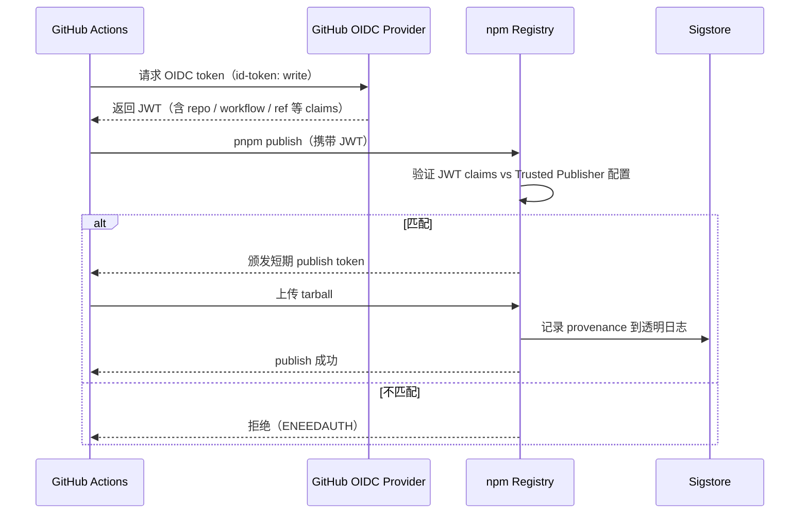

# 多包发布架构设计文档

## 1. 概述 (Overview)

本文档描述了墨梅博客（momei）项目中 `packages/` 下子包的自动化发布方案。当前项目仅对根包（Nuxt 博客应用）通过 `semantic-release` 做版本管理与 Docker 镜像发布，而 `packages/` 下的多个子包虽然已在 CI 中构建和测试，但尚未发布到 npm。本文档旨在设计一套零侵入的发布方案，为子包增加自动化 npm 发布与 per-package CHANGELOG 生成能力，并采用 npm OIDC Trusted Publishing 机制保障安全。

### 1.1 目标 (Goals)

-   为 `packages/` 下的所有子包实现自动化 npm 发布
-   每个子包生成独立的 CHANGELOG.md
-   内部跨包依赖（workspace 协议）在发布时自动转换为正确的 semver 区间
-   不依赖长期有效的 NPM_TOKEN，使用 OIDC 短期凭证
-   不影响现有的根包发布流程（semantic-release + Docker 镜像）

### 1.2 非目标 (Non-Goals)

-   不替换现有的根包 `semantic-release` 发布流程
-   不引入 Turborepo / Nx 等构建编排器
-   不改变现有的 Conventional Commits 提交规范

---

## 2. 现状分析 (Current State)

### 2.1 项目结构

```
momei/                                    # 根包 (private, Nuxt app)
├── packages/
│   ├── api-client/                       # @momei-blog/api-client  v0.1.0
│   │   └── (被 cli 和 mcp-server 依赖)
│   ├── cli/                              # momei-cli               v0.1.0
│   │   └── dependencies: @momei-blog/api-client: workspace:*
│   └── mcp-server/                       # momei-mcp-server        v1.0.0
│       └── dependencies: @momei-blog/api-client: workspace:*
├── release.config.js                     # semantic-release 配置
└── .github/workflows/
    ├── release.yml                       # 发布工作流
    ├── test.yml                          # 测试工作流
    └── docker.yml                        # Docker 构建工作流
```

### 2.2 当前发布流程

```
每周六 UTC 12:00
  │
  ├── precheck（CI 预检）
  ├── regression（回归门禁）
  └── release
        ├── semantic-release
        │     ├── commit-analyzer 分析 commits → 决定版本 bump
        │     ├── release-notes-generator 生成 release notes
        │     ├── @semantic-release/changelog → 更新根 CHANGELOG.md
        │     ├── @semantic-release/npm → 跳过（根包 private）
        │     ├── @semantic-release/github → 创建 GitHub Release
        │     └── @semantic-release/git → 提交回 CHANGELOG.md + package.json
        │
        └── Docker build（基于 semantic-release 创建的 git tag）
              ├── ghcr.io/CaoMeiYouRen/momei
              ├── docker.io/CaoMeiYouRen/momei
              └── registry.cn-hangzhou.aliyuncs.com/CaoMeiYouRen/momei
```

### 2.3 现有基础设施

| 维度 | 状态 |
|------|------|
| Monorepo 工具 | pnpm workspace |
| 包管理器 | pnpm v11.11.0 |
| 发布工具 | semantic-release v25 + semantic-release-cmyr-config |
| 提交规范 | Conventional Commits（commitlint + commitizen + husky） |
| CHANGELOG | 根 CHANGELOG.md 已生成（中文分类，v1.11.0 ~ v1.22.0） |
| CI/CD | GitHub Actions（release / test / docker / docs） |
| 子包构建 | CI 中已构建和测试，但未发布 npm |

---

## 3. 目标架构 (Target Architecture)

### 3.1 整体设计

采用 **Hybrid（混合）模式**：

-   **根包**：保持 `semantic-release` 不变——管理根版本、根 CHANGELOG、GitHub Release、Docker 构建
-   **子包**：引入 `@changesets/cli` 管理各包版本、per-package CHANGELOG 和 npm 发布
-   **安全**：通过 npm Trusted Publisher (OIDC) 实现零长期凭证发布

```
GitHub Actions (release.yml)
  │
  ├── 1. semantic-release（根包）
  │     ├── 分析 commits → bump 根版本（如 1.22.0 → 1.23.0）
  │     ├── 更新根 CHANGELOG.md
  │     ├── 创建 GitHub Release
  │     └── git tag v1.23.0 + 提交回
  │
  ├── 2. changeset publish（子包）
  │     ├── 消费 .changeset/*.md
  │     ├── bump 各包版本 + 生成各包 CHANGELOG.md
  │     ├── 内部依赖自动转换（workspace:* → ^0.2.0）
  │     ├── OIDC 认证 → npm publish（3 个包）
  │     └── git tags（@momei-blog/api-client@0.2.0 等）
  │
  └── 3. Docker build（基于根 git tag，不变）
        ├── ghcr.io/...
        ├── docker.io/...
        └── registry.cn-hangzhou.aliyuncs.com/...
```

### 3.2 核心概念：Changesets

Changesets 是一种"声明式"版本管理方案：

```
开发者提交代码时 → 运行 pnpm changeset add
  → 选择受影响的包 + bump 类型 (major/minor/patch)
  → 写入变更摘要
  → 生成 .changeset/<random-name>.md

发布时 → pnpm changeset version
  → 消费所有 .changeset/*.md
  → 更新各包版本号
  → 生成/追加各包 CHANGELOG.md
  → 删除已处理的 changeset 文件

发布时 → pnpm changeset publish
  → 遍历各包，检查新版本是否已在 npm 上
  → 未发布则调用 pnpm publish（内部触发 OIDC 认证）
  → 创建 git tags
```

### 3.3 安全架构：OIDC Trusted Publishing



关键安全特性：

-   JWT 包含 `repository`、`workflow`、`ref` 等字段，npm Registry 将其与 Trusted Publisher 配置比对
-   token 有效期仅限当前 job 运行期间，不可复用
-   发布后自动附加 provenance（SLSA 供应链证明）
-   可完全禁用 token 认证，只允许 OIDC 发布

---

## 4. 详细设计方案 (Detailed Design)

### 4.1 子包配置变更

#### 4.1.1 添加 publishConfig

所有 3 个子包需添加 `publishConfig`：

```jsonc
// packages/api-client/package.json
{
  "name": "@momei-blog/api-client",
  "publishConfig": {
    "access": "public",          // scoped package 必须显式 public
    "provenance": true           // 开启 SLSA provenance
  },
  "repository": {                // OIDC 验证需要匹配此字段
    "type": "git",
    "url": "git+https://github.com/CaoMeiYouRen/momei.git"
  }
}
```

```jsonc
// packages/cli/package.json
{
  "name": "momei-cli",
  "publishConfig": {
    "provenance": true
  },
  "repository": {
    "type": "git",
    "url": "git+https://github.com/CaoMeiYouRen/momei.git"
  }
}
```

```jsonc
// packages/mcp-server/package.json
{
  "name": "momei-mcp-server",
  "publishConfig": {
    "provenance": true
  },
  "repository": {
    "type": "git",
    "url": "git+https://github.com/CaoMeiYouRen/momei.git"
  }
}
```

> `provenance: true` 作为防御性配置。使用 Trusted Publisher 时 npm 会自动生成 provenance，显式设置可在本地开发中保持行为一致。

#### 4.1.2 确保各包已有构建脚本

每个子包已有 `"build": "tsdown"`，发布前 CI 会先执行构建。无需额外变更。

### 4.2 Changesets 配置

#### 4.2.1 安装

```bash
pnpm add -Dw @changesets/cli @changesets/changelog-github
```

#### 4.2.2 初始化配置

```bash
pnpm changeset init
```

生成 `.changeset/config.json`：

```json
{
  "$schema": "https://unpkg.com/@changesets/config@3/schema.json",
  "changelog": "@changesets/changelog-github",
  "commit": false,
  "fixed": [],
  "linked": [],
  "access": "public",
  "baseBranch": "master",
  "updateInternalDependencies": "patch",
  "ignore": ["momei"]
}
```

关键配置说明：

| 字段 | 值 | 说明 |
|------|-----|------|
| `changelog` | `@changesets/changelog-github` | 生成带 GitHub 链接的 CHANGELOG（需 GITHUB_TOKEN） |
| `access` | `public` | 子包默认公开发布（scoped / unscoped 均适用） |
| `baseBranch` | `master` | 与项目主分支一致 |
| `updateInternalDependencies` | `patch` | 内部依赖（如 api-client）以 patch 级别联动更新 |
| `ignore` | `["momei"]` | 根包不走 changesets（由 semantic-release 管理） |
| `commit` | `false` | 不自动提交（由 CI 流程统一管理提交） |

#### 4.2.3 添加 scripts 到根 package.json

```json
{
  "scripts": {
    "changeset": "changeset",
    "changeset:version": "changeset version",
    "changeset:publish": "changeset publish"
  }
}
```

### 4.3 CI/CD 集成

#### 4.3.1 release.yml 修改

在发布 job 中，semantic-release 之后添加 changeset publish：

```yaml
jobs:
  release:
    runs-on: ubuntu-latest
    timeout-minutes: 120
    permissions:
      id-token: write          # OIDC 必须
      packages: write
      contents: write
      issues: write
      pull-requests: write
      security-events: read
    steps:
      - uses: actions/checkout@v7
        with:
          persist-credentials: false
          fetch-depth: 0        # semantic-release 和 changesets 都需要完整 git 历史
      - uses: pnpm/action-setup@v6
        with:
          version: "11.11.0"
      - uses: actions/setup-node@v6
        with:
          node-version: "lts/*"
          registry-url: "https://registry.npmjs.org"
          package-manager-cache: false
      - run: pnpm i --frozen-lockfile

      # 步骤 1：semantic-release — 根包版本 + CHANGELOG + GitHub Release
      - name: Semantic Release (root)
        env:
          GITHUB_TOKEN: ${{ secrets.GITHUB_TOKEN }}
        run: pnpm run release:semantic

      # 步骤 2：changeset publish — 子包版本 + CHANGELOG + npm publish
      - name: Changeset Publish (packages)
        env:
          GITHUB_TOKEN: ${{ secrets.GITHUB_TOKEN }}
          # 无需 NPM_TOKEN — npm CLI 通过 OIDC 自动认证
        run: pnpm changeset publish

      # 步骤 3：Docker build — 基于 semantic-release 的 git tag
      - name: Get git tag
        id: git_tag
        run: |
          GIT_TAG=$(git describe --tags --exact-match HEAD 2>/dev/null || true)
          echo "tag=$GIT_TAG" >> $GITHUB_OUTPUT
      # ... 后续 Docker 构建步骤保持不变 ...
```

#### 4.3.2 test.yml 确认

`test.yml` 中已有 `api-client` / `cli` / `mcp-server` 的测试 job，构建和测试流程正常运行，无需修改。

### 4.4 开发工作流变更

#### 4.4.1 日常开发

开发者修改子包时，在 PR 中附带 changeset：

```bash
# 在 feature 分支上
pnpm changeset add
# 交互式选择包、bump 类型、填写摘要
# 生成 .changeset/*.md 文件
git add .changeset/
git commit -m "chore: add changeset for xxx"
```

或者直接手动创建 changeset 文件（适合快速调整）：

```bash
pnpm changeset --patch @momei-blog/api-client -m "修复 XX 问题"
```

#### 4.4.2 PR 审查

CI 中通过 `@changesets/action` 或 `changeset status --since=master` 检查 PR 是否含 changeset。对于只改根包的 PR 可以不添加 changeset。

#### 4.4.3 发布流程（不变）

发布仍按现有节奏触发：

-   手动触发：`workflow_dispatch`
-   定时触发：每周六 UTC 12:00

在 release workflow 中，semantic-release 和 changeset publish 依次执行。

### 4.5 Changelog 生成策略

#### 4.5.1 根 CHANGELOG.md

由 `@semantic-release/changelog` 管理，记录所有 commit（包含子包变更），分类标签保持现有中文格式：
- `✨ 新功能`
- `🐛 Bug 修复`
- `📦 代码重构`
- `⚡ 性能优化`

#### 4.5.2 各子包 CHANGELOG.md

由 `@changesets/changelog-github` 基于 changeset 文件的摘要生成，每个包独立维护：

```
packages/
  api-client/CHANGELOG.md     # 只记录 api-client 相关的变更
  cli/CHANGELOG.md            # 只记录 cli 相关的变更
  mcp-server/CHANGELOG.md     # 只记录 mcp-server 相关的变更
```

格式示例（由 @changesets/changelog-github 生成）：

```markdown
# @momei-blog/api-client

## 0.2.0

### Minor Changes

- [#123](https://github.com/CaoMeiYouRen/momei/pull/123) [`abc1234`](https://github.com/CaoMeiYouRen/momei/commit/abc1234) - 重构 HTTP 客户端，支持超时重试

### Patch Changes

- [#121](https://github.com/CaoMeiYouRen/momei/pull/121) [`def5678`](https://github.com/CaoMeiYouRen/momei/commit/def5678) - 修复并发请求时的 token 刷新竞争条件
```

---

## 5. 安全设计 (Security Design)

### 5.1 npm OIDC Trusted Publisher

| 包名 | npmjs.com Trusted Publisher 配置 |
|------|--------------------------------|
| `@momei-blog/api-client` | org: `CaoMeiYouRen`, repo: `momei`, workflow: `release.yml` |
| `momei-cli` | org: `CaoMeiYouRen`, repo: `momei`, workflow: `release.yml` |
| `momei-mcp-server` | org: `CaoMeiYouRen`, repo: `momei`, workflow: `release.yml` |

配置完成后，建议在 npmjs.com 上对每个包启用最高安全策略：

```
Package → Settings → Publishing access
  → "Require two-factor authentication and disallow tokens"
```

这样即使有历史 token 泄露，也无法绕过 OIDC 发布包。

### 5.2 凭证清单

| 凭证 | 用途 | 存储方式 | 轮换策略 |
|------|------|---------|---------|
| `GITHUB_TOKEN` | GitHub Release + git tag push | GitHub 自动注入 | 自动，per-job |
| OIDC JWT | npm publish 认证 | GitHub 自动注入 | 自动，per-job |
| ~~NPM_TOKEN~~ | ~~npm publish~~ | ~~不再需要~~ | ~~—~~ |

### 5.3 安全约束

-   发布必须使用 **GitHub-hosted runner**（`ubuntu-latest`），自托管 runner 不支持 OIDC
-   `id-token: write` 权限仅允许 workflow 请求 OIDC token，不赋予任何写资源权限
-   每个包在 npmjs.com 上只能配置一个 Trusted Publisher，但可以随时编辑

---

## 6. 实施计划 (Implementation Plan)

### 6.1 前置条件

| # | 事项 | 负责人 | 预估 |
|---|------|--------|------|
| 1 | 在 npmjs.com 为 3 个包配置 Trusted Publisher | 项目维护者 | 5 分钟 |
| 2 | 可选：在 npmjs.com 上禁用 token 认证 | 项目维护者 | 2 分钟 |

### 6.2 代码变更

| # | 文件 | 变更类型 | 说明 |
|---|------|---------|------|
| 1 | `.changeset/config.json` | 新增 | Changesets 主配置 |
| 2 | `.changeset/README.md` | 新增 | Changesets 使用说明 |
| 3 | `package.json` (根) | 修改 | 添加 `changeset` / `changeset:version` / `changeset:publish` 脚本 |
| 4 | `packages/api-client/package.json` | 修改 | 添加 `publishConfig` + `repository` |
| 5 | `packages/cli/package.json` | 修改 | 添加 `publishConfig` + `repository` |
| 6 | `packages/mcp-server/package.json` | 修改 | 添加 `publishConfig` + `repository` |
| 7 | `.github/workflows/release.yml` | 修改 | 添加 OIDC permission + changeset publish 步骤 |

### 6.3 变更后的发布流程

```
weekly release trigger
  │
  ├── precheck
  ├── regression gate
  └── release
        ├── semantic-release
        │     ├── root version bump (e.g. 1.22.0 → 1.23.0)
        │     ├── root CHANGELOG 更新
        │     ├── GitHub Release 创建
        │     └── git commit back (CHANGELOG.md, package.json)
        │
        ├── changeset publish
        │     ├── 读取 .changeset/*.md
        │     ├── 更新各包版本号
        │     ├── 生成各包 CHANGELOG.md
        │     ├── 自动转换 workspace:* 依赖为 semver 区间
        │     ├── 删除已处理的 changeset 文件
        │     ├── OIDC 认证 → npm publish × 3
        │     └── git tags (api-client@0.2.0, cli@0.1.1 ...)
        │
        └── Docker build（基于根 tag）
```

### 6.4 验证清单

| # | 验证项 | 方法 |
|---|--------|------|
| 1 | `changeset publish` 能在 CI 中通过 OIDC 认证 | 触发 release workflow 观察日志 |
| 2 | 子包版本正确 bump | 检查 npmjs.com 上的版本号 |
| 3 | 内部依赖正确转换 | 检查 `cli/package.json` 中的 `@momei-blog/api-client` 版本 |
| 4 | per-package CHANGELOG 正确生成 | 检查各包 CHANGELOG.md 内容 |
| 5 | 根包发布不受影响 | 确认 Docker 镜像正常构建和推送 |
| 6 | 根 CHANGELOG 继续更新 | 确认根 CHANGELOG.md 追加了新版内容 |

---

## 7. 备选方案 (Alternatives)

### 7.1 纯 Changesets（替换 semantic-release）

如果将来希望统一发布工具，可以将根包也迁到 Changesets：

-   优点：单工具、统一流程
-   代价：现有 release workflow 需要重新设计，Docker 构建触发逻辑需调整
-   迁移条件：需要支持按 schedule 触发的"Version Packages" PR 自动合并流程

当前不采用此方案，留作未来优化选项。

### 7.2 per-package semantic-release（multi-semantic-release）

-   `@qiwi/multi-semantic-release` 已归档停维护
-   手动运行多个 semantic-release 实例需要复杂的 commit 过滤逻辑
-   内部依赖联动需要额外脚本处理

不推荐。

### 7.3 pnpm -r publish + 手动 changelog

-   缺少自动版本管理和 changelog 生成
-   依赖的版本联动需要手动维护

不推荐。

---

## 8. 相关文档 (References)

-   [Changesets 官方文档](https://changesets.dev/)
-   [npm Trusted Publishing 文档](https://docs.npmjs.com/trusted-publishers)
-   [npm Provenance 文档](https://docs.npmjs.com/generating-provenance-statements)
-   [项目路线图](../plan/roadmap.md)
-   [项目待办事项](../plan/todo.md)
-   [发布工作流](../../.github/workflows/release.yml)
