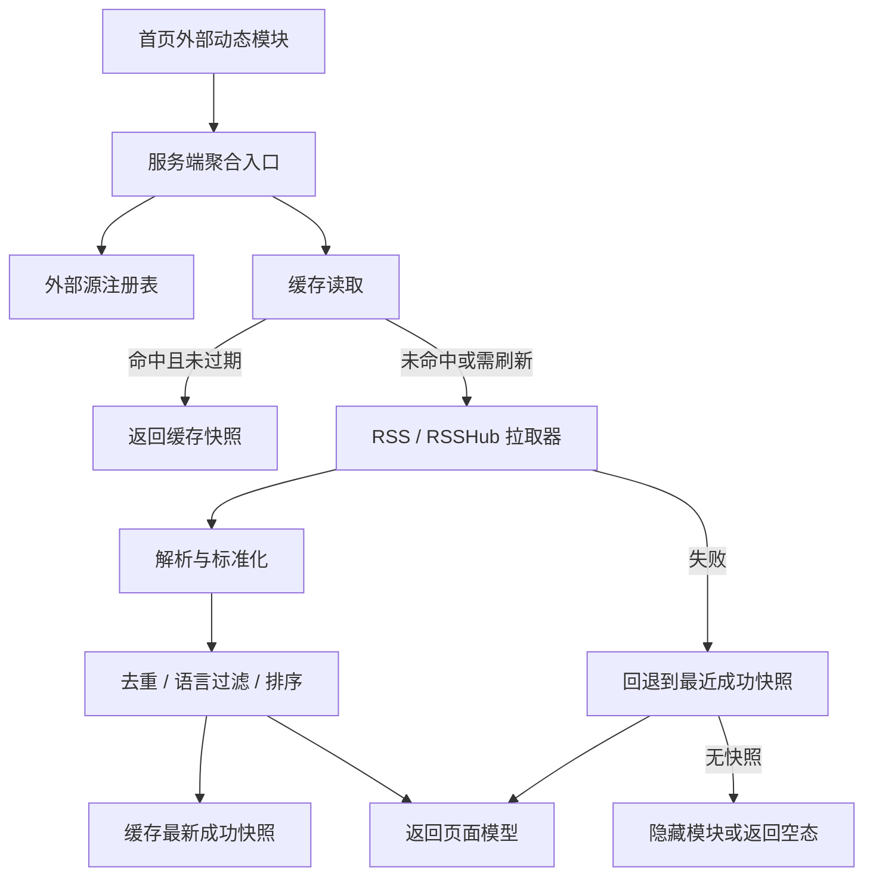

# 外部 RSS / RSSHub 聚合挂载设计 (External Feed Aggregation)

> 本文档是 [订阅系统设计文档](../modules/subscription.md) 的专项增量设计，只负责定义“外部 RSS / RSSHub 资源如何被安全接入、缓存、降级并挂载到正式页面”的治理边界，不重复描述站内自有 Feed 输出能力。

## 1. 概述

当前项目已经具备完整的站内 Feed 输出链路：`server/utils/feed.ts` 负责将站内文章渲染为 RSS / Atom / JSON Feed，`server/routes/feed*.ts` 及分类、标签子路由负责公开分发。但 Phase 21 的目标不是继续扩写自有 Feed，而是补上“外部内容如何稳定挂载”的统一模型。

截至 2026-04-03，本专项最小交付面已经落地：服务端统一接入层、首页消费 API、后台设置项、首页正式展示模块，以及对应的定向测试已完成收口。本文档现同时承担“设计约束 + 当前实现契约”的双重说明。

本轮设计聚焦以下问题：

- 站点目前没有统一的外部源注册与拉取层，页面不能直接安全复用第三方 RSS / RSSHub。
- 站内已经存在 `friend_links` 的 `rssUrl` 字段，但它属于友情链接上下文，不等于“可直接公开挂载的动态流”。
- 页面层缺少统一的缓存与失败降级口径，若直接请求外部源，会把第三方抖动暴露给 SSR 和首页首屏。
- 还没有正式的挂载入口、排序、去重、语言过滤与跳转策略，难以形成可复跑的最小交付面。

## 2. 目标与非目标

### 2.1 目标

- 为 RSS 与 RSSHub 提供统一的服务端接入层，避免页面直接拼接第三方返回结果。
- 建立可缓存、可降级、可关闭的外部内容聚合链路。
- 输出一套稳定的标准化数据模型，覆盖来源标识、发布时间、语言、跳转地址与摘要。
- 在首页提供至少一个正式展示入口，并明确桌面端与移动端的降级展示方式。
- 为后续实现保留最小文件映射、设置项契约与验证矩阵。

### 2.2 非目标

- 本轮不修改现有站内 RSS / Atom / JSON Feed 输出协议。
- 本轮不把所有友情链接 `rssUrl` 自动纳入聚合源，避免把友情链接巡检与外部动态展示强耦合。
- 本轮不引入全文搜索、站外内容全文入库或复杂推荐算法。
- 本轮不承诺首版就提供作者页和独立聚合页双入口，先以首页正式入口作为最小交付面。

## 3. 现状与问题边界

### 3.1 已有能力

- 站内 Feed 输出已由 `server/utils/feed.ts` 和 `server/routes/feed*.ts` 收敛。
- 分类页、标签页和页脚已经暴露站内订阅入口。
- 系统设置链路已经支持“配置项 -> 公共设置接口 -> `useMomeiConfig()` -> 页面渲染”的公开能力注入模式。

### 3.2 缺口

- 外部源没有注册表，缺少“哪些源可公开挂载”的统一事实源。
- 没有专门的 fetch / parse / normalize / cache / fallback 服务层。
- 缺少供页面消费的聚合 API 或 server composable。
- 没有公共设置项来控制开关、缓存时效、首页展示数量和来源白名单。

## 4. 统一架构



架构原则：

- 页面只能消费内部聚合结果，不能直接请求第三方 RSS / RSSHub。
- 外部源拉取必须经过统一超时、缓存、错误分类和回退逻辑。
- 失败优先回退最近成功快照，其次返回空态；不允许第三方错误直接导致首页报错。

## 5. 数据模型

### 5.1 外部源注册模型

首轮不新增数据库实体，优先采用“系统设置 JSON 注册表 + 服务端运行时解析”的轻量方案。

建议新增逻辑模型 `ExternalFeedSourceConfig`：

```ts
interface ExternalFeedSourceConfig {
  id: string
  enabled: boolean
  provider: 'rss' | 'rsshub'
  title: string
  sourceUrl: string
  siteUrl?: string | null
  siteName?: string | null
  defaultLocale?: string | null
  localeStrategy: 'inherit-current' | 'fixed' | 'all'
  includeInHome: boolean
  badgeLabel?: string | null
  priority: number
  timeoutMs?: number | null
  cacheTtlSeconds?: number | null
  staleWhileErrorSeconds?: number | null
  maxItems?: number | null
}
```

设计取舍：

- 使用设置项而不是新表，可以先完成“统一接入层 + 正式入口”的第一阶段能力。
- `provider` 区分标准 RSS 与 RSSHub，便于后续补 URL 模板与鉴权差异。
- `includeInHome` 作为最小入口开关，避免首版同时设计多页面投放矩阵。

### 5.2 标准化条目模型

建议统一输出 `ExternalFeedItem`：

```ts
interface ExternalFeedItem {
  id: string
  sourceId: string
  title: string
  summary: string | null
  url: string
  canonicalUrl: string
  publishedAt: string | null
  authorName: string | null
  language: string | null
  coverImage: string | null
  sourceTitle: string
  sourceSiteUrl: string | null
  sourceBadge: string | null
  dedupeKey: string
}
```

字段要求：

- `canonicalUrl` 优先使用条目原始链接的规范化结果，作为跨源去重主键。
- `language` 允许为空，但必须在后处理阶段套用来源默认语言与当前 locale 过滤规则。
- `sourceBadge` 用于页面展示“RSS / RSSHub / 外部博客”等来源标签。

## 6. 缓存与降级策略

### 6.1 缓存策略

- 缓存位置：优先使用 Nitro storage 或等价 server storage，而不是页面级内存变量。
- 缓存粒度：按 `sourceId + localeBucket` 写入，避免不同语种互相污染。
- 默认 TTL：建议 15 分钟。
- `stale-while-error` 窗口：建议 24 小时。
- 单源抓取超时：建议 5 秒，最多不超过 8 秒。

### 6.2 降级顺序

1. 返回未过期缓存。
2. 若缓存过期，则尝试刷新并返回新快照。
3. 若刷新失败但存在最近成功快照，则返回 stale 数据并标记 `degraded`。
4. 若没有任何成功快照，则返回空数组，由页面隐藏模块或显示空态占位。

### 6.3 失败分类

- `network_error`: DNS、超时、连接中断。
- `upstream_4xx`: 第三方源地址失效、被限流或鉴权失败。
- `parse_error`: XML / JSON 结构无法解析。
- `policy_blocked`: 来源被停用、语言不匹配或被白名单策略拒绝。

这些状态应进入服务端日志与后续 Review Gate 证据，而不是直接暴露给最终用户。

## 7. 首页挂载模型

### 7.1 正式入口

首轮正式入口定为：首页二级内容区的“外部动态”模块。

选择原因：

- 首页是当前阶段最容易形成稳定可见回归入口的位置。
- 相比作者页，首页不依赖额外作者维度建模。
- 相比独立聚合页，首页模块更适合先验证缓存与降级策略是否稳定。

### 7.2 展示形态

- 桌面端：右侧侧栏或首页次级卡片区展示 5 到 8 条卡片流。
- 移动端：折叠为首页正文下方的单列列表块，避免挤压首屏主内容。
- 每条卡片最少展示：标题、来源徽标、发布时间、摘要首行、外链跳转按钮。

### 7.3 排序、去重、语言过滤

- 排序：优先按 `publishedAt DESC`，同时间戳按 `priority DESC`，最后按 `sourceId ASC` 保持稳定性。
- 去重：按 `canonicalUrl` 去重；若缺失，则回退 `guid`，再回退 `title + publishedAt` 的哈希。
- 语言过滤：
  - 条目明确声明语言时，只展示与当前页面 locale 一致的条目。
  - 条目语言为空时，按来源 `localeStrategy` 处理。
  - `inherit-current` 表示仅在当前 locale 对应该来源时展示。
  - `fixed` 表示使用来源默认语言，不跨语种兜底。
  - `all` 表示允许所有 locale 共享该来源，但页面仍需显示来源标签，避免误导为本站翻译内容。

### 7.4 跳转策略

- 外部条目统一新标签页打开。
- 页面显式展示“外部来源”标识，不伪装为站内文章卡片。
- 不接入站内文章详情路由，避免 SEO 与权限语义混淆。

## 8. 设置项契约

为保证可关闭、可降级、可运维，建议新增以下设置项：

- `external_feed_enabled`: 全局开关。
- `external_feed_sources`: 外部源注册表 JSON。
- `external_feed_home_enabled`: 首页模块开关。
- `external_feed_home_limit`: 首页最多展示条数。
- `external_feed_cache_ttl_seconds`: 默认缓存 TTL。
- `external_feed_stale_while_error_seconds`: 失败回退窗口。

公开设置接口仅暴露页面真正需要的字段：

- `externalFeedEnabled`
- `externalFeedHomeEnabled`
- `externalFeedHomeLimit`

源注册表明细保留在服务端，避免把第三方源配置原样下发到浏览器。

### 8.1 当前默认值

当前实现中的默认值如下：

- `external_feed_enabled`: `false`
- `external_feed_sources`: `[]`
- `external_feed_home_enabled`: `false`
- `external_feed_home_limit`: `6`
- `external_feed_cache_ttl_seconds`: `900`
- `external_feed_stale_while_error_seconds`: `86400`

这些默认值定义在 `server/services/setting.constants.ts`，含义是“默认关闭、后台按需启用、首页最多展示 6 条、默认缓存 15 分钟、失败时最多回退 24 小时”。

### 8.2 后台可用的默认示例

以下示例可直接作为 `external_feed_sources` 的后台 JSON 初始值使用：

```json
[
  {
    "id": "nuxt-blog",
    "enabled": true,
    "provider": "rss",
    "title": "Nuxt Blog",
    "sourceUrl": "https://nuxt.com/blog/rss.xml",
    "siteUrl": "https://nuxt.com/blog",
    "siteName": "Nuxt",
    "defaultLocale": "en-US",
    "localeStrategy": "all",
    "includeInHome": true,
    "badgeLabel": "RSS",
    "priority": 20,
    "timeoutMs": 5000,
    "cacheTtlSeconds": 900,
    "staleWhileErrorSeconds": 86400,
    "maxItems": 6
  },
  {
    "id": "rsshub-github-vuejs-core",
    "enabled": true,
    "provider": "rsshub",
    "title": "Vue Core Releases",
    "sourceUrl": "https://rsshub.app/github/release/vuejs/core",
    "siteUrl": "https://github.com/vuejs/core/releases",
    "siteName": "GitHub Releases",
    "defaultLocale": "en-US",
    "localeStrategy": "all",
    "includeInHome": true,
    "badgeLabel": "RSSHub",
    "priority": 10,
    "timeoutMs": 5000,
    "cacheTtlSeconds": 1800,
    "staleWhileErrorSeconds": 86400,
    "maxItems": 4
  }
]
```

使用建议：

- 首次启用时先只保留 1 到 2 个稳定来源，避免把不稳定源一起带入首页。
- 若来源本身不区分语言，优先使用 `all`；若来源固定某一种语言且不希望跨语种展示，则使用 `fixed` 并设置 `defaultLocale`。
- `rsshub` 来源应优先选择团队自维护节点或稳定公共节点，避免把临时公共节点当作正式生产依赖。

## 9. 受影响文件映射

本轮实现已落在以下路径：

- `server/services/external-feed/registry.ts`: 解析设置项并生成源注册表。
- `server/services/external-feed/fetcher.ts`: 统一抓取、超时和错误分类。
- `server/services/external-feed/parser.ts`: RSS / RSSHub 输出标准化。
- `server/services/external-feed/cache.ts`: Nitro storage 缓存读写。
- `server/services/external-feed/aggregator.ts`: 去重、语言过滤、排序与降级。
- `server/api/external-feed/home.get.ts`: 首页模块消费入口。
- `types/setting.ts`: 新增设置键与后台表单类型。
- `server/services/setting.constants.ts`: 设置键映射与默认值。
- `server/api/settings/public.get.ts`: 暴露最小公开开关。
- `composables/use-momei-config.ts`: 补齐公开设置消费字段。
- `components/home/external-feed-panel.vue`: 首页模块组件。
- `pages/index.vue`: 正式挂载入口。

补充：

- `types/external-feed.ts`: 外部源、标准化条目与首页返回模型类型定义。
- `utils/schemas/external-feed.ts`: 后台 `external_feed_sources` 的 Zod 校验契约。
- `components/home/external-feed-panel.test.ts`: 首页模块 UI 状态测试。
- `tests/server/external-feed/cache.test.ts`: 缓存辅助逻辑测试。
- `tests/server/external-feed/aggregator.test.ts`: 聚合、去重、语言过滤与 stale 回退测试。
- `tests/server/api/external-feed/home.get.test.ts`: 首页 API 返回模型测试。

## 10. 验证矩阵

按当前阶段要求，首轮实现至少满足 `V0 + V1 + V2 + V3 + RG`；当前交付状态如下：

- `V0`: 已完成。本文档与设置项契约、缓存口径、首页挂载策略已同步。
- `V1`: 已完成。已通过定向诊断与 `pnpm exec nuxt typecheck`。
- `V2`: 已完成。服务层测试已覆盖缓存回退、去重、排序与语言过滤。
- `V3`: 已完成。首页模块组件测试已覆盖有数据与 degraded/stale 状态；空态由组件逻辑直接覆盖。
- `RG`: 部分完成。已明确第三方源抖动、RSSHub 节点稳定性与语言误标仍属于运行期观察项。

建议最小测试集合：

- `tests/server/external-feed/aggregator.test.ts`
- `tests/server/external-feed/cache.test.ts`
- `components/home/external-feed-panel.test.ts`
- 首页定向浏览器验证或等价截图证据

当前已落地的最小测试集合：

- `tests/server/external-feed/cache.test.ts`
- `tests/server/external-feed/aggregator.test.ts`
- `tests/server/api/external-feed/home.get.test.ts`
- `components/home/external-feed-panel.test.ts`

## 11. 分阶段落地顺序

### 11.1 当前落地结果

- 已完成服务端统一接入层：注册表、抓取器、解析器、缓存层与聚合器。
- 已完成首页消费入口：`/api/external-feed/home` 与首页 `ExternalFeedPanel` 模块。
- 已完成后台设置收口：系统设置键、后台保存校验、多语言文案与首页公开配置字段。
- 已完成最小验证：定向组件测试、服务层测试与类型检查。

### 11.2 后续增强方向

- 若后续需要扩展作者页或独立聚合页，应继续复用当前标准化模型与缓存层，不再新增第二套拉取链路。
- 若来源数量继续增长，可进一步补充来源健康状态监控、后台示例模板与 Review Gate 证据脚本化沉淀。
- 若生产运行中出现跨语种误判，可把 `language` 纠偏规则从“来源默认 locale”进一步扩展为“来源级白名单映射”。

## 12. 相关文档

- [订阅系统设计文档](../modules/subscription.md)
- [友链系统](../modules/friend-links.md)
- [功能模块索引](./index.md)
- [项目待办](../../plan/todo.md)
- [项目规划](../../plan/roadmap.md)
- [测试规范](../../standards/testing.md)
