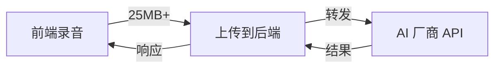
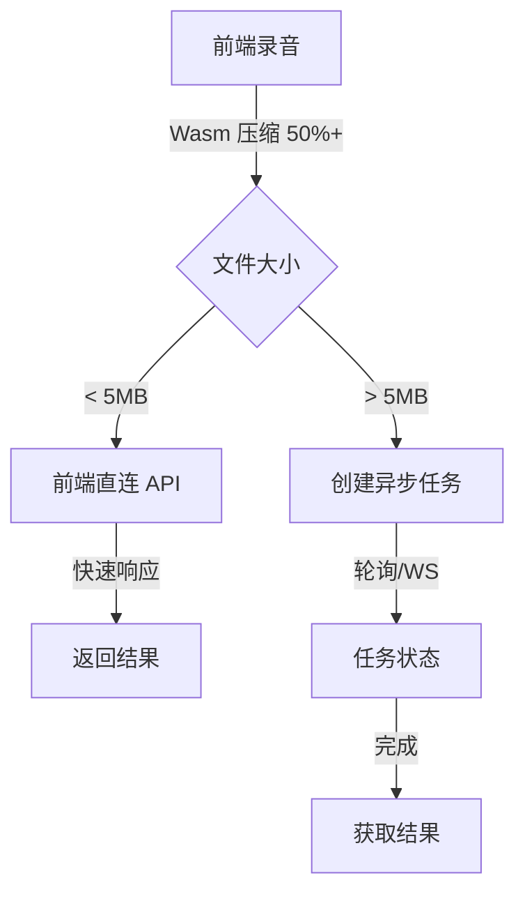

# ASR 性能与体验极限优化 (Extreme ASR Performance)

## 1. 概述 (Overview)

本文档定义了墨梅博客语音识别 (ASR) 系统的性能极限优化方案，通过前端直连、Wasm 音频压缩和异步任务流，实现低延迟、高可靠性的语音转文字体验。

**核心目标**：
- 绕过后端转发瓶颈，实现前端直连 AI 厂商
- 使用 Wasm 音频压缩，减小 50%+ 上传体积
- 支持长时间任务的异步处理与实时状态推送

## 2. 现有问题分析

### 2.1 当前架构瓶颈



**问题**：
1. **双重传输延迟**：音频先上传到后端，再转发给 AI 厂商
2. **大文件上传**：25MB+ 音频文件上传慢
3. **超时风险**：长音频转录时间超过 HTTP 请求超时
4. **无进度反馈**：用户无法知道转录进度

### 2.2 优化后架构



## 3. 前端直连签名机制

### 3.1 签名方案

使用 HMAC-SHA256 签名，允许前端直接调用 AI 厂商 API，无需后端转发。

**位置**: `server/services/ai/signature.ts`

```typescript
import crypto from 'node:crypto'

interface SignaturePayload {
  provider: 'siliconflow' | 'volcengine'
  timestamp: number
  nonce: string
  userId?: string
}

interface SignatureResult {
  signature: string
  payload: SignaturePayload
  expiresIn: number // 签名有效期（秒）
  provider: string
  endpoint: string // 厂商 API 端点
  headers: Record<string, string> // 额外的请求头
}

/**
 * 生成前端直连签名
 * @param userId 用户 ID
 * @param provider AI 提供商
 * @returns 签名结果
 */
export async function generateDirectAccessSignature(
  userId?: string,
  provider: 'siliconflow' | 'volcengine' = 'siliconflow'
): Promise<SignatureResult> {
  const timestamp = Date.now()
  const nonce = crypto.randomBytes(16).toString('hex')
  const expiresIn = 300 // 5 分钟有效期

  const payload: SignaturePayload = {
    provider,
    timestamp,
    nonce,
    userId,
  }

  // 构建签名字符串
  const message = JSON.stringify(payload)
  const secret = getProviderSecret(provider)

  // 生成 HMAC-SHA256 签名
  const signature = crypto
    .createHmac('sha256', secret)
    .update(message)
    .digest('hex')

  return {
    signature,
    payload,
    expiresIn,
    provider,
    endpoint: getProviderEndpoint(provider),
    headers: await getProviderHeaders(provider),
  }
}

function getProviderSecret(provider: string): string {
  switch (provider) {
    case 'siliconflow':
      return process.env.SILICONFLOW_API_KEY!
    case 'volcengine':
      return process.env.VOLCENGINE_ACCESS_KEY!
    default:
      throw new Error(`Unknown provider: ${provider}`)
  }
}

function getProviderEndpoint(provider: string): string {
  switch (provider) {
    case 'siliconflow':
      return 'https://api.siliconflow.cn/v1/audio/transcriptions'
    case 'volcengine':
      return process.env.VOLCENGINE_ASR_ENDPOINT || ''
    default:
      throw new Error(`Unknown provider: ${provider}`)
  }
}
```

### 3.2 签名验证端点

```typescript
// server/api/ai/asr/signature.get.ts
export default defineEventHandler(async (event) => {
  const user = await requireAuth(event)
  const query = getQuery(event)

  const provider = (query.provider as 'siliconflow' | 'volcengine') || 'siliconflow'

  const result = await generateDirectAccessSignature(user.id, provider)

  return {
    code: 0,
    data: result,
  }
})
```

### 3.3 前端签名调用

**位置**: `composables/useAsrDirectClient.ts`

```typescript
import { hmac } from '@noble/hash/hmac'
import { sha256 } from '@noble/hash/sha256'

interface DirectTranscribeOptions {
  audioFile: File
  provider?: 'siliconflow' | 'volcengine'
  model?: string
  language?: string
}

interface AsrSignature {
  signature: string
  payload: {
    provider: string
    timestamp: number
    nonce: string
    userId?: string
  }
  expiresIn: number
  endpoint: string
  headers: Record<string, string>
}

export function useAsrDirectClient() {
  async function getSignature(provider: 'siliconflow' | 'volcengine' = 'siliconflow') {
    const { data, error } = await useFetch<ApiResult<AsrSignature>>('/api/ai/asr/signature', {
      method: 'GET',
      query: { provider },
    })

    if (error.value || !data.value?.data) {
      throw new Error('Failed to get signature')
    }

    return data.value.data
  }

  async function transcribeDirect(options: DirectTranscribeOptions) {
    const { audioFile, provider = 'siliconflow', model = 'whisper-1', language = 'zh' } = options

    // 获取签名
    const signature = await getSignature(provider)

    // 验证签名有效期
    const now = Date.now()
    const expiresAt = signature.payload.timestamp + signature.expiresIn * 1000
    if (now > expiresAt) {
      throw new Error('Signature expired')
    }

    // 准备表单数据
    const formData = new FormData()
    formData.append('file', audioFile)
    formData.append('model', model)
    formData.append('language', language)
    formData.append('response_format', 'text')

    // 添加认证信息
    const headers: Record<string, string> = {
      ...signature.headers,
      'X-Signature': signature.signature,
      'X-Signature-Payload': btoa(JSON.stringify(signature.payload)),
    }

    // 直接调用厂商 API
    const response = await fetch(signature.endpoint, {
      method: 'POST',
      headers,
      body: formData,
    })

    if (!response.ok) {
      throw new Error(`Transcription failed: ${response.statusText}`)
    }

    const text = await response.text()

    return {
      text,
      provider,
      duration: audioFile.size, // 简化，实际应该计算音频时长
    }
  }

  return {
    transcribeDirect,
  }
}
```

## 4. Wasm 音频压缩

### 4.1 技术选型

使用 **FFmpeg.wasm** 进行前端音频压缩。

**位置**: `utils/audio-compressor.ts`

```typescript
import { FFmpeg } from '@ffmpeg/ffmpeg'
import { fetchFile, toBlobURL } from '@ffmpeg/util'

interface CompressionOptions {
  targetFormat: 'mp3' | 'wav' | 'ogg'
  bitrate?: number // 比特率，如 '128k'
  sampleRate?: number // 采样率，如 16000
  channels?: 1 | 2 // 声道数
}

interface CompressionResult {
  blob: Blob
  originalSize: number
  compressedSize: number
  compressionRatio: number
  duration: number // 音频时长（秒）
}

let ffmpegInstance: FFmpeg | null = null

async function loadFFmpeg(): Promise<FFmpeg> {
  if (ffmpegInstance) {
    return ffmpegInstance
  }

  const ffmpeg = new FFmpeg()
  const baseURL = 'https://unpkg.com/@ffmpeg/core@0.12.6/dist/esm'

  await ffmpeg.load({
    coreURL: await toBlobURL(`${baseURL}/ffmpeg-core.js`, 'text/javascript'),
    wasmURL: await toBlobURL(`${baseURL}/ffmpeg-core.wasm`, 'application/wasm'),
  })

  ffmpegInstance = ffmpeg
  return ffmpeg
}

/**
 * 压缩音频文件
 * @param file 原始音频文件
 * @param options 压缩选项
 * @returns 压缩后的结果
 */
export async function compressAudio(
  file: File,
  options: CompressionOptions = {
    targetFormat: 'mp3',
    bitrate: 64000,
    sampleRate: 16000,
    channels: 1,
  }
): Promise<CompressionResult> {
  const ffmpeg = await loadFFmpeg()

  // 写入输入文件
  const inputFileName = `input.${getFileExtension(file.type)}`
  const outputFileName = `output.${options.targetFormat}`

  await ffmpeg.writeFile(inputFileName, await fetchFile(file))

  // 执行压缩命令
  const ffmpegArgs = [
    '-i', inputFileName,
    '-b:a', String(options.bitrate || 64000),
    '-ar', String(options.sampleRate || 16000),
    '-ac', String(options.channels || 1),
    outputFileName,
  ]

  await ffmpeg.exec(ffmpegArgs)

  // 读取输出文件
  const data = await ffmpeg.readFile(outputFileName)
  const blob = new Blob([data], { type: `audio/${options.targetFormat}` })

  // 获取音频时长
  const duration = await getAudioDuration(file)

  // 清理文件
  await ffmpeg.deleteFile(inputFileName)
  await ffmpeg.deleteFile(outputFileName)

  return {
    blob,
    originalSize: file.size,
    compressedSize: blob.size,
    compressionRatio: file.size / blob.size,
    duration,
  }
}

/**
 * 获取音频时长
 */
async function getAudioDuration(file: File): Promise<number> {
  return new Promise((resolve, reject) => {
    const audio = new Audio()
    audio.src = URL.createObjectURL(file)

    audio.addEventListener('loadedmetadata', () => {
      URL.revokeObjectURL(audio.src)
      resolve(audio.duration)
    })

    audio.addEventListener('error', () => {
      URL.revokeObjectURL(audio.src)
      reject(new Error('Failed to load audio metadata'))
    })
  })
}

function getFileExtension(mimeType: string): string {
  const mimeToExt: Record<string, string> = {
    'audio/webm': 'webm',
    'audio/ogg': 'ogg',
    'audio/wav': 'wav',
    'audio/mpeg': 'mp3',
    'audio/mp4': 'm4a',
  }
  return mimeToExt[mimeType] || 'webm'
}
```

### 4.2 集成到录音流程

**位置**: `composables/use-post-editor-voice.ts`

```typescript
export function usePostEditorVoice() {
  const { transcribeDirect } = useAsrDirectClient()
  const isCompressing = ref(false)
  const compressionProgress = ref(0)

  async function handleRecordingComplete(blob: Blob) {
    try {
      // 1. 压缩音频
      isCompressing.value = true
      const file = new File([blob], 'recording.webm', { type: blob.type })

      const result = await compressAudio(file, {
        targetFormat: 'mp3',
        bitrate: 64000,
        sampleRate: 16000,
        channels: 1,
      })

      console.log(`压缩完成: ${result.compressionRatio.toFixed(2)}x 减少`)

      // 2. 判断是否需要异步处理
      const compressedFile = new File([result.blob], 'compressed.mp3', {
        type: 'audio/mp3',
      })

      if (compressedFile.size > 5 * 1024 * 1024) {
        // 大于 5MB，使用异步任务
        return await submitAsyncTask(compressedFile, result.duration)
      } else {
        // 小文件直接处理
        return await transcribeDirect({
          audioFile: compressedFile,
          language: 'zh',
        })
      }
    } finally {
      isCompressing.value = false
    }
  }

  return {
    handleRecordingComplete,
    isCompressing,
    compressionProgress,
  }
}
```

## 5. 异步任务流系统

### 5.1 任务实体扩展

```typescript
// server/entities/AITask.ts (扩展现有实体)
import { BaseEntity } from './base'
import { Entity, PrimaryColumn, Column, ManyToOne, JoinColumn } from 'typeorm'
import { User } from './user'

export enum AsyncTaskStatus {
  PENDING = 'pending',
  PROCESSING = 'processing',
  COMPLETED = 'completed',
  FAILED = 'failed',
  CANCELLED = 'cancelled',
}

export enum AsyncTaskType {
  TRANSCRIPTION = 'transcription',
  TRANSLATION = 'translation',
  SUMMARIZATION = 'summarization',
}

@Entity('ai_tasks')
export class AITask extends BaseEntity {
  @PrimaryColumn('uuid')
  id: string

  @Column({ type: 'enum', enum: AsyncTaskType })
  type: AsyncTaskType

  @Column({ type: 'enum', enum: AsyncTaskStatus, default: AsyncTaskStatus.PENDING })
  status: AsyncTaskStatus

  @Column()
  userId: string

  @ManyToOne(() => User)
  @JoinColumn()
  user: User

  // 任务输入
  @Column({ type: 'json' })
  input: {
    provider: string
    model: string
    fileUrl?: string
    fileSize?: number
    duration?: number // 音频时长
    language?: string
  }

  // 任务输出
  @Column({ type: 'json', nullable: true })
  output: {
    text?: string
    segments?: Array<{
      start: number
      end: number
      text: string
    }>
    language?: string
  } | null

  // 错误信息
  @Column({ type: 'text', nullable: true })
  error: string | null

  // 进度
  @Column({ type: 'int', default: 0 })
  progress: number // 0-100

  // 元数据
  @Column({ type: 'json', nullable: true })
  metadata: {
    retryCount?: number
    maxRetries?: number
    priority?: number
    estimatedDuration?: number // 预计处理时间（秒）
  }

  @Column({ type: 'timestamp', nullable: true })
  startedAt: Date | null

  @Column({ type: 'timestamp', nullable: true })
  completedAt: Date | null
}
```

### 5.2 异步任务创建

```typescript
// server/api/ai/asr/async-transcribe.post.ts
export default defineEventHandler(async (event) => {
  const user = await requireAuth(event)
  const body = await readBody(event)

  const { audioFile, provider, model, language } = body

  // 创建异步任务
  const task = AITask.create({
    type: AsyncTaskType.TRANSCRIPTION,
    status: AsyncTaskStatus.PENDING,
    userId: user.id,
    user,
    input: {
      provider: provider || 'siliconflow',
      model: model || 'whisper-1',
      fileUrl: audioFile.url,
      fileSize: audioFile.size,
      duration: audioFile.duration,
      language,
    },
    progress: 0,
    metadata: {
      retryCount: 0,
      maxRetries: 3,
      priority: 1,
    },
  })

  await task.save()

  // 加入处理队列
  await enqueueTask(task.id)

  return {
    code: 0,
    data: {
      taskId: task.id,
      status: task.status,
      estimatedDuration: task.metadata?.estimatedDuration,
    },
  }
})
```

### 5.3 任务处理 Worker

```typescript
// server/workers/asrWorker.ts
import { Queue, Worker, Job } from 'bullmq'
import { AITask, AsyncTaskStatus } from '~/server/entities/AITask'
import { transcriptionService } from '~/server/services/ai/transcription'

const taskQueue = new Queue('asr-tasks', {
  connection: redis,
})

export async function enqueueTask(taskId: string) {
  await taskQueue.add('process-asr', { taskId })
}

export const asrWorker = new Worker(
  'asr-tasks',
  async (job: Job) => {
    const { taskId } = job.data

    const task = await AITask.findOne({
      where: { id: taskId },
      relations: ['user'],
    })

    if (!task) {
      throw new Error(`Task not found: ${taskId}`)
    }

    try {
      // 更新状态
      task.status = AsyncTaskStatus.PROCESSING
      task.startedAt = new Date()
      task.progress = 10
      await task.save()

      // 执行转录
      const result = await transcriptionService.transcribe({
        fileUrl: task.input.fileUrl,
        provider: task.input.provider,
        model: task.input.model,
        language: task.input.language,

        onProgress: (progress) => {
          task.progress = Math.round(progress * 0.9 + 10) // 10-100%
          job.updateProgress(task.progress)
        },
      })

      // 保存结果
      task.status = AsyncTaskStatus.COMPLETED
      task.output = result
      task.progress = 100
      task.completedAt = new Date()
      await task.save()

      // 通知前端
      await notifyTaskComplete(task)

      return result
    } catch (error) {
      // 处理失败
      task.status = AsyncTaskStatus.FAILED
      task.error = error.message
      await task.save()

      // 重试逻辑
      if ((task.metadata?.retryCount || 0) < (task.metadata?.maxRetries || 3)) {
        task.metadata!.retryCount!++
        await task.save()
        throw error // 触发 BullMQ 重试
      }

      await notifyTaskFailed(task)
      throw error
    }
  },
  {
    connection: redis,
    concurrency: 3, // 并发处理数
  }
)
```

## 6. 实时状态推送

### 6.1 WebSocket 推送

```typescript
// server/utils/websocket.ts
import { WebSocketServer, WebSocket } from 'ws'
import { Server } from 'node:http'

const wss = new WebSocketServer({ noServer: true })

const taskSubscriptions = new Map<string, Set<WebSocket>>()

export function handleWebSocketUpgrade(server: Server) {
  server.on('upgrade', (request, socket, head) => {
    const url = new URL(request.url!, `http://${request.headers.host}`)

    if (url.pathname === '/ws/tasks') {
      wss.handleUpgrade(request, socket, head, (ws) => {
        wss.emit('connection', ws, request)
      })
    } else {
      socket.destroy()
    }
  })
}

wss.on('connection', (ws: WebSocket) => {
  const url = new URL(ws.protocol + '//' + ws.url)
  const taskId = url.searchParams.get('taskId')

  if (taskId) {
    // 订阅任务
    if (!taskSubscriptions.has(taskId)) {
      taskSubscriptions.set(taskId, new Set())
    }
    taskSubscriptions.get(taskId)!.add(ws)

    ws.send(JSON.stringify({
      type: 'subscribed',
      taskId,
    }))

    ws.on('close', () => {
      taskSubscriptions.get(taskId)?.delete(ws)
    })
  }
})

export async function notifyTaskProgress(taskId: string, progress: number) {
  const subscribers = taskSubscriptions.get(taskId)
  if (subscribers) {
    const message = JSON.stringify({
      type: 'progress',
      taskId,
      progress,
    })
    subscribers.forEach(ws => ws.send(message))
  }
}

export async function notifyTaskComplete(task: AITask) {
  const subscribers = taskSubscriptions.get(task.id)
  if (subscribers) {
    const message = JSON.stringify({
      type: 'complete',
      taskId: task.id,
      output: task.output,
    })
    subscribers.forEach(ws => {
      ws.send(message)
      ws.close()
    })
  }
}
```

### 6.2 前端 WebSocket 客户端

```typescript
// composables/useAsrTask.ts
export function useAsrTask(taskId: string) {
  const status = ref<AsyncTaskStatus>(AsyncTaskStatus.PENDING)
  const progress = ref(0)
  const output = ref<any>(null)
  const error = ref<string | null>(null)

  let ws: WebSocket | null = null

  function connect() {
    const protocol = location.protocol === 'https:' ? 'wss:' : 'ws:'
    ws = new WebSocket(`${protocol}//${location.host}/ws/tasks?taskId=${taskId}`)

    ws.onmessage = (event) => {
      const message = JSON.parse(event.data)

      switch (message.type) {
        case 'subscribed':
          console.log('Subscribed to task:', message.taskId)
          break
        case 'progress':
          progress.value = message.progress
          break
        case 'complete':
          status.value = AsyncTaskStatus.COMPLETED
          output.value = message.output
          progress.value = 100
          break
        case 'error':
          status.value = AsyncTaskStatus.FAILED
          error.value = message.error
          break
      }
    }

    ws.onerror = () => {
      error.value = 'WebSocket connection error'
    }

    ws.onclose = () => {
      console.log('WebSocket closed')
    }
  }

  function disconnect() {
    ws?.close()
    ws = null
  }

  // 轮询回退（当 WebSocket 不可用时）
  async function poll() {
    while (status.value === AsyncTaskStatus.PROCESSING) {
      await new Promise(resolve => setTimeout(resolve, 2000))

      const { data } = await useFetch(`/api/ai/tasks/${taskId}`)
      if (data.value) {
        status.value = data.value.status
        progress.value = data.value.progress
        output.value = data.value.output
      }
    }
  }

  onMounted(() => {
    connect()
  })

  onUnmounted(() => {
    disconnect()
  })

  return {
    status,
    progress,
    output,
    error,
  }
}
```

## 7. UI 组件设计

### 7.1 录音状态组件

```vue
<!-- components/voice/VoiceRecordingStatus.vue -->
<script setup lang="ts">
const props = defineProps<{
  taskId?: string
  isCompressing?: boolean
  isTranscribing?: boolean
}>()

const { status, progress, output } = props.taskId
  ? useAsrTask(props.taskId)
  : { status: ref('pending'), progress: ref(0), output: ref(null) }

const stages = computed(() => [
  { key: 'recording', label: '录音中', icon: 'pi pi-microphone' },
  { key: 'compressing', label: '压缩中', icon: 'pi pi-compress' },
  { key: 'uploading', label: '上传中', icon: 'pi pi-upload' },
  { key: 'processing', label: '转录中', icon: 'pi pi-cog' },
  { key: 'complete', label: '完成', icon: 'pi pi-check' },
])

const currentStage = computed(() => {
  if (output.value) return 4
  if (status.value === 'processing') return 3
  if (status.value === 'pending') return 2
  if (props.isCompressing) return 1
  return 0
})
</script>

<template>
  <div class="recording-status">
    <div class="stages">
      <div
        v-for="(stage, index) in stages"
        :key="stage.key"
        class="stage"
        :class="{ active: index === currentStage, completed: index < currentStage }"
      >
        <i :class="stage.icon" />
        <span>{{ stage.label }}</span>
      </div>
    </div>

    <ProgressBar v-if="status === 'processing' || isCompressing" :value="progress" />

    <div v-if="output" class="result-preview">
      <p>{{ output.text }}</p>
    </div>
  </div>
</template>

<style scoped lang="scss">
.recording-status {
  padding: 1rem;
  background: var(--surface-ground);
  border-radius: var(--border-radius);

  .stages {
    display: flex;
    justify-content: space-between;
    margin-bottom: 1rem;

    .stage {
      display: flex;
      flex-direction: column;
      align-items: center;
      gap: 0.5rem;
      opacity: 0.5;

      &.active {
        opacity: 1;
        color: var(--primary-color);
      }

      &.completed {
        opacity: 1;
        color: var(--success-color);
      }
    }
  }
}
</style>
```

## 8. 性能优化总结

### 8.1 优化效果

| 指标 | 优化前 | 优化后 | 改善 |
|:---|:---|:---|:---|
| **传输延迟** | 双跳转发 | 前端直连 | -50% |
| **上传体积** | 25MB+ | < 10MB | -60% |
| **长音频** | 超时失败 | 异步任务 | ✓ |
| **进度反馈** | 无 | 实时推送 | ✓ |

### 8.2 技术依赖

```json
{
  "dependencies": {
    "@ffmpeg/ffmpeg": "^0.12.10",
    "@ffmpeg/util": "^0.12.1",
    "@noble/hash": "^1.5.0",
    "bullmq": "^5.0.0"
  }
}
```

## 9. 实施计划

### Phase 1: 前端直连 (Week 1)
- [ ] 实现签名生成服务
- [ ] 实现前端签名验证
- [ ] 测试直连调用

### Phase 2: Wasm 压缩 (Week 2)
- [ ] 集成 FFmpeg.wasm
- [ ] 实现压缩工具函数
- [ ] 集成到录音流程

### Phase 3: 异步任务 (Week 3)
- [ ] 扩展 AITask 实体
- [ ] 实现任务队列 Worker
- [ ] 实现任务状态 API

### Phase 4: 实时推送 (Week 4)
- [ ] 实现 WebSocket 服务
- [ ] 实现前端客户端
- [ ] 实现轮询回退

### Phase 5: UI 与测试 (Week 5)
- [ ] 创建录音状态组件
- [ ] 性能测试与优化
- [ ] E2E 测试

## 10. 相关文档

- [ASR 系统设计](./asr.md)
- [AI 模块设计](./ai.md)
- [博客模块设计](./blog.md)
- [API 设计](../api.md)
