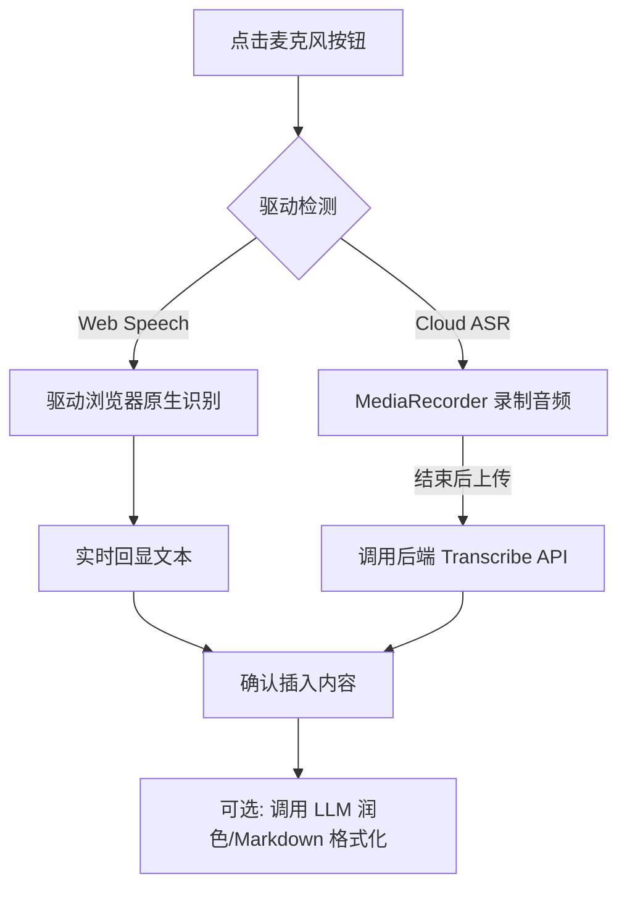

# 语音识别系统 (ASR System)

本文档定义了墨梅博客中语音转文字 (Automatic Speech Recognition, ASR) 功能的实现方案，旨在提升移动端与碎片化场景下的文章创作效率。

## 1. 核心模式

系统支持三种识别驱动，满足不同场景下的性能与成本平衡：

| 驱动 | 模式 | 特点 | 状态 |
| :--- | :--- | :--- | :--- |
| **Web Speech API** | 实时 (Streaming) | 浏览器原生，零开销。 | **默认开启** |
| **SiliconFlow** | 批量 (Batch) | OpenAI 兼容接口，高精度全文转录。 | **已实现** |
| **Volcengine** | 实时 (Streaming) | 豆包 2.0 模型，极低延迟，写作优化。 | **已接入** |

## 2. 系统架构

### 2.1 驱动接入抽象层
通过 Composable `use-post-editor-voice.ts` 隐藏底层驱动差异：
- **一致性输出**: 无论哪种模型，最终均输出格式化的识别文本。
- **环境嗅探**: 自动检测浏览器支持度及后端 API Key 配置状态（如无 Key 则隐藏云端选项）。

### 2.2 后端转发代理 (Cloud Proxy)
为保护 API Key 并不绕过跨域限制，所有云端请求由 Nitro 服务器转发：
- `POST /api/ai/asr/transcribe`: 接收音频 Blob，在内存中直接转发至 AI 厂商，避免 OSS 中转延时。

## 3. 混合识别工作流 (Workflow)

## 4. 数据库设计 (AI Task)
所有的 ASR 离线任务通过 `AITask` 表进行追踪，类型标记为 `transcription`。
- 记录内容：用户 ID、驱动商、模型、音频时长、识别出的文本文本、实际生成的成本。

## 5. 限制与优化
- **文件限额**: 默认限制单次转录音频大小为 25MB。
- **降噪优化**: 前端在采集音频时默认开启 `noiseSuppression` 与 `echoCancellation`。

## 6. Volcengine 配置约定

- 当 `ASR_PROVIDER=volcengine` 时，凭据统一使用 `VOLCENGINE_APP_ID` 与 `VOLCENGINE_ACCESS_KEY`（可选 `VOLCENGINE_SECRET_KEY`）。
- ASR 专属参数通过 `ASR_MODEL`（资源 ID）与 `ASR_ENDPOINT` 控制，不再推荐维护单独的 `ASR_VOLCENGINE_*` 凭据。
