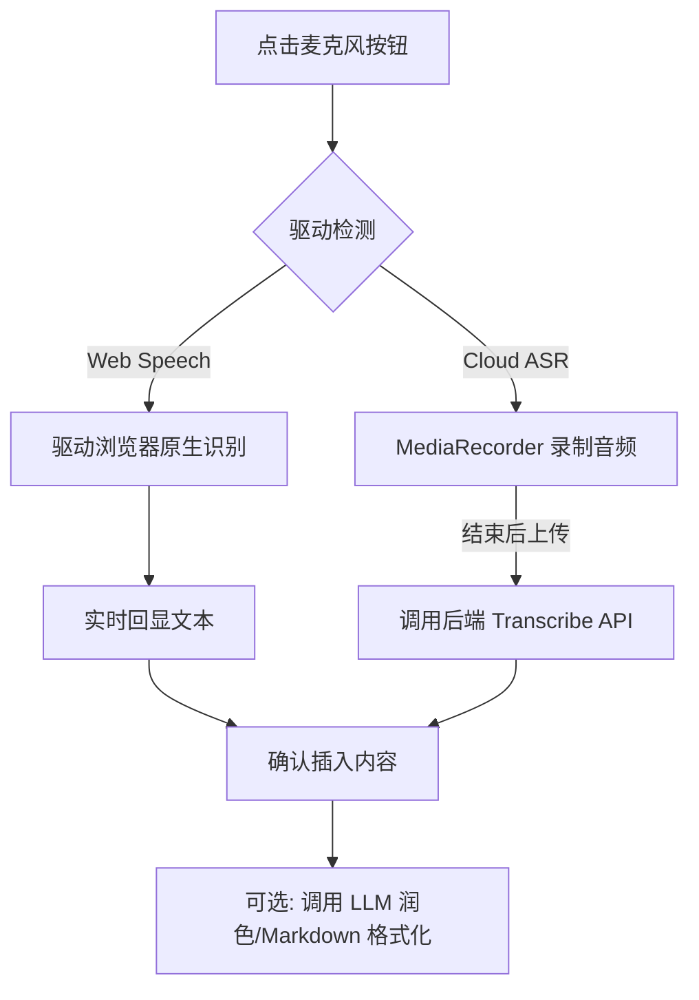

# 语音识别系统 (ASR System)

本文档定义了墨梅博客中语音转文字 (Automatic Speech Recognition, ASR) 功能的实现方案，旨在提升移动端与碎片化场景下的文章创作效率。

## 1. 核心模式

系统支持三种识别驱动，满足不同场景下的性能与成本平衡：

| 驱动 | 模式 | 特点 | 状态 |
| :--- | :--- | :--- | :--- |
| **Web Speech API** | 实时 (Streaming) | 浏览器原生，零开销。 | **默认开启** |
| **SiliconFlow** | 批量 (Batch) | OpenAI 兼容接口，高精度全文转录。 | **已实现** |
| **Volcengine** | 实时 (Streaming) | 豆包 2.0 模型，极低延迟，写作优化。 | **已接入** |

## 2. 系统架构

### 2.1 驱动接入抽象层
通过 Composable `use-post-editor-voice.ts` 隐藏底层驱动差异：
- **一致性输出**: 无论哪种模型，最终均输出格式化的识别文本。
- **环境嗅探**: 自动检测浏览器支持度及后端 API Key 配置状态（如无 Key 则隐藏云端选项）。

### 2.2 后端转发代理 (Cloud Proxy)
为保护 API Key 并不绕过跨域限制，所有云端请求由 Nitro 服务器转发：
- `POST /api/ai/asr/transcribe`: 接收音频 Blob，在内存中直接转发至 AI 厂商，避免 OSS 中转延时。

## 3. 混合识别工作流 (Workflow)


```mermaid
graph TD
    A[点击麦克风按钮] --> B{驱动检测}
    B -- Web Speech --> C[驱动浏览器原生识别]
    B -- Cloud ASR --> D[MediaRecorder 录制音频]
    C --> E[实时回显文本]
    D -- 结束后上传 --> F[调用后端 Transcribe API]
    E --> G[确认插入内容]
    F --> G
    G --> H[可选: 调用 LLM 润色/Markdown 格式化]
```

## 4. 数据库设计 (AI Task)
所有的 ASR 离线任务通过 `AITask` 表进行追踪，类型标记为 `transcription`。
- 记录内容：用户 ID、驱动商、模型、音频时长、识别出的文本文本、实际生成的成本。

## 5. 限制与优化
- **文件限额**: 默认限制单次转录音频大小为 25MB。
- **降噪优化**: 前端在采集音频时默认开启 `noiseSuppression` 与 `echoCancellation`。

## 6. 前端直连架构 (Direct Connection)

为提升 ASR 性能，降低延迟和服务器带宽消耗，支持前端直连 AI 厂商模式。

### 6.1 架构对比

```
传统代理模式:
前端 → 后端 API → AI 厂商 (延迟高，占用服务器带宽)

直连模式:
前端 → 凭证 API (获取临时签名) → 前端直连 AI 厂商 (低延迟，无服务器中转)
```

### 6.2 安全机制

- **临时凭证**: 通过 `/api/ai/asr/credentials` 获取临时签名凭证
- **有效期**: 凭证 5 分钟有效期，过期需重新获取
- **火山引擎直连**: 服务端使用 `appid + access token` 换取临时 JWT，前端不再接触永久 Access Key
- **临时身份**: 前端直连会话统一使用服务端签发的临时 `uid`，避免暴露站内永久用户标识
- **权限控制**: 仅 Admin 和 Author 角色可获取凭证

### 6.3 支持的直连模式

| 厂商 | 模式 | 直连方式 |
|-----|------|---------|
| SiliconFlow | Batch | HTTP REST (Bearer Token) |
| Volcengine | Stream | WebSocket (Query JWT) |

### 6.4 相关文件

| 文件路径 | 说明 |
|---------|------|
| `types/asr.ts` | ASR 类型定义 |
| `server/utils/ai/asr-credentials.ts` | 凭证生成工具 |
| `server/api/ai/asr/credentials.post.ts` | 凭证颁发 API |
| `composables/use-asr-direct.ts` | 前端直连 Composable |

## 7. 音频压缩优化

为减少传输数据量，前端支持音频压缩策略：

### 7.1 压缩策略

| 策略 | 说明 | 适用场景 |
|-----|------|---------|
| Opus/WebM | 浏览器内置，高压缩比 | 优先使用 |
| PCM 16kHz | ASR 最佳采样率，单声道 | 降级方案 |
| WASM Opus | 可选增强 | 需要更高压缩比时 |

### 7.2 相关文件

| 文件路径 | 说明 |
|---------|------|
| `utils/audio-compression.ts` | 音频压缩工具 |

## 8. 异步任务支持

针对大文件 ASR 任务，支持异步处理和状态追踪：

### 8.1 任务流程

1. 前端上传音频文件
2. 后端创建异步任务，返回任务 ID
3. 前端通过轮询或 SSE 追踪任务状态
4. 任务完成后推送通知

### 8.2 状态追踪

- **轮询模式**: 5 秒间隔查询任务状态
- **SSE 模式**: 实时推送任务状态更新 (优先)

### 8.3 相关文件

| 文件路径 | 说明 |
|---------|------|
| `composables/use-asr-task.ts` | 任务追踪 Composable |
| `server/services/ai/asr.ts` | ASR 服务 (含异步任务方法) |

## 9. 配额与成本治理策略

- 当前策略：部署者、作者与管理员默认视为可信用户，不额外施加独立 ASR 额度限制。
- 当前防护：保留请求频率限制、单次音频大小限制以及厂商接口自身的时长约束，避免异常消耗。
- 数据归集：ASR 用量统计统一沉淀到 `AITask`，用于后台审计、成本观测与后续分析。
- 后续演进：若未来进入多用户、多租户或开放投稿场景，再基于角色、用户组或站点套餐引入 AI/ASR 配额治理。

## 10. Volcengine 配置约定

- 当 `ASR_PROVIDER=volcengine` 时，凭据统一使用 `VOLCENGINE_APP_ID` 与 `VOLCENGINE_ACCESS_KEY`（可选 `VOLCENGINE_SECRET_KEY`）。
- ASR 专属参数通过 `ASR_MODEL`（资源 ID）与 `ASR_ENDPOINT` 控制，不再推荐维护单独的 `ASR_VOLCENGINE_*` 凭据。
