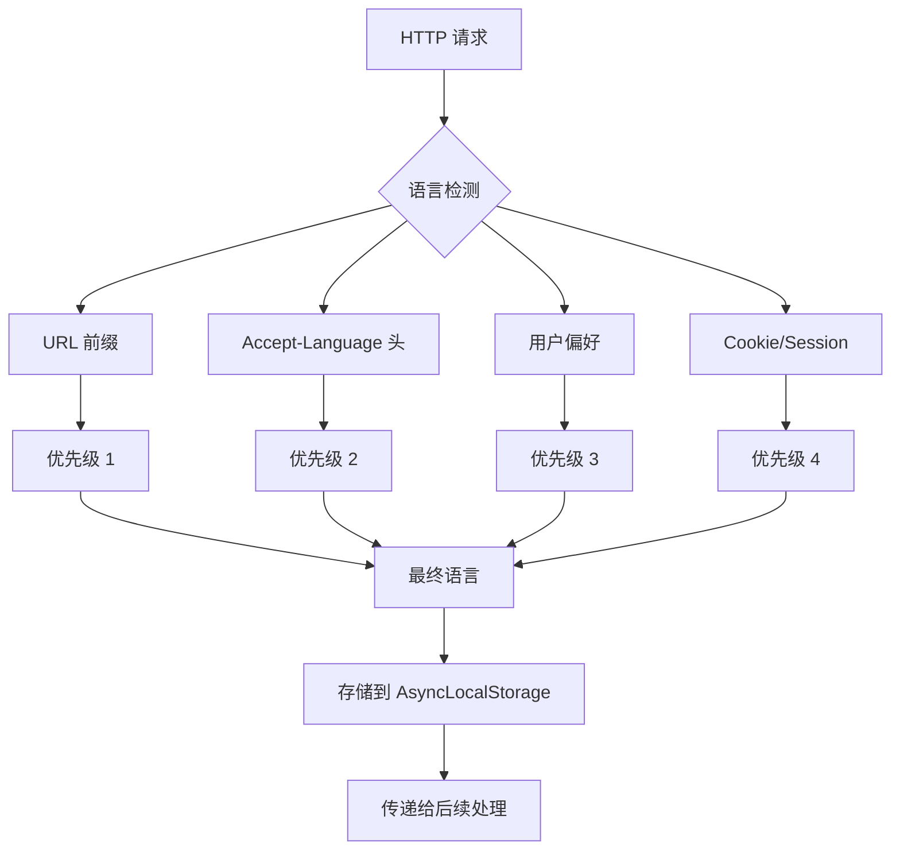

# 后端统一 i18n 机制设计文档 (Backend i18n Integration)

本文档定义了墨梅博客后端统一国际化机制的实现方案。该功能旨在通过 Nitro 钩子实现请求级的语言识别，并确保邮件模板、RSS 摘要及错误码反馈实现全自动关联翻译。

## 1. 核心目标

- **请求级语言识别**: 通过 Nitro 钩子自动识别用户语言偏好
- **服务端翻译能力**: 后端服务可直接调用翻译函数获取多语言文本
- **模板国际化**: 邮件模板、RSS Feed 等动态内容支持多语言
- **错误信息国际化**: API 错误消息根据请求语言自动翻译
- **一致性翻译键值**: 前后端共享相同的翻译键值，确保一致性

## 2. 技术方案

### 2.1 语言检测策略



### 2.2 Nitro 钩子实现

```typescript
// server/middleware/i18n.ts
import { defineEventHandler } from 'h3'
import { detectUserLocale, toProjectLocale } from '../utils/locale'
import { AsyncLocalStorage } from 'node:async_hooks'

// 定义全局存储
export const i18nStorage = new AsyncLocalStorage<string>()

export default defineEventHandler((event) => {
    // 设置请求上下文中的语言
    const detectedLocale = detectUserLocale(event)
    const locale = toProjectLocale(detectedLocale)
    
    event.context.locale = locale

    // 存储到 AsyncLocalStorage 供后续使用（支持异步深度调用不传递 event）
    // 注意：在 Nitro 中，AsyncLocalStorage.run 是最佳实践
    return i18nStorage.run(locale, () => {
        // 继续执行后续处理器
    })
})
```

### 2.3 服务端翻译工具

```typescript
// server/utils/i18n.ts
import type { H3Event } from 'h3'

interface TranslationFunction {
    (key: string, params?: Record<string, any>): string
}

interface I18nContext {
    locale: string
    t: TranslationFunction
}

/**
 * 获取当前请求上下文的翻译函数
 */
export async function getI18n(): Promise<I18nContext> {
    const locale = i18nStorage.getStore() || 'zh-CN'
    const messages = await loadLocaleMessages(locale)

    return {
        locale,
        t: (key: string, params?: Record<string, any>) => {
            let template = getNestedValue(messages, key) || key

            // 替换参数
            if (params) {
                Object.entries(params).forEach(([param, value]) => {
                    template = template.replace(`{{${param}}}`, String(value))
                })
            }

            return template
        },
    }
}

/**
 * 获取嵌套对象的值
 */
function getNestedValue(obj: any, path: string): string | null {
    return path.split('.').reduce((current, key) => {
        return current?.[key]
    }, obj)
}

/**
 * 加载语言文件（服务端版本）
 */
async function loadLocaleMessages(locale: string): Promise<Record<string, any>> {
    // 可以直接从 i18n/locales 目录读取
    const messages = await import(`../../i18n/locales/${locale}.json`)
    return messages.default || messages
}

/**
 * 简化的快捷方法
 */
export async function t(key: string, params?: Record<string, any>): Promise<string> {
    const { t: translate } = await getI18n()
    return translate(key, params)
}

/**
 * 带语言参数的响应
 */
export interface LocalizedResponse<T = any> {
    data: T
    message: string
    locale: string
}

export async function localizedResponse<T>(
    data: T,
    messageKey: string,
    params?: Record<string, any>
): Promise<LocalizedResponse<T>> {
    const { locale, t } = await getI18n()

    return {
        data,
        message: t(messageKey, params),
        locale,
    }
}
```

## 3. 邮件模板国际化

### 3.1 邮件模板结构

```
server/templates/emails/
├── layouts/
│   └── default.html          # 基础布局
├── partials/
│   ├── header.html            # 头部
│   ├── footer.html            # 底部
│   └── button.html           # 按钮组件
└── locales/
    ├── zh-CN/
    │   ├── welcome.html
    │   ├── comment-reply.html
    │   └── marketing.html
    └── en-US/
        ├── welcome.html
        ├── comment-reply.html
        └── marketing.html
```

### 3.2 邮件渲染服务

```typescript
// server/services/email.ts
import { getI18n } from '../utils/i18n'
import { readFileSync } from 'fs'
import { join } from 'path'
import { compile } from 'handlebars'

export interface EmailTemplate {
    subject: string
    html: string
    text: string
}

export class EmailService {
    /**
     * 渲染邮件模板（自动根据语言选择）
     */
    async renderTemplate(
        templateName: string,
        data: Record<string, any>
    ): Promise<EmailTemplate> {
        const { locale, t } = await getI18n()

        // 加载模板文件
        const templatePath = join(process.cwd(), 'server/templates/emails', locale, `${templateName}.html`)
        const templateContent = readFileSync(templatePath, 'utf-8')

        // 编译模板
        const template = compile(templateContent)

        // 合并数据与翻译函数
        const html = template({
            ...data,
            __: t,
            locale,
        })

        // 提取主题（从 HTML 注释或元数据）
        const subject = this.extractSubject(html) || t(`email.${templateName}.subject`, data)

        return {
            subject,
            html,
            text: this.htmlToText(html),
        }
    }

    private extractSubject(html: string): string | null {
        const match = html.match(/<!-- subject: (.+? -->/)
        return match ? match[1].trim() : null
    }

    private htmlToText(html: string): string {
        // 简单的 HTML 转文本转换
        return html
            .replace(/<style[^>]*>.*?<\/style>/gi, '')
            .replace(/<script[^>]*>.*?<\/script>/gi, '')
            .replace(/<[^>]+>/g, ' ')
            .replace(/\s+/g, ' ')
            .trim()
    }
}
```

### 3.3 模板示例

```html
<!-- server/templates/emails/locales/zh-CN/comment-reply.html -->
<!-- subject: {{postTitle}} 有新评论 --><!--
--><!DOCTYPE html>
<html>
<head>
    <meta charset="UTF-8">
    <style>
        /* 邮件样式 */
    </style>
</head>
<body>
    {{> layouts/default}}

    <div class="email-content">
        <h1>{{__ 'email.commentReply.title'}}</h1>

        <p>{{__ 'email.commentReply.greeting' name=authorName}}</p>

        <blockquote>{{commentContent}}</blockquote>

        <p>{{__ 'email.commentReply.cta'}}</p>

        {{> partials/button href=postUrl label="查看评论"}}
    </div>

    {{> partials/footer}}
</body>
</html>
```

## 4. RSS Feed 国际化

### 4.1 Feed 生成服务

```typescript
// server/services/feed.ts
import { getI18n } from '../utils/i18n'
import { Feed } from 'feed'

export class FeedService {
    async generateRSS(
        type: 'blog' | 'podcast',
        options?: {
            locale?: string
            category?: string
            tag?: string
        }
    ): Promise<string> {
        const { locale, t } = await getI18n()

        const feed = new Feed({
            title: t('feed.title'),
            description: t('feed.description'),
            id: baseUrl,
            link: baseUrl,
            language: locale,
            image: {
                title: t('feed.title'),
                url: siteLogo,
            },
            copyright: t('feed.copyright'),
            updated: new Date(),
        })

        // 添加文章
        const posts = await this.fetchPosts({ locale, ...options })

        for (const post of posts) {
            feed.addItem({
                title: post.title,
                description: post.summary || post.content.slice(0, 200),
                url: `${baseUrl}/post/${post.slug}`,
                date: post.publishedAt!,
                author: {
                    name: post.author.name,
                    link: `${baseUrl}/author/${post.author.username}`,
                },
                category: post.category?.name ? [post.category.name] : undefined,
                // 播客音频支持
                enclosure: post.audioUrl ? {
                    url: post.audioUrl,
                    length: post.audioSize || 0,
                    type: post.audioMimeType || 'audio/mpeg',
                } : undefined,
            })
        }

        return feed.render('rss-2.0')
    }
}
```

### 4.2 翻译键值定义

```json
// locales/zh-CN.json
{
    "feed": {
        "title": "墨梅博客",
        "description": "AI 驱动、原生国际化的开发者博客平台",
        "copyright": "© 2024 墨梅博客. 保留所有权利。"
    }
}

// locales/en-US.json
{
    "feed": {
        "title": "Momei Blog",
        "description": "AI-driven, natively internationalized developer blog platform",
        "copyright": "© 2024 Momei Blog. All rights reserved."
    }
}
```

## 5. API 错误信息国际化

### 5.1 统一错误响应

```typescript
// server/utils/error-handler.ts
import { getI18n, localizedResponse } from './i18n'
import type { H3Event } from 'h3'

export class APIError extends Error {
    constructor(
        public key: string,
        public statusCode: number = 400,
        public params?: Record<string, any>
    ) {
        super(key)
    }
}

export async function handleAPIError(
    error: Error,
    event: H3Event
): Promise<Response> {
    const { locale } = await getI18n()

    let statusCode = 500
    let messageKey = 'error.internal'
    let params: Record<string, any> = {}

    if (error instanceof APIError) {
        statusCode = error.statusCode
        messageKey = error.key
        params = error.params || {}
    } else {
        logger.error('Unhandled API error:', error)
    }

    const response = await localizedResponse(null, messageKey, params)
    response.locale = locale

    event.node.res.statusCode = statusCode
    return response
}

// 常用错误定义
export const Errors = {
    UNAUTHORIZED: new APIError('error.unauthorized', 401),
    FORBIDDEN: new APIError('error.forbidden', 403),
    NOT_FOUND: (resource: string) => new APIError('error.notFound', 404, { resource }),
    VALIDATION_FAILED: (field: string) => new APIError('error.validation', 400, { field }),
    RATE_LIMITED: new APIError('error.rateLimited', 429),
}
```

### 5.2 使用示例

```typescript
// server/api/posts/[id].get.ts
export default defineEventHandler(async (event) => {
    const id = getRouterParam(event, 'id')
    const post = await postRepo.findOne({ where: { id } })

    if (!post) {
        throw Errors.NOT_FOUND('post')
    }

    return {
        code: 0,
        data: post,
    }
})
```

## 6. 前后端翻译同步

### 6.1 共享翻译键值

前端 `locales/` 目录和服务端 `locales/` 目录应共享相同的翻译键值结构：

```typescript
// scripts/sync-i18n.ts
import { readFileSync, writeFileSync } from 'fs'
import { join } from 'path'

const FRONTEND_LOCALES = ['zh-CN', 'en-US']
const SHARED_NAMESPACES = [
    'common',
    'validation',
    'error',
    'feed',
    'email',
]

function syncSharedKeys() {
    for (const locale of FRONTEND_LOCALES) {
        const frontendPath = join(process.cwd(), 'locales', `${locale}.json`)
        const backendPath = join(process.cwd(), 'server/locales', `${locale}.json`)

        const frontend = JSON.parse(readFileSync(frontendPath, 'utf-8'))
        const backend = JSON.parse(readFileSync(backendPath, 'utf-8'))

        // 合并共享命名空间
        for (const ns of SHARED_NAMESPACES) {
            if (frontend[ns] && !backend[ns]) {
                backend[ns] = frontend[ns]
            } else if (backend[ns] && !frontend[ns]) {
                frontend[ns] = backend[ns]
            }
        }

        // 写回文件
        writeFileSync(backendPath, JSON.stringify(backend, null, 2))
        writeFileSync(frontendPath, JSON.stringify(frontend, null, 2))
    }
}
```

### 6.2 类型安全

```typescript
// types/i18n.ts
export type TranslationKeys =
    // Common
    | 'common.save'
    | 'common.cancel'
    | 'common.confirm'
    // Errors
    | 'error.unauthorized'
    | 'error.forbidden'
    | 'error.notFound'
    // ... 其他键值

export type TranslationParams<T extends TranslationKeys> = T extends
    | `error.notFound`
        ? { resource: string }
    : Record<string, any>

declare module 'vue-i18n' {
    export interface DefineLocaleMessage {
        [key: string]: any
    }
}
```

## 7. 环境变量配置

```env
# i18n 配置
I18N_DEFAULT_LOCALE=zh-CN
I18N_SUPPORTED_LOCALES=zh-CN,en-US
I18N_COOKIE_NAME=locale
I18N_QUERY_PARAM=lang
```

## 8. 实现路线图

### Phase 1: 核心机制
- [ ] 实现语言检测钜子
- [ ] 实现服务端翻译工具
- [ ] 添加 AsyncLocalStorage 集成

### Phase 2: 内容国际化
- [ ] 邮件模板国际化
- [ ] RSS Feed 国际化
- [ ] 错误信息国际化

### Phase 3: 工具与优化
- [ ] 前后端翻译同步脚本
- [ ] 翻译键值类型定义
- [ ] 翻译覆盖率检测

### Phase 4: 高级特性
- [ ] 动态加载语言文件
- [ ] 翻译缓存机制
- [ ] 翻译缺失降级处理
