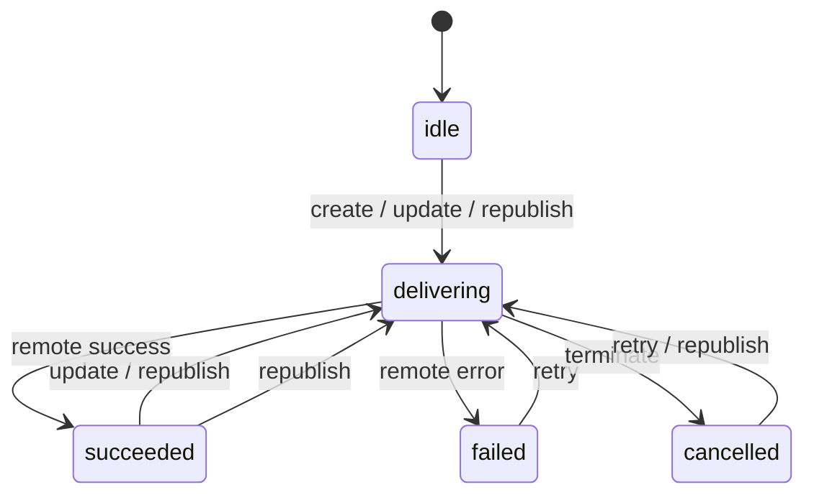

# 第三方分发解耦与投递控制设计文档

## 1. 概述

本文档定义第十一阶段“第三方分发解耦与投递控制”的最小可交付方案，目标是在不引入新数据表的前提下，为文章分发建立统一的状态机、手动投递入口、失败重试与审计时间线。

本轮仅覆盖两个既有集成：

- Memos：服务端直连、可维护远端主副本。
- WechatSync：浏览器插件驱动、由前端执行投递，但状态与结果回写到站内。

## 2. 设计目标

### 2.1 核心目标

- 将“文章发布”与“第三方分发”拆开，发布后不再自动触发 Memos 同步。
- 为 Memos 与 WechatSync 建立统一的分发抽象、状态模型与审计时间线。
- 在后台提供显式的手动同步、重试、状态查看和人工终止入口。
- 对已同步内容提供“更新原内容”与“重推新内容”二选一控制。

### 2.2 非目标

- 不新增独立的 `post_distribution` 数据表。
- 不在本轮引入新的第三方平台。
- 不让 WechatSync 脱离浏览器插件独立运行。

## 3. 当前问题

### 3.1 发布副作用耦合

- 现有 `server/services/post-publish.ts` 会在发布时根据 `syncToMemos` 立即同步到 Memos。
- 该行为无法在发布后独立重试、切换“更新原内容 / 重推新内容”策略，也没有统一的失败审计面板。

### 3.2 多渠道状态碎片化

- Memos 仅在 `metadata.integration.memosId` 中保存远端 ID，没有完整状态机和时间线。
- WechatSync 完全停留在前端插件调用态，站内无法记录最近一次结果、失败原因与人工终止。

## 4. 统一抽象

### 4.1 渠道定义

- `memos`：服务端托管型渠道，支持创建、更新、重推、失败重试。
- `wechatsync`：客户端协同型渠道，支持创建投递任务、记录完成结果、失败重试与人工终止。

### 4.2 操作定义

- `create`：首次同步，还没有远端主副本。
- `update`：更新已存在的远端主副本。
- `republish`：不覆盖既有远端内容，重新创建一个新副本。
- `retry`：针对失败状态重试，沿用显式指定或最近一次模式。
- `terminate`：人工终止当前仍处于进行中的手动分发任务。

### 4.3 同步模式

- `update-existing`：更新原内容。
- `republish-new`：重推新内容。

## 5. 状态机

### 5.1 通用状态

- `idle`：未开始或已清空临时活动态。
- `delivering`：正在投递。
- `succeeded`：最近一次投递成功。
- `failed`：最近一次投递失败。
- `cancelled`：最近一次投递被人工终止。

### 5.2 状态转换



### 5.3 渠道边界

- Memos：
  - `update-existing` 依赖已记录的 `memosId`。
  - 如果远端返回不存在，则标记为 `remote_missing`，由用户选择重试为 `republish-new`。
- WechatSync：
  - 由于插件侧不提供稳定的远端资源标识，本轮只保证“操作模式、最近一次结果、账户级错误摘要、人工终止”可追踪。
  - “更新原内容 / 重推新内容”作为用户明确意图与审计字段保存；实际是否覆盖远端草稿由插件/平台能力决定。

## 6. 数据模型

### 6.1 存储位置

- 统一落在 `Post.metadata.integration.distribution`。
- 继续兼容既有 `metadata.integration.memosId`，作为 Memos 当前主副本的快捷字段。

### 6.2 结构摘要

```typescript
interface PostDistributionMetadata {
  channels?: {
    memos?: PostDistributionChannelState
    wechatsync?: PostDistributionChannelState
  }
  timeline?: PostDistributionTimelineEntry[]
}
```

### 6.3 渠道状态字段

- `status`：最近一次状态。
- `remoteId` / `remoteUrl`：远端主副本标识，仅对具备稳定远端资源标识的渠道强制要求。
- `lastMode` / `lastAction`：最近一次操作口径。
- `lastAttemptId` / `activeAttemptId`：用于并发保护与回写。
- `lastSuccessAt` / `lastFailureAt` / `lastFinishedAt`：最近一次结果时间。
- `lastFailureReason` / `lastMessage`：最近一次失败分类与可展示说明。
- `retryCount`：累计重试次数。

### 6.4 时间线字段

- `id`：站内尝试 ID。
- `channel` / `action` / `mode` / `status`。
- `triggeredBy`：`manual` / `retry` / `system`。
- `operatorId`：操作人。
- `startedAt` / `finishedAt`。
- `failureReason`：统一失败分类。
- `message`：简短审计说明。
- `details`：渠道级附加信息，例如 WechatSync 账户结果。

## 7. 失败分类

为便于后台提示与后续处理建议，失败原因统一归一为：

- `auth_failed`
- `rate_limited`
- `network_error`
- `content_validation_failed`
- `remote_missing`
- `manual_terminated`
- `unknown`

## 8. 服务边界

### 8.1 Memos

- 由服务端直接执行。
- 首次同步使用 `createMemo`。
- 更新原内容优先调用 `updateMemo`。
- 重推新内容始终新建远端 Memo，并把新的远端标识回写为当前主副本。

### 8.2 WechatSync

- 服务端负责创建尝试记录、状态机流转、人工终止与最终结果入库。
- 前端负责检测插件、选择账户、发起实际 `window.$syncer.addTask()` 调用，并在完成后把账户级结果回写到服务端。

## 9. API 设计

### 9.1 查询分发状态

- `GET /api/admin/posts/:id/distribution`
- 返回渠道状态摘要与最近时间线。

### 9.2 发起手动分发

- `POST /api/admin/posts/:id/distribution`
- 入参包含：`channel`、`mode`、`operation`。
- `memos` 会直接执行并返回结果。
- `wechatsync` 会先创建站内尝试记录，再由前端拉起插件执行。

### 9.3 回写 WechatSync 结果

- `POST /api/admin/posts/:id/distribution/wechatsync-complete`
- 由前端在插件任务结束后提交账户级结果摘要，用于补齐最终状态与时间线。

## 10. 管理端交互

### 10.1 入口

- 文章编辑页提供统一“分发管理”按钮。
- 文章列表提供显式入口，跳转到编辑页并自动打开分发面板。

### 10.2 面板内容

- 渠道摘要：最近状态、最近时间、失败原因、远端链接。
- 操作区域：首次同步、更新原内容、重推新内容、失败重试、人工终止。
- 审计区域：展示最近时间线，避免只剩原始错误日志。

## 11. 测试计划

### 11.1 服务端

- 分发服务单元测试。
- Memos 更新/重推/失败分类测试。
- WechatSync 完成回写与人工终止测试。

### 11.2 API

- 查询状态。
- 发起手动同步。
- 失败重试。
- 并发点击保护。

### 11.3 管理端

- 分发面板模式切换。
- WechatSync 账户选择与结果回写。
- 最近状态与时间线展示。

## 12. 落地结论

- 本轮以 `metadata.integration.distribution` 完成最小统一抽象。
- 发布流程保留营销推送等既有副作用，但不再自动触发 Memos 同步。
- Memos 与 WechatSync 在一个面板中统一查看状态、执行手动同步与重试，同时保留各自实现边界。
