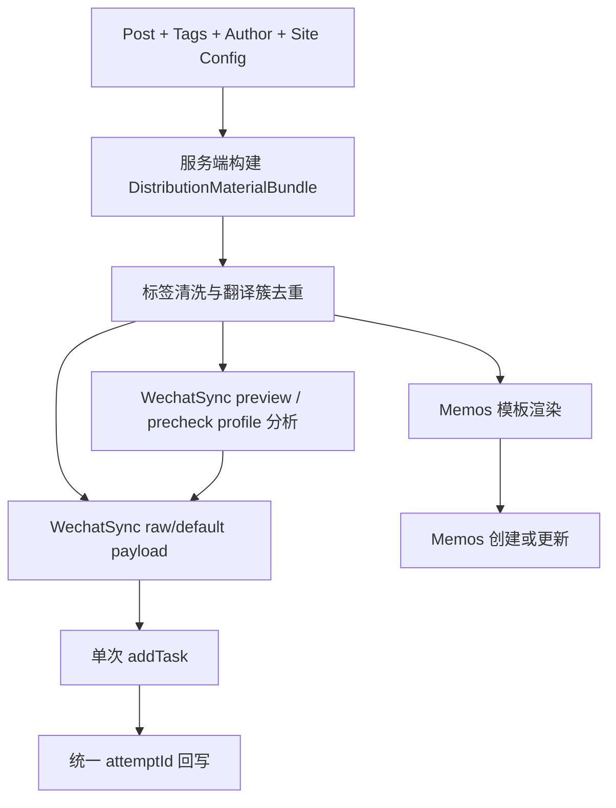

# 渠道分发模板与标签适配方案

> 定位：本文是 [第三方分发解耦与投递控制设计文档](./content-distribution-governance.md) 的第十三阶段增量方案，聚焦“渠道分发内容模板与标签适配”的实现收口与回归边界，不再承担当前 Todo 入口职责。

> 2026-04-16 调研补充：当前仓库早先落地的“WechatSync 账户按 profile 分批、多次调用 `addTask()`”在真实联调中暴露了兼容风险。官方旧版 compat 层更接近“单次 `addTask()` + 原始 article + 扩展内部 per-platform preprocess”；因此当前运行时桥接已切换到“单次 `addTask()` + raw/default payload”最小实验路径，页面侧 profile 分析只保留在 preview / precheck，不再作为实际分批投递契约。

## 1. 调研结论

### 1.1 当前实现现状

- Memos 内容目前由 `server/services/post-distribution.ts` 内部的 `buildMemoContent()` 直接拼接，结构只有标题、纯文本摘要、阅读全文链接与版权尾注，尚未把封面和标签纳入模板层。
- WechatSync 内容目前由 `components/admin/posts/post-distribution-button.vue` 内部的 `buildWechatSyncPost()` 在前端生成，输出 `markdown`、`content`、`desc`、`thumb` 四段通用字段，但没有渠道级模板分层，也没有标签格式差异化处理。
- WechatSync 插件的 `addTask()` 当前接收的是“单份文章内容 + 多个账户”，这意味着如果 B 站、微博和小红书同时勾选，现状无法给不同平台发送不同标签策略。
- 现有分发状态机、时间线、失败分类和回写端点已经在 [content-distribution-governance.md](./content-distribution-governance.md) 中收敛完成，本轮方案不能破坏 `attemptId`、手动重试、人工终止和审计时间线。
- 标签翻译簇当前已明确要求按 `translationId -> slug -> id` 收口，见 [taxonomy.md](./taxonomy.md) 第 6 节；因此分发场景不能再按“标签显示名字符串”直接导出，否则会把同簇标签重复输出到渠道正文中。

### 1.2 根因判断

当前问题的根因不是“缺少某一个渠道模板”，而是缺少一层可复用的“分发素材结构层”：

- Memos 在服务端自行拼接摘要式内容。
- WechatSync 在前端自行拼接全文式内容。
- 标签尚未经过统一清洗、去重、格式化和平台映射。

结果就是：正文、摘要、封面、标签、版权尾注五类素材分散在不同位置，各渠道只能各自拼字符串，难以做到可测试、可回归、可演进。

## 2. 方案目标

本轮只落一套方案，不并行维护多种模板体系。

- 建立单一的“分发素材结构层”，先把文章拆成结构化素材，再由各渠道模板渲染。
- 保持现有 `memos` 与 `wechatsync` 渠道状态机、重试、回写和审计链路不变。
- 统一标签清洗、翻译簇去重、长度限制和非法字符处理规则。
- 支持 `#标签` 与 `#标签#` 两种格式，并允许 WechatSync 按目标平台差异化输出。
- 不新增独立数据表；分发仍然沿用现有 `Post.metadata.integration.distribution`。

## 3. 单一方案总览

### 3.1 方案摘要

采用“服务端生成结构化素材包 + 渠道模板渲染”为核心方案；WechatSync 当前仍保留账户分组投递实现，但 2026-04-16 起不再把该分组模型视为长期稳定契约。

- 服务端负责生成唯一事实源 `DistributionMaterialBundle`。
- Memos 直接消费服务端渲染后的最终 Markdown 内容。
- 当前仓库的 WechatSync 运行时桥接已切换为“单次 `addTask()` + raw/default payload”最小实验路径；页面侧仍保留 profile 预览与预检能力，用于说明不同平台的兼容风险，但不再按 profile 拆成多个运行时批次。
- 所有批次仍归属于同一个站内 `attemptId`，最终统一回写到账户级结果与时间线。

### 3.2 流程图



  > 兼容性说明（2026-04-16）：上图中的 WechatSync 运行时路径已经切换为“单次 `addTask()` + raw/default payload”实验模型；profile 仍用于预览与预检，但不再对应页面侧多次 `addTask()`。

## 4. 分发素材结构层

### 4.1 统一素材模型

```typescript
interface NormalizedDistributionTag {
    clusterKey: string
    rawName: string
    sanitizedName: string
}

interface DistributionMaterialBundle {
    canonical: {
        title: string
        url: string
        summaryPlain: string
        coverUrl: string | null
        bodyMarkdown: string
        bodyHtml: string
        bodyPlain: string
        copyrightMarkdown: string
        tags: NormalizedDistributionTag[]
    }
    channels: {
        memos: {
            content: string
        }
        wechatsync: {
            basePost: {
                title: string
                markdown: string
                content: string
                desc: string
                thumb: string
            }
            tagPlacement: 'before-copyright'
        }
    }
}
```

### 4.2 字段说明

- `canonical` 是唯一事实源，不直接面向外部平台。
- `summaryPlain` 只保留纯文本摘要，不混入标签和版权尾注。
- `bodyMarkdown` / `bodyHtml` / `bodyPlain` 表示正文主体，不包含平台标签尾注。
- `copyrightMarkdown` 单独生成，避免 Memos 与 WechatSync 各自重复拼版权逻辑。
- `tags` 是清洗后的标签令牌列表，不直接带 `#`，由渠道模板决定最终格式。

## 5. 渠道模板策略

### 5.1 Memos 模板

Memos 继续由服务端直连，但内容从“临时字符串拼接”升级为固定模板顺序：

1. 一级标题
2. 封面图（有则插入一次）
3. 纯文本摘要
4. 阅读全文链接
5. 标签尾注
6. 版权尾注

推荐模板：

```markdown
# {title}


{summaryPlain}

[阅读全文]({url})

{#标签 列表}

{copyrightMarkdown}
```

约束如下：

- Memos 不再复用“仅摘要 + 链接”的极简模板，而是显式拥有标题、封面、标签和版权的独立段位。
- Memos 的标签格式固定为 `#标签`，因为它本质上是站内直连渠道，不需要承担 WechatSync 的多平台分化。
- 若无封面，则省略封面段，不补空行占位。

### 5.2 WechatSync 基础模板

WechatSync 继续通过插件投递，但基础文章结构统一为：

- `title`: 文章标题
- `markdown`: 正文主体 Markdown + 标签段 + 版权尾注
- `content`: 上述 Markdown 渲染得到的 HTML
- `desc`: 纯文本摘要
- `thumb`: 封面图 URL

正文段位顺序固定为：

1. 正文主体
2. 标签尾注
3. 版权尾注

这样可以保证：

- `desc` 始终保持纯文本摘要，不被标签污染。
- `thumb` 只承担封面图职责，不需要从正文中反推首图。
- 版权尾注始终落在最后，和 Memos 保持一致的收口位置。

### 5.3 WechatSync 平台标签映射

WechatSync 并不是一个单一渠道，而是一组账号平台的投递入口。本轮仅处理下列已明确的平台标签格式：

| 平台类型 | 标签格式 | 说明 |
| :-- | :-- | :-- |
| `bilibili` | `#标签#` | 双井号包裹 |
| `weibo` | 不追加标签 | 微博专栏当前会报 `CODE:004`，因此禁用标签尾注 |
| `xiaohongshu` / `twitter` | `#标签` | 单前缀 |
| 其他平台 | 不追加标签 | 当前阶段暂不考虑 |

说明：

- 平台识别必须优先读取 WechatSync 账户的 `type`，只有缺失时才回退 `id`。这是现有插件兼容层的历史约束，不能回退成数组索引。
- 平台映射表只决定“标签如何渲染”，不改变基础正文和版权模板。

## 6. 标签清洗与翻译簇去重规则

### 6.1 标签来源

分发标签只允许来自文章当前已持久化的标签关系，不直接使用编辑器中未保存的临时输入。

服务层需要在加载文章时补齐标签关系，并尽可能拿到以下字段：

- `id`
- `name`
- `slug`
- `translationId`

### 6.2 去重口径

标签去重的唯一键为：

```text
translationId || slug || id
```

规则：

- 同一翻译簇只导出一次。
- 若同一篇文章意外绑定了同簇多个标签，优先保留当前文章语言下的标签名称；若仍无法区分，则按原标签顺序保留第一个。
- 不允许因为同簇多语言标签同时存在而在正文尾部出现 `#Nuxt #Nuxt中文` 这类重复输出。

### 6.3 清洗规则

标签在进入渠道模板前统一执行以下步骤：

1. 去掉首尾已有的 `#` 或全角 `＃`。
2. 去除换行、制表符和控制字符。
3. 将连续空白和连接符归一为单个 `-`。
4. 移除不适合出现在 hashtag 中的边界字符，例如引号、括号、尖括号、反引号、斜杠。
5. 去掉首尾多余的 `-`、`_`、`.`。
6. 清洗后为空则丢弃。

### 6.4 限制规则

- 单个标签清洗后最长保留 24 个字符；超出部分截断。
- 单篇文章默认最多导出 5 个标签，按文章已有标签顺序保留前 5 个有效项。

说明：

- 长度与数量限制只作用于“分发导出令牌”，不回写数据库，不修改原 taxonomy 数据。
- 这样可以避免正文尾注被超长标签或过多标签淹没，同时满足当前阶段“长度限制”和“非法字符处理”的验收口径。

### 6.5 格式化规则

在完成清洗后，再由渠道模板决定最终格式：

- `leading`: `#标签`
- `wrapped`: `#标签#`
- `none`: 不输出

## 7. WechatSync 运行时实验路径与兼容风险

### 7.1 为什么曾采用分组

- 旧版 `window.$syncer.addTask()` 的页面入参仍是“一个 `post` + 多个 `accounts`”。
- 当时为了给 B 站、微博和小红书输出不同的标签尾注格式，当前仓库先在页面侧引入 `wrapped / leading / none` 三种 profile，并把账户拆成多个批次分别调用 `addTask()`。
- 这种做法可以解释“为什么当前实现会分组”，但它只说明了项目侧需求，不代表官方扩展把“多次 `addTask()`”视为等价操作。

### 7.2 当前实现规则

- 前端在点击 WechatSync 投递时，运行时桥接不再按 profile 分组循环调用 `addTask()`，而是对当前选中的全部账户只调用一次 `addTask()`。
- 本次最小实验直接发送 `DistributionMaterialBundle.channels.wechatsync.basePost`，即 raw/default payload，不再在页面侧注入微博 / 小红书专属 sanitize，也不再运行时追加平台差异标签尾注。
- 页面侧仍保留 profile 预览与预检结果，用来提示兼容风险，但不再阻断实际 dispatch；联调观测则会记录 `dispatch_started / ready / status_received / resolved / start_failed / timeout_resolved` 等事件，并随 `/distribution/wechatsync-complete` 一并回写到站内 attempt timeline。

### 7.3 2026-04-16 调研修正

- 官方旧版 compat 层 `packages/extension/src/content/api.ts` 会在每次 `addTask()` 时重置全局 `currentSyncId` 与 `currentAccounts`，然后只转发一次 `SYNC_ARTICLE`；这意味着旧版页面侧的稳定契约更接近“一次人工同步对应一次 `addTask()`”。
- 官方 background `sync-service.ts` 会把同一份原始 `rawHtml` 交给扩展内部的 per-platform preprocess 流程，由各 adapter 的 `preprocessConfig` 生成 `platformContents`。页面侧先做微博 / 小红书专属 sanitize，再多次调用 `addTask()`，已经改变了官方的预处理责任边界。
- 因此，“按平台分组、多次 `addTask()`”现在只能被视为当前仓库的临时实现现状，不再是长期推荐方案，也不应继续当作后续功能扩写的稳定前提。

### 7.4 当前建议

- 当前最优先事项已经从“实现单次 `addTask()` 实验”切换为“对新桥接层做真实扩展联调”，验证它是否恢复与官方 SDK 更接近的运行期行为。
- 如果单次 `addTask()` 路径验证成立，页面侧 profile 分析应继续退回到 preview / precheck 辅助角色，而不是再回到运行时分批投递。
- 在真实联调结论出来之前，任何新增的平台 profile 或平台专属 payload 规则都应先视为风险扩写，而不是默认演进方向。

## 8. 实施落点

### 8.1 服务端

建议新增或重构以下文件：

- `server/services/post-distribution-template.ts`
  - 负责组装 `DistributionMaterialBundle`。
- `server/services/post-distribution.ts`
  - Memos 改为调用统一模板服务，而不是继续使用内嵌 `buildMemoContent()` 拼接。
  - 加载文章时补齐 `tags` 关系与翻译簇字段。
- `utils/shared/distribution-tags.ts`
  - 放置标签清洗、截断、格式化与平台 profile 映射的纯函数。

### 8.2 前端

- `components/admin/posts/post-distribution-button.vue`
  - 移除本地直拼完整 WechatSync 正文的逻辑。
  - 改为消费统一的基础模板结果。
  - 在调用插件前按 profile 对账户分组，并聚合多个 `addTask()` 的状态。

### 8.3 契约层

本轮不建议新增独立数据表；如需记录模板版本，可先写入时间线 `details.templateVersion`，不额外扩大持久化模型。

## 9. 测试计划

### 9.1 模板输出测试

- Memos 模板：覆盖标题层级、封面图插入、纯文本摘要、版权尾注。
- WechatSync 模板：覆盖全文 Markdown、HTML、摘要和封面字段的独立输出。

### 9.2 标签规则测试

- 空标签被丢弃。
- 重复标签按翻译簇去重。
- 超长标签被截断。
- 非法字符被清洗。
- `leading` / `wrapped` 两种格式输出正确。

### 9.3 WechatSync 分组测试

- 同时选择 B 站和微博时，需要拆成 `wrapped` 与 `none` 两个批次。
- 同时选择 B 站和小红书时，自动拆成两个批次。
- 多批次结果最终仍能回写到同一个 `attemptId`。
- 旧版仅返回 `type` 的账户对象仍能被正确识别和回写。

## 10. 风险与边界

- 本轮不新增新的第三方直连渠道，B 站、微博、小红书、Twitter 仍然只是 WechatSync 账户 profile，不升级为站内一等渠道。微博仅保留正文与版权同步，不再追加标签尾注。
- 其他未知平台默认不追加标签，避免误伤内容格式。
- 当前更高优先级的不是等待插件支持“每个账户单独 post payload”，而是验证是否应回退为“单次 `addTask()` + 原始内容交付”。如果这条实验路径成立，前端分组聚合将被降级为临时兼容层或直接删除。

## 11. 结论

本轮采用“服务端统一素材包 + 渠道模板渲染 + WechatSync 按平台分组投递”的单一方案，可以同时解决以下问题：

- Memos 与 WechatSync 不再各自维护一套字符串拼接逻辑。
- 标签清洗、翻译簇去重和格式化规则有唯一事实源。
- 模板输出具备明确的可测试边界，能够覆盖标题、图片、摘要、版权尾注与标签差异。
- 当前仓库的 WechatSync 运行时桥接已切换到“单次 `addTask()` + raw/default payload”实验路径，页面侧 profile 只保留在 preview / precheck 辅助层。
- 下一轮收口重点已经从代码结构调整转为真实扩展联调确认，而不是继续追加项目侧平台 sanitize。
