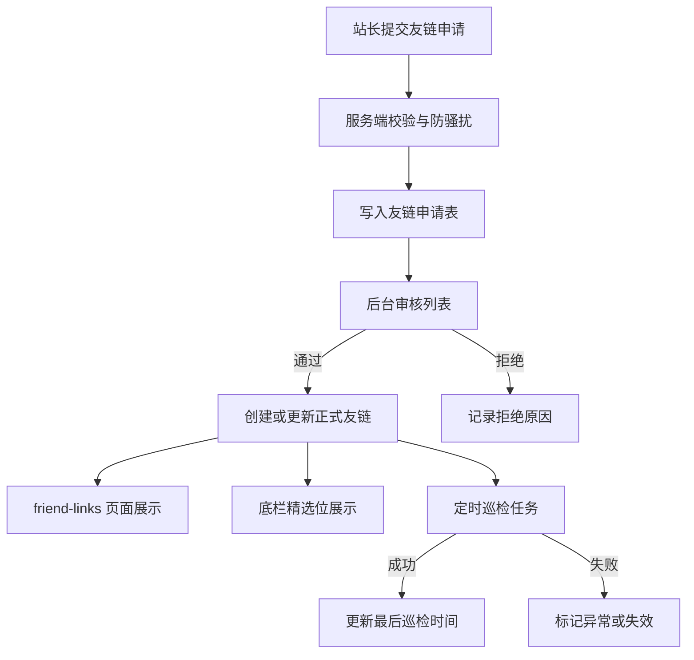

# 友链系统 (Friend Links System)

## 1. 概述 (Overview)

友链系统用于为站点提供公开展示、站长自助申请、后台审核与定时可用性巡检能力，形成“申请 -> 审核 -> 展示 -> 巡检 -> 失效处理”的最小闭环。

本模块属于第十阶段“反馈与互动增强”中的 P0 任务，首轮目标聚焦以下能力：

- 公开页面 `friend-links`，支持按分类分组展示、精选位展示与基础状态过滤。
- 公开申请入口，支持名称、网址、Logo、描述、分类意向与联系方式提交。
- 后台审核与管理，支持审批、拒绝、置顶、排序、分类管理和失效标记。
- 基于现有 `task-scheduler.ts` 的定时巡检，周期性检测友链可访问性并更新状态。
- 底栏精选友链展示，与公开页共用同一套数据源和排序策略。

## 2. 设计目标 (Goals)

### 2.1 业务目标

- 降低站长交换友链的沟通成本，提供标准化自助申请入口。
- 将“审核”和“展示”解耦，允许管理员先存档申请，再决定上线。
- 将友链从纯静态配置提升为可运营资产，支持精选位与健康状态治理。

### 2.2 非目标

- 首轮不实现“开往”联动自动同步，该能力单列在 Phase 10 的独立任务中。
- 首轮不引入复杂的站点截图抓取、SEO 评分或 PageRank 类评价逻辑。
- 首轮不做邮件通知强依赖，后台可见即可形成最小闭环，后续再对接通知矩阵。

## 3. 核心流程 (Core Flow)

## 4. 数据模型 (Data Model)

首轮采用“两张核心表 + 若干设置项”的设计，而不是把申请与正式友链混在一起。

### 4.1 `friend_link_categories`

用途：定义公开页分组与后台筛选维度。

建议字段：

- `name`: 分类名称。
- `slug`: 稳定标识，用于接口和排序。
- `description`: 可选说明。
- `sortOrder`: 前台分组顺序。
- `isEnabled`: 是否启用。

### 4.2 `friend_links`

用途：正式展示的友链记录。

建议字段：

- `name`: 站点名称。
- `url`: 站点地址。
- `logo`: Logo URL。
- `description`: 站点简介。
- `rssUrl`: 可选 RSS 地址。
- `contactEmail`: 可选联系方式。
- `categoryId`: 分类 ID。
- `status`: `draft | active | inactive`，用于管理员控制是否上架。
- `healthStatus`: `unknown | healthy | checking | unreachable`，用于记录巡检结果，不直接决定上架状态。
- `consecutiveFailures`: 连续失败次数，用于阈值化自动处理策略。
- `source`: `manual | application`，标识来源。
- `isPinned`: 是否置顶。
- `isFeatured`: 是否在底栏精选展示。
- `sortOrder`: 自定义排序值。
- `lastCheckedAt`: 最近巡检时间。
- `lastErrorMessage`: 最近失败摘要。
- `lastHttpStatus`: 最近巡检 HTTP 状态码。
- `applicationId`: 若由申请转化而来，关联申请 ID。
- `createdById` / `updatedById`: 审计字段。

### 4.3 `friend_link_applications`

用途：保存公开申请原始数据与审核状态。

建议字段：

- `name`: 站点名称。
- `url`: 站点地址。
- `logo`: Logo URL。
- `description`: 站点简介。
- `categorySuggestion`: 分类建议。
- `contactEmail`: 联系邮箱。
- `contactName`: 联系人。
- `rssUrl`: 可选 RSS 地址。
- `reciprocalUrl`: 申请方已放置本站友链的页面地址。
- `message`: 申请备注。
- `status`: `pending | approved | rejected | archived`。
- `reviewNote`: 审核备注。
- `submittedIp`: 申请来源 IP。
- `submittedUserAgent`: 申请来源 UA。
- `reviewedById`: 审核人。
- `reviewedAt`: 审核时间。
- `friendLinkId`: 若审核通过并落库，回填正式友链 ID。

## 5. 系统设置 (Settings)

首轮通过系统设置管理对外说明和展示行为，避免把轻量配置也建成独立表。

建议新增设置键：

- `friend_links_enabled`: 是否启用友链系统。
- `friend_links_application_enabled`: 是否开放公开申请。
- `friend_links_application_guidelines`: 申请说明与准入条件。
- `friend_links_footer_enabled`: 是否在底栏显示精选友链。
- `friend_links_footer_limit`: 底栏最多展示数量。
- `friend_links_check_interval_minutes`: 巡检最小间隔提示值，首轮主要用于展示与后续扩展。
- `travellings_enabled`: 是否启用“开往”全站集成。
- `travellings_header_enabled`: 是否在页眉与移动端抽屉中显示“开往”入口。
- `travellings_footer_enabled`: 是否在页脚导航中显示“开往”入口。
- `travellings_sidebar_enabled`: 是否在文章详情页侧边栏显示“开往”入口。

## 6. 接口设计 (API Design)

### 6.1 公开接口

- `GET /api/friend-links`
  - Query: `featured`, `grouped`, `category`, `status=active`
  - 返回正式友链列表，可按分类聚合。
- `POST /api/friend-links/applications`
  - 接收公开申请。
  - 使用共享 schema 校验，若启用验证码则要求验证码 Token。
- `GET /api/friend-links/meta`
  - 返回公开页说明、是否允许申请、准入条件等轻量配置。

### 6.2 后台接口

- `GET /api/admin/friend-links`
  - 列表查询，支持 `status`、`categoryId`、`featured` 过滤。
- `POST /api/admin/friend-links`
  - 创建正式友链。
- `PUT /api/admin/friend-links/:id`
  - 更新友链、分类、排序、置顶、精选状态。
- `DELETE /api/admin/friend-links/:id`
  - 删除正式友链。
- `GET /api/admin/friend-link-categories`
  - 获取分类列表。
- `POST /api/admin/friend-link-categories`
  - 创建分类。
- `PUT /api/admin/friend-link-categories/:id`
  - 更新分类。
- `DELETE /api/admin/friend-link-categories/:id`
  - 删除分类。
- `GET /api/admin/friend-link-applications`
  - 获取申请列表，支持 `status` 过滤。
- `PUT /api/admin/friend-link-applications/:id/review`
  - 审核申请，支持批准时直接生成正式友链。

所有接口遵循 [API 规范](../../standards/api.md)，统一返回 `code`、`message`、`data`。

## 7. 页面与交互 (UI & UX)

### 7.1 公开页 `friend-links`

- 页面头部展示标题、副标题和申请说明。
- 主体按分类分组展示友链卡片。
- 卡片展示 Logo、名称、简介和访问按钮。
- 若开放申请，在页面底部展示申请表单。

### 7.2 申请表单

- 字段：名称、网址、Logo、简介、分类意向、联系人、邮箱、RSS、互链页、备注。
- 若站点已启用验证码，复用 `app-captcha.vue`。
- 成功后给出明确反馈并清空表单。

### 7.3 后台管理

- 新增正式友链列表页：管理排序、精选、置顶、状态。
- 新增申请审核列表页：审核、拒绝、转正式友链。
- 分类管理优先以内联对话框或独立卡片形式接入同一页，避免首轮路由过度膨胀。

### 7.4 “开往”集成

- 遵循官方 Logo 模式，在页眉、页脚与文章详情页侧边栏提供统一的“开往”入口。
- 入口统一以外链样式呈现，带外链图标，避免与站内跳转混淆。
- 展示位置由系统设置控制，支持单独关闭页眉、页脚或侧边栏入口。

## 8. 巡检策略 (Health Check)

巡检任务依附现有定时任务体系，不新增独立调度器。

- 默认仅扫描 `active` 状态的正式友链。
- 使用 `HEAD` 优先，失败时可回退 `GET`。
- 记录 HTTP 状态码、错误摘要和最近巡检时间。
- 巡检结果仅写入 `healthStatus` 与连续失败计数，不直接修改 `status`。
- 默认不自动下架；可通过环境变量配置“连续失败阈值”后再自动转为 `inactive`。

## 9. 安全与风控 (Security)

- 公开申请必须做 Zod 校验，禁止直接信任表单内容。
- 仅允许 `http/https` URL，必要时复用现有外链校验工具。
- 若启用验证码，申请接口必须验证验证码 Token。
- 记录 IP 和 UA，用于后台审计与限流扩展。
- 前台展示简介等文本时保持纯文本输出，避免 XSS。

## 10. 实施拆解 (Implementation Plan)

### 10.1 首轮实现范围

1. 设计文档与模块入口。
2. 实体、类型、Schema 与数据库注册。
3. 公开列表接口、申请接口与 `friend-links` 页面。
4. 后台正式友链列表与申请审核页。
5. 底栏精选友链展示。
6. 巡检服务与 `task-scheduler` 挂点。

### 10.2 后续增强

1. 与通知矩阵联动，在申请待审核或巡检失败时推送管理员通知。
2. 基于现有入口继续扩展“开往”联动能力，例如在友链申请说明中复用官方准入提示。
3. 增加更精细的可用性检测，如 favicon 拉取、标题抓取与截图缓存。

## 11. 相关文档

- [项目待办](../../plan/todo.md)
- [后台管理](./admin.md)
- [系统能力与设置](./system.md)
- [广告投放与外链跳转](./ad-network-integration.md)
- [开发规范](../../standards/development.md)
- [测试规范](../../standards/testing.md)
