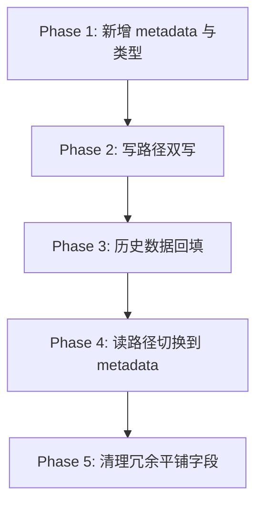

# Post 元数据统一化迁移方案 (Post Metadata Unification)

## 1. 概述 (Overview)

本文档定义 `Post` 实体的元数据统一化方案，目标是将当前分散在实体中的非核心字段进行分层整合，并提供可回滚、可灰度、可兼容的迁移路径。

当前问题主要集中在以下方面：

- 字段分散：音频、TTS、大纲、发布意图等元数据以平铺字段存在，演进成本高。
- 类型不稳定：部分字段使用 `Record<string, any>`，缺少明确约束。
- 更新方式不统一：不同入口（编辑器、任务引擎、外部 API）对元数据的局部更新行为不一致。
- 查询与兼容耦合：部分业务（如播客 Feed）依赖特定平铺字段查询。

## 2. 设计目标 (Goals)

### 2.1 核心目标

1. **统一存储模型**：建立 `metadata` 主容器，按功能域分层。
2. **局部更新稳健化**：提供统一的 Metadata Patch 规则。
3. **平滑迁移**：兼容现有前后端契约，分阶段迁移，避免一次性切换风险。
4. **查询性能可控**：保留必要影子字段（Shadow Fields）支持高频查询。

### 2.2 非目标

- 本阶段不重构文章核心字段（如 `title/content/status/visibility`）。
- 本阶段不变更前台渲染交互行为。

## 3. 统一数据模型 (Unified Model)

### 3.1 Post 元数据容器

建议在 `Post` 中引入：

- `metaVersion: number`（默认 `1`）
- `metadata: json | null`

`metadata` 建议结构（示例）：

```json
{
  "audio": {
    "url": "https://...",
    "duration": 180,
    "size": 1024000,
    "mimeType": "audio/mpeg"
  },
  "tts": {
    "provider": "volcengine",
    "voice": "female_01",
    "generatedAt": "2026-02-23T10:00:00.000Z"
  },
  "scaffold": {
    "outline": "...",
    "metadata": {
      "template": "tutorial",
      "sections": 5
    }
  },
  "publish": {
    "intent": {
      "syncToMemos": true,
      "pushOption": "draft",
      "pushCriteria": {
        "categoryIds": ["..."],
        "tagIds": ["..."]
      }
    }
  },
  "integration": {
    "memosId": "..."
  }
}
```

### 3.2 影子字段策略 (Shadow Fields)

为兼顾查询性能与兼容性，保留以下字段作为影子字段：

- `audioUrl`（播客过滤与列表展示）
- `audioMimeType`、`audioSize`（Feed enclosure 组装）
- `publishedAt`、`status`（定时任务与发布查询）

说明：影子字段来源于 `metadata`，由服务层统一回填，避免多处写入导致不一致。

## 4. Metadata Patch 规范 (Partial Update Rules)

统一使用 `PUT` 语义下的局部更新规则：

- `undefined`：保持原值不变。
- `null`：显式清空目标字段。
- 具体值：覆盖写入。

### 4.1 合并原则

1. 仅允许白名单路径更新（如 `audio.*`, `tts.*`, `scaffold.*`, `publish.intent.*`）。
2. 对对象采用深度合并（Deep Merge），数组默认整体替换。
3. 合并后执行结构校验（Zod Schema），不合法则拒绝写入。

### 4.2 安全约束

- 限制 `metadata` 最大体积（防止异常膨胀）。
- 严禁透传未知顶层键。
- 任务引擎与管理端统一走同一服务层写入入口。

## 5. 迁移方案 (Migration Plan)

### 5.1 迁移阶段



### 5.2 阶段细则

#### Phase 1：结构落地

- 在 `Post` 增加 `metaVersion` 与 `metadata`。
- 在 `types` 与 `utils/schemas` 增加强类型定义。
- 保持现有 API 对外返回结构不变。

#### Phase 2：写路径双写

- 服务层写入改为：先写 `metadata`，再回填影子字段。
- 旧平铺字段继续写入，保障前端与外部集成无感。

#### Phase 3：历史数据回填

- 执行一次性迁移任务：将历史平铺字段转入 `metadata`。
- 迁移任务要求可重入、可分批执行、可观测日志。
- PostgreSQL 实施脚本：`database/postgres/migration_v6_post_metadata_unification.sql`。

#### Phase 4：读路径切换

- 服务端读模型以 `metadata` 为主，平铺字段为兜底。
- 前端编辑器逐步切换到新结构（内部映射兼容旧字段）。

#### Phase 5：字段收敛

- 在确认稳定后移除冗余平铺字段。
- 更新文档与测试，完成最终收口。

> 当前阶段策略：为保证平稳性，已完成“弃用标记 + 依赖统计”，暂不执行字段删除。

## 6. 兼容性策略 (Compatibility)

### 6.1 API 兼容

- 外部接口与管理端短期继续接受平铺字段。
- 服务层内部将平铺字段转换为 `metadata` 结构。
- 响应体在过渡期可同时返回平铺字段，避免前端破坏性升级。

### 6.2 任务系统兼容

- 定时发布任务读取 `publish.intent`，并兼容旧 `publishIntent`。
- TTS 回写优先写 `metadata.audio` / `metadata.tts`，同步影子字段。

## 7. 风险与缓解 (Risks & Mitigations)

1. **查询退化风险**：全部迁入 JSON 可能影响筛选效率。  
   缓解：保留并维护影子字段 + 必要索引。

2. **双写不一致风险**：新旧字段并存阶段可能出现偏差。  
   缓解：统一由服务层写入，禁止旁路写数据库。

3. **历史脏数据风险**：旧数据格式不规范导致回填失败。  
   缓解：迁移脚本容错 + 失败记录 + 可重跑。

## 8. 验收标准 (Acceptance Criteria)

- `Post` 具备统一的 `metadata` 与版本字段。
- 管理端保存、TTS 回写、定时发布均可通过统一元数据读写。
- 历史数据可回填，且重复执行无副作用。
- Feed、文章详情、后台列表行为与迁移前一致。
- 相关测试覆盖新增的 Patch 合并逻辑与迁移脚本核心分支。

## 9. 关联文档 (Related Documents)

- [系统能力与设置](./system.md)
- [音频与播客](./audio.md)
- [迁移与集成](./migration.md)
- [API 规范](../../standards/api.md)
- [开发规范](../../standards/development.md)
- [测试规范](../../standards/testing.md)

## 10. 当前执行结果 (Execution Status)

### 10.1 已完成阶段

- Phase 1：结构落地（`metaVersion` + `metadata` + 类型与 Schema 扩展）
- Phase 2：写路径双写（服务层统一写入 `metadata` 并回填影子字段）
- Phase 3：历史数据回填（PostgreSQL 脚本已执行）
- Phase 4：读路径切换（读取时 `metadata` 优先，平铺字段兜底）
- Phase 5（当前子阶段）：已为平铺字段添加 `@deprecated`，并完成依赖盘点

### 10.2 平铺字段直接依赖统计（代码层）

> 统计口径：全仓库代码命中（含类型定义、运行时代码、测试与工具层）。

| 字段 | 直接命中次数 |
| :--- | :---: |
| `audioUrl` | 69 |
| `audioDuration` | 32 |
| `audioSize` | 37 |
| `audioMimeType` | 24 |
| `ttsProvider` | 8 |
| `ttsVoice` | 8 |
| `ttsGeneratedAt` | 9 |
| `scaffoldOutline` | 12 |
| `scaffoldMetadata` | 13 |
| `publishIntent` | 37 |
| `memosId` | 15 |

### 10.3 已落地的弃用声明

- `Post` 实体中的平铺元数据字段已标注 `@deprecated`。
- `Post` 类型接口中的平铺元数据字段已标注 `@deprecated`。
- 目前仍保留平铺字段读写能力，确保兼容历史调用与前端现有逻辑。

## 11. 下一阶段替换方案 (Next-stage Replacement Plan)

### 11.1 目标

- 将业务代码对平铺字段的直接依赖逐步替换为 `metadata.*` 路径。
- 在替换完成并稳定后，再进入最终字段删除窗口。

### 11.2 分批替换顺序（建议）

> 执行进度（2026-02-23）：
> - 第 1 批：已完成（编辑器设置面板、发布意图、Markdown 导入链路切换为 `metadata` 优先，保留兼容回填）。
> - 第 2 批：已完成（Feed `enclosure` 与 Markdown 导出 front-matter 读取切换为 `metadata.audio` 优先，并保留兼容兜底）。

1. **前端编辑器与设置面板（高频写入）**
  - 管理端文章编辑页、设置抽屉、TTS 弹窗统一改用 `metadata` 映射读写。
2. **Feed 与导出链路（高价值读取）**
  - Feed `enclosure`、Markdown 导出 front-matter 读取改为优先 `metadata.audio`。
3. **后台列表与详情展示（管理面）**
  - 后台文章列表与详情页 UI 依赖改为 `metadata` 只读映射。
4. **任务系统与发布副作用（关键流程）**
  - 发布意图与任务恢复统一读取 `metadata.publish.intent`。
5. **测试与类型收口**
  - 将测试用例默认 fixture 迁移到 `metadata`，仅保留少量兼容回归用例。

### 11.3 进入字段删除窗口前的准入条件

- 平铺字段直接依赖下降到可控阈值（建议核心运行时依赖为 0，仅保留迁移回归测试）。
- 关键链路（保存、发布、Feed、导出、TTS）回归测试全部通过。
- 至少一个发布周期内无 metadata 相关线上错误。

### 11.4 计划中的最终动作（暂缓）

- 移除 `Post` 实体中的冗余平铺字段列。
- 移除 API 入参中的平铺字段兼容分支。
- 迁移脚本升级为“清理脚本”，回收历史列与兼容代码。
