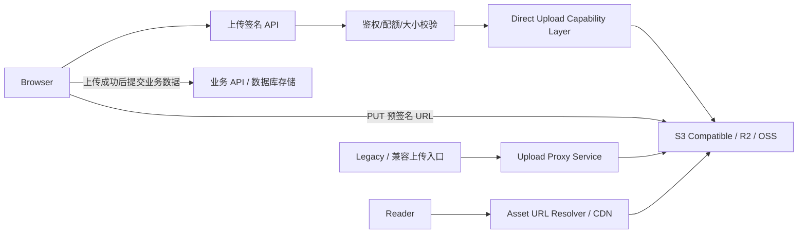

# 存储模块设计文档 (Storage Module)

## 1. 概述 (Overview)

存储模块负责处理应用中的文件持久化与静态资源分发，包括文章插图、用户头像、音频文件以及未来的视频等媒体资源。第九阶段的目标不再只是“能上传”，而是要补齐以下三类基础设施能力：

- 云端对象存储直传，降低应用服务端中转压力。
- 静态资源公共访问地址治理，支持 CDN/域名切换与统一前缀管理。
- 存量资源迁移与链接重写，避免未来更换存储后端时出现大规模手工修复。

本轮设计不再把某一家对象存储单独抽象为“专用能力”，而是统一抽象为 **对象存储签名直传能力层**。在这层之下，Cloudflare R2、通用 S3 兼容存储、阿里云 OSS 都只是不同的 provider profile。默认推荐链路仍然是 **PUT 预签名 URL 直传**，但文档同时覆盖 **STS 临时凭证** 与 **POST Policy 表单直传** 两种模式，以适配大文件分片、HTML 表单上传、上传回调等差异化场景。

### 1.1 本阶段目标 (Phase 9 Goals)

- 保留现有 `local`、`s3`、`vercel blob` 的服务端代理上传能力，确保兼容存量调用。
- 将 `r2`、通用 `s3-compatible`、`oss` 统一收敛为同一套签名直传模型，而不是按厂商分别设计主能力。
- 收敛存储引擎值、公开地址解析规则和对象路径前缀策略。
- 为未来的资源迁移工具和后台监控界面预留清晰边界。

### 1.2 非目标 (Non-goals)

- 本轮不实现 Multipart Upload 分片上传。
- 本轮不引入图片转码、缩略图、视频转码等媒体处理流水线。
- 本轮不把对象存储抽象成独立数据库实体系统，仍以最小侵入方式兼容现有 URL 存储结构。

## 2. 现状基线与问题 (Current Baseline & Gaps)

当前仓库已经具备第九阶段的大部分存储能力，但设计文档仍需明确哪些能力已经落地、哪些仍处于后续增强阶段：

| 维度 | 当前现状 | 风险/问题 | 本轮设计决策 |
| :--- | :--- | :--- | :--- |
| 驱动实现 | 已有 `local`、`s3`、`r2`、`vercel_blob` 四类规范化存储类型，继续复用 `Storage.upload()` | 浏览器直传只在 S3 兼容链路下启用，其他驱动仍通过代理上传 | 保留代理上传作为兼容回退，同时在 S3 兼容链路启用“签名直传能力层” |
| R2/OSS 支持 | `cloudflare_r2_*` 设置、R2 provider profile、统一直传授权服务和前端直传链路均已落地；OSS 仍处于预留阶段 | R2 已形成闭环，但 OSS 仍未提供正式 profile | 继续按“签名协议 + provider profile”建模，OSS 作为下一阶段扩展位 |
| 枚举一致性 | 后台设置页、运行时与文档已经收敛到 `vercel_blob`，同时兼容历史值 `vercel-blob` | 若外部部署仍沿用旧枚举，容易误判当前规范值 | 明确规范化枚举，并保留旧值兼容读取 |
| 公共访问地址 | `ASSET_PUBLIC_BASE_URL`、`ASSET_OBJECT_PREFIX` 与驱动级 `base_url` 已进入统一解析链路 | 仍需补齐迁移工具，处理历史内容里写死的绝对 URL | 继续使用全局资源地址解析优先级，并补齐迁移工具 |
| 迁移能力 | 当前仍未交付资源重写或迁移工具 | 历史文章内如果写入绝对 URL，切换存储后端成本极高 | 将迁移工具与干跑校验流程顺延到下一阶段 |

## 3. 核心方案决策 (Key Decisions)

### 3.1 方案评估矩阵 (Momei Score)

| 方案 | Value | Alignment | Difficulty | Risk | Score |
| :--- | :---: | :---: | :---: | :---: | :---: |
| 通用 PUT 预签名 URL 直传 + 服务端强校验 | 5 | 5 | 3 | 2 | 2.0 |
| STS 临时凭证直传（支持分片/断点续传） | 5 | 5 | 4 | 3 | 1.43 |
| POST Policy 表单直传（限制更细，可挂回调） | 4 | 4 | 3 | 2 | 1.6 |
| 继续沿用服务端代理上传 | 2 | 3 | 1 | 3 | 1.25 |

结论：当前阶段应优先推进 **通用 PUT 预签名 URL 直传**，并把 R2 作为默认落地 profile。服务端中转方案保留，但只作为兼容回退链路，而不是未来主路径。对于未来的大文件分片和断点续传，优先扩展 STS 模式；对于需要 HTML 表单约束和 OSS 回调的场景，保留 POST Policy profile。

### 3.2 规范化存储类型 (Canonical Storage Types)

本轮开始，`storage_type` 的规范值统一为：

| 值 | 含义 | 状态 |
| :--- | :--- | :--- |
| `local` | 本地磁盘存储 | 已存在 |
| `s3` | 通用 S3 兼容存储 | 已存在 |
| `r2` | Cloudflare R2 provider profile | 本轮新增一等类型 |
| `oss` | 阿里云 OSS provider profile | 规划新增 |
| `vercel_blob` | Vercel Blob 模式 | 已存在，统一命名 |

兼容策略：

- 运行时读取时，允许把历史值 `vercel-blob` 归一化为 `vercel_blob`。
- 文档、安装向导、后台设置页、服务端工厂和测试必须全部收敛到同一枚举集合。
- `r2` 与 `oss` 都作为 provider profile 暴露，但上层能力模型保持统一。
- `oss` 允许在 provider 级别扩展 STS、POST Policy 和回调，不把这些差异反向污染通用上传接口。

## 4. 目标架构 (Target Architecture)



### 4.1 组件职责 (Component Responsibilities)

- `Upload Proxy Service`: 现有服务端中转上传逻辑，继续服务于 `local` 和回退场景。
- `Upload Signer Service`: 新增的直传签名服务，仅负责元信息校验、对象键生成和签名授权生成，不接收文件二进制本体。
- `Storage Adapter`: 现有 `Storage.upload()` 保持不变，用于代理上传；新增 signer 能力时采用平行接口扩展，避免强行破坏旧调用。
- `Provider Profile`: 负责不同厂商在 endpoint、签名字段、表单字段、回调能力、STS 获取方式上的差异化封装。
- `Asset URL Resolver`: 统一把对象键解析为最终可访问地址，支持 CDN 前缀或自定义公共域名。
- `Rewrite / Migration Tool`: 用于历史绝对 URL 的批量重写和迁移审计。

## 5. 存储模型与配置设计 (Storage Model & Configuration)

### 5.1 保留的代理上传接口 (Existing Proxy Interface)

现有服务端上传抽象继续保留：

```typescript
export interface Storage {
    upload(buffer: Buffer, filename: string, contentType?: string): Promise<{ url: string }>
}
```

该接口仍用于：

- `local` 模式。
- 兼容旧版前端调用。
- 无法走浏览器直传的内部服务场景。

### 5.2 新增的直传签名接口 (New Direct Upload Contract)

为了不污染现有 `Storage` 语义，本轮新增独立 signer 抽象，并把签名模式分为 `put-presign`、`post-policy`、`sts-credential` 三类：

```typescript
export interface DirectUploadCapability {
    createAuthorization(input: {
        mode: 'put-presign' | 'post-policy' | 'sts-credential'
        key: string
        contentType: string
        contentLength: number
        expiresIn: number
        // ... 其他元数据
    }): Promise<DirectUploadAuthorization>
}
```

## 6. 静态资源地址治理 (Asset URL Governance)

为了支持 CDN 切换、域名迁移以及对象路径的统一管理，系统引入了全局地址解析优先级：

### 6.1 公开访问地址 (Public Base URL)

系统按照以下优先级解析文件的公开访问地址：
1. **`ASSET_PUBLIC_BASE_URL` (全局)**: 如果配置了此项，所有上行资源链接将以此为前缀（支持含有路径，如 `https://cdn.example.com/assets`）。
2. **驱动级 Base URL**: 如 `S3_BASE_URL`、`CLOUDFLARE_R2_BASE_URL` 或 `LOCAL_STORAGE_BASE_URL`。
3. **驱动默认地址**: 如果以上均未配置，则回退到驱动返回的原始地址。

### 6.2 对象键前缀 (Object Prefix)

对象存储中的路径前缀遵循以下规则：
1. **`ASSET_OBJECT_PREFIX` (全局)**: 统一的对象键前缀（如 `momei-blog/`）。
2. **驱动级前缀**: 如 `S3_BUCKET_PREFIX` 或 `BUCKET_PREFIX`。
3. **业务默认路径**: 优先按业务归属建模，例如 `avatars/{userId}/` 与 `posts/{postId}/{image|audio|video|file}/`。

最终生成的对象路径格式为：`[GlobalPrefix][DriverPrefix][BusinessPrefix][Filename]`。

### 6.3 业务默认路径策略 (Business Default Path Strategy)

- 路径规划遵循“业务归属优先，媒体类型次之”的原则，而不是单纯按来源或 MIME 大类切一级目录。
- 用户头像继续固定归档到 `avatars/{userId}/`，便于后续用户资料替换、清理与配额治理。
- 文章关联资源统一归档到 `posts/{postId}/{image|audio|video|file}/`。
- 若文章资源还需要表达用途，可在媒体类型后追加用途子目录，例如 `posts/{postId}/audio/tts/`、`posts/{postId}/image/cover/`。
- 文章相关的 AI 图片、TTS 音频等产物在生成时就应直接写入对应文章目录，不再额外拆分独立的来源型顶级目录，以避免后续搬运、回写与清理链路复杂化。
- `image/`、`audio/`、`video/`、`file/` 仍可作为未来“无明确业务归属”文件的兜底类型目录，但不作为文章资源的主路径模型。

## 7. 存量资源迁移与重写 (Migration & Rewrite)

资源 URL 已不再作为孤立问题处理。第十一阶段开始，资源域名切换、对象键映射、正文内资源链接修复与旧站内容链接治理统一进入 [迁移链接治理与云端资源重写](../governance/migration-link-governance.md) 这份专项设计。

本模块继续只负责以下事实：

- 资源 canonical 地址如何由 `objectKey`、`asset_public_base_url` 与驱动级 `base_url` 解析得到。
- 哪些 URL 可被认定为“受系统托管资产”，从而允许进入重写流程。
- `POST /api/upload/direct-auth`、对象键前缀和 provider profile 的实现边界。

治理层的 `dry-run / apply / report` 契约、redirect seeds 输出和正文链接重写规则不再在本文件重复定义。
            credentials: Record<string, string>
            objectKeyPrefix: string
            expiresIn: number
        }
    >
}
```

设计原则：

- `Storage` 负责“服务端代传”。
- `DirectUploadCapability` 负责“浏览器直传授权”。
- 两条链路共享同一套对象键生成、前缀策略、大小/类型限制和资源地址解析逻辑。
- provider profile 只负责厂商差异，不负责业务鉴权和配额判断。

### 5.3 直传模式矩阵 (Direct Upload Modes)

| 模式 | 适用场景 | 优点 | 局限 |
| :--- | :--- | :--- | :--- |
| `put-presign` | 中小文件、简单浏览器直传 | 接入简单、客户端无需 SDK、适配 R2 与大多数 S3 兼容存储 | 不适合大文件分片和断点续传 |
| `post-policy` | HTML 表单上传、需限制 key 前缀/文件大小/类型、需要回调 | 约束表达力强，OSS 原生支持回调 | 不适合分片上传；不同云厂商支持差异较大 |
| `sts-credential` | 大文件、分片上传、断点续传、移动端/原生 SDK | 适合 multipart，客户端可复用短期凭证完成多次签名 | 服务端需要额外做 STS 凭证获取和缓存，权限策略更复杂 |

### 5.4 配置矩阵 (Configuration Matrix)

| 范围 | 键名 | 状态 | 说明 |
| :--- | :--- | :--- | :--- |
| 全局 | `storage_type` | 已存在 | 存储类型枚举 |
| 全局 | `asset_public_base_url` | 已实现 | 全局静态资源公共访问前缀，优先级高于各驱动自带地址 |
| 全局 | `asset_object_prefix` | 已实现 | 通用对象路径前缀，长期替代偏 S3 语义的 `s3_bucket_prefix` |
| 本地 | `local_storage_dir` | 已存在 | 本地存储目录 |
| 本地 | `local_storage_base_url` | 已存在 | 本地资源公开访问前缀 |
| 本地 | `local_storage_min_free_space` | 已存在 | 磁盘空间保护阈值 |
| S3 | `s3_endpoint` / `s3_bucket` / `s3_region` / `s3_access_key` / `s3_secret_key` / `s3_base_url` | 已存在 | 通用 S3 兼容配置 |
| R2 | `cloudflare_r2_account_id` / `cloudflare_r2_access_key` / `cloudflare_r2_secret_key` / `cloudflare_r2_bucket` / `cloudflare_r2_base_url` | 已实现 | R2 provider profile 的默认 endpoint、直传签名与公共地址配置 |
| OSS | `oss_region` / `oss_bucket` / `oss_access_key_id` / `oss_access_key_secret` / `oss_role_arn` / `oss_base_url` | 规划新增 | 阿里云 OSS provider profile，覆盖 PUT 签名、POST Policy、STS 与回调 |
| Vercel Blob | `vercel_blob_token` | 已存在 | Vercel Blob 专用令牌 |
| 兼容 | `s3_bucket_prefix` | 已存在 | 本轮继续兼容，后续迁移到 `asset_object_prefix` |

### 5.5 资源地址解析优先级 (Public URL Resolution)

所有上传成功后的 `publicUrl` 按以下顺序计算：

1. `asset_public_base_url`，用于统一 CDN 或公共域名切换。
2. 驱动专属 `base_url`，例如 `cloudflare_r2_base_url`、`s3_base_url`、`local_storage_base_url`。
3. 驱动原生公开地址。

对象路径前缀按以下顺序解析：

1. `asset_object_prefix`
2. `s3_bucket_prefix`
3. 业务侧传入的 `prefix`

这样可以把“对象真实存储位置”和“最终对外访问地址”拆开，避免未来切换 CDN 时必须立即全量重写历史内容。

## 6. 对象存储签名直传设计 (Direct Upload Design)

### 6.1 统一能力抽象

系统层面将对象存储直传抽象为三种模式：

1. `PUT` 预签名 URL：面向简单直传。
2. `POST` Policy 表单直传：面向表单上传、细粒度限制和上传回调。
3. `STS` 临时凭证：面向大文件分片、断点续传和客户端 SDK 场景。

这三种模式共享以下服务端前置逻辑：

1. 鉴权与角色校验。
2. 上传频率与日额度校验。
3. 文件大小与 MIME 类型白名单校验。
4. 对象键生成与前缀策略。
5. 公共访问地址解析。

### 6.2 为什么默认先落地 PUT 预签名 URL

- 对 R2 和大多数 S3 兼容存储而言，`PUT` 预签名 URL 是最低复杂度的默认路径。
- 对简单 Web 上传场景，客户端无需引入厂商 SDK，只需用 `fetch` 即可完成上传。
- 服务端可以将 `Content-Type` 与 `Content-Length` 纳入签名校验，形成强约束。
- 该路径与现有代码结构最接近，便于先落地 MVP。

### 6.3 PUT 预签名 URL 的服务端约束

服务端生成预签名 URL 前必须先完成以下检查：

1. 鉴权与角色校验。
2. 上传频率与日额度校验，复用现有上传限流逻辑。
3. 单文件大小校验，对应 `MAX_UPLOAD_SIZE` / `MAX_AUDIO_UPLOAD_SIZE`。
4. MIME 类型白名单校验。
5. 对象键生成与前缀收敛。

签名时必须：

- 在 `PutObjectCommand` 中显式传入 `ContentType`。
- 将 `content-type` 和 `content-length` 纳入 `signableHeaders`。
- 对 R2 使用 `region=auto` 和 `https://<ACCOUNT_ID>.r2.cloudflarestorage.com` 作为默认 endpoint。
- 对通用 S3 兼容存储使用配置化 `endpoint`。
- 对 OSS 则走对应 provider profile 的 URL 签名实现，不强耦合 AWS SDK 语义。

这意味着一旦客户端上传时的 `Content-Length` 或 `Content-Type` 与签名不一致，存储服务会直接拒绝请求，从而形成服务端强校验闭环。

### 6.4 PUT 预签名 API 契约 (API Contract)

当前实现接口：`POST /api/upload/direct-auth`

请求体：

```typescript
interface DirectUploadRequestBody {
    filename: string
    contentType: string
    size: number
    type?: 'image' | 'audio' | 'file'
    prefix?: string
}
```

响应体：

```typescript
interface DirectUploadAuthorizationResponse {
    code: 200
    data: {
        strategy: 'proxy'
    } | {
        strategy: 'put-presign'
        method: 'PUT'
        url: string
        headers: {
            'content-type': string
        }
        objectKey: string
        publicUrl: string
        expiresIn: number
    }
}
```

说明：

- `strategy=proxy` 表示当前存储驱动不支持浏览器直传，前端需回退到既有 `/api/upload` 代理上传链路。
- `strategy=put-presign` 表示当前存储驱动走 S3 兼容签名上传；`url` 用于浏览器直接 `PUT`。
- `publicUrl` 用于业务层写入文章、头像、播客封面等字段。
- `objectKey` 用于未来迁移工具、审计日志和去重策略。

### 6.5 POST Policy 模式 (OSS-first Profile)

`POST` Policy 主要用于以下场景：

- 浏览器原生 HTML 表单上传。
- 需要在服务端限制 key 前缀、文件大小、类型、成功状态码等细粒度条件。
- 需要 OSS 上传回调，由对象存储在文件落盘后反向通知业务服务。

设计要求：

- `POST` 模式仅作为 provider-capability，不要求所有存储厂商都支持。
- OSS profile 需要支持 `policy`、签名字段、临时安全令牌、`callback` 字段和可选的禁止覆盖参数。
- 回调能力属于 provider 级附加功能，应挂在 `post-policy` 的授权结果中，而不是污染通用 `put-presign` 返回结构。

### 6.6 STS 临时凭证模式 (Multipart-first Profile)

`STS` 模式主要用于以下场景：

- 大文件分片上传。
- 断点续传。
- 移动端、原生 SDK 或需要客户端多次签名的场景。

设计要求：

- 服务端只发放最小权限、短时有效的临时凭证。
- 必须支持缓存和提前刷新，避免频繁调用 STS 导致限流。
- 必须支持额外的最小权限策略，例如仅允许写入指定目录前缀。

### 6.7 前端上传流程 (Browser Flow)

1. 用户选中文件。
2. 前端读取 `file.name`、`file.type`、`file.size`。
3. 前端调用统一授权接口获取对应模式的授权结果。
4. 如果是 `put-presign`，浏览器使用 `fetch(uploadUrl, { method: 'PUT', headers: uploadHeaders, body: file })` 上传。
5. 如果是 `post-policy`，前端构造 `FormData` 并提交至存储服务。
6. 如果是 `sts-credential`，前端使用相应厂商 SDK 进行分片或断点续传。
7. 上传成功后，前端使用 `publicUrl` 或 `objectKey` 完成业务提交。

### 6.8 Provider Profile 对比 (Provider Profiles)

| Provider | 推荐模式 | 关键差异 | 设计结论 |
| :--- | :--- | :--- | :--- |
| Cloudflare R2 | `put-presign` | 走 S3 SigV4，默认 endpoint 需带 account id，不支持 HTML `POST` 表单直传 | 作为默认 profile 落地 |
| 通用 S3 兼容存储 | `put-presign` / `sts-credential` | 依赖自定义 endpoint、region、bucket 配置 | 作为通用 profile 保持抽象 |
| 阿里云 OSS | `put-presign` / `post-policy` / `sts-credential` | 支持基于 Policy 的表单直传、上传回调、STS 临时凭证 | 作为能力最完整的 profile 预留实现位点 |

### 6.9 Provider 特殊限制

- R2：预签名 URL 必须使用 R2 的 S3 API 域名，不能直接使用自定义公共域名上传。
- OSS：如果启用 POST Policy 或上传回调，需要按 OSS 的字段约定组装表单，并显式配置 CORS。
- 所有 provider：公共访问域名与上传签名域名必须分离建模，不能混为一个字段。

## 7. 静态资源统一治理与迁移 (Static Asset Governance & Migration)

### 7.1 治理目标

- 上传地址和访问地址分离。
- 路径前缀统一，不再把路径策略散落在组件、服务和配置页中。
- 历史绝对 URL 可被安全重写，不影响外部第三方资源链接。

### 7.2 链接重写工具 (Rewrite Tool)

后续实现建议提供单独脚本或任务入口，例如：

- `scripts/storage/rewrite-asset-urls.ts`
- 或 `POST /api/admin/storage/rewrite-assets` 受管理员权限保护

能力要求：

- 支持 `dry-run` 干跑，先输出受影响数量和样例。
- 仅重写受系统托管的已知域名或路径前缀，绝不动外部第三方链接。
- 支持从旧 `base_url` 批量迁移到新 `asset_public_base_url`。
- 输出迁移报告，便于回滚和人工抽样核对。

### 7.3 渐进式迁移策略 (Progressive Migration)

- 新上传资源从落地开始返回 `objectKey + publicUrl`。
- 新路径策略仅约束后续新写入对象键；文章相关 AI 图片、TTS 音频等应在生成时直接落到文章目录，不依赖生成后的二次搬运。
- 存量历史数据先保持可用，优先通过解析器和公共域名完成“零改数据”切换。
- 只有在确实存储了大量绝对 URL 且无法通过公共前缀覆盖时，才执行批量重写。

## 8. 安全与质量要求 (Security & Quality)

### 8.1 安全要求

- 预签名 URL、POST Policy 和 STS 临时凭证都视为短期 bearer token，过期时间建议控制在 `60s - 300s` 或 provider 推荐窗口内。
- 服务端永远不向前端暴露长期 Access Key 或 Secret Key。
- 必须同时校验类型、大小、上传频率与权限边界，不能仅依赖客户端提示。
- `local` 模式继续保留 Serverless 环境卫兵与磁盘剩余空间保护。
- 当前阶段默认不开放 Multipart Upload 的实现交付，但设计层面保留 `sts-credential` 扩展位。

### 8.2 测试要求

本轮实现至少需要以下测试覆盖：

- `put-presign` 单元测试：对象键生成、过期时间、`content-type` / `content-length` 签名头收敛。
- provider profile 测试：R2 默认 endpoint、S3 自定义 endpoint、OSS Policy 字段与回调参数组装。
- 上传 API 集成测试：权限、大小超限、MIME 非法、别名值归一化、模式分流。
- 资源地址解析测试：`asset_public_base_url` 与各驱动 `base_url` 的优先级。
- 重写工具测试：`dry-run`、已知域名过滤、幂等执行。

## 9. 后续实现拆分 (Implementation Breakdown)

建议按照以下顺序推进：

1. 统一 `storage_type` 枚举、兼容别名，并补齐 provider profile 配置模型。
2. 新增统一直传授权 service 与 `POST /api/upload/direct-auth`，先实现 `put-presign`。
3. 以 R2 和通用 S3 兼容存储作为第一批 `put-presign` profile 落地。
4. 为 OSS 预留 `post-policy`、回调和 `sts-credential` profile 扩展点。
5. 改造前端上传 composable，支持按模式分流。
6. 收敛公共访问地址解析、对象前缀与业务默认路径策略。
7. 增加链接重写工具、测试与部署文档更新。

受影响文件预计包括：

- `server/utils/storage/*`
- `server/services/upload.ts`
- `server/services/ai/image.ts`
- `server/services/ai/tts.ts`
- `server/api/upload/*`
- `components/admin/settings/storage-settings.vue`
- `components/installation/step-extra-config.vue`
- `composables/use-upload.ts`
- `docs/guide/deploy.md`
- `docs/guide/variables.md`

## 10. 待办事项 (Next Steps)

- [x] 统一 `storage_type` 的规范值与 provider profile。
- [x] 实现通用直传授权 service，首批落地 `put-presign` 模式。
- [x] 为 R2、通用 S3 兼容存储补齐 `put-presign` profile。
- [ ] 为 OSS 设计并预留 `post-policy`、回调与 `sts-credential` profile。
- [x] 新增浏览器直传接口与前端上传链路。
- [x] 收敛 `asset_public_base_url`、对象前缀与业务默认路径策略。
- [ ] 提供资源地址重写工具与测试。
