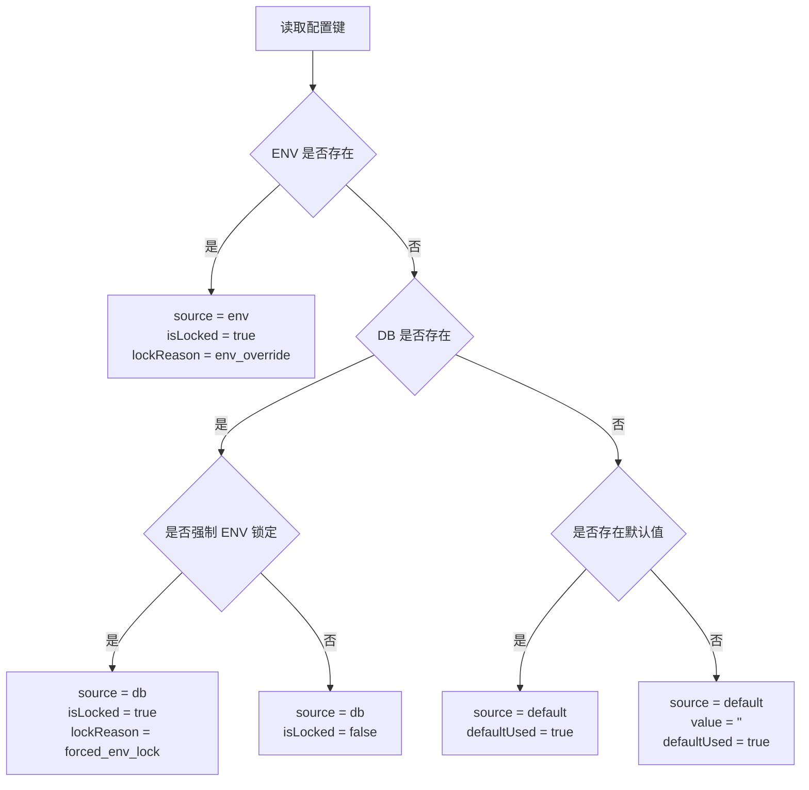

# 系统配置深度解耦与统一化 (System Config Unification)

## 1. 概述 (Overview)

本文档用于收敛墨梅博客当前的系统配置实现，并给出后续可实施的增强方案。

本次收敛后的结论如下：
- 当前项目已经实现了基于 `ENV -> DB -> Default` 的轻量三层读取模型。
- 当前项目已经实现了后台设置页的环境变量锁定提示、字段禁用和安装期 ENV 同步。
- `Better-Auth` 仍然属于启动期静态配置，短期继续维持环境变量锁定，不再承诺运行时热重载。
- 配置变更审计日志已经落地，当前剩余缺口主要是设置页层面的“智能混合模式”说明卡片、来源徽标与更细粒度锁定原因提示。

本轮执行策略明确为“文档与契约先行”：
- 先收敛解释层的数据契约、页面结构和测试边界。
- 不在本轮设计阶段调整 `Setting` 实体 Schema。
- 代码实现将在设计评审后按增量方式落地，优先补服务层与接口层，再补后台页面消费。

## 2. 当前实现现状 (Current State)

### 2.1 已落地能力

当前代码已经具备以下能力：
- **统一键名映射**: 通过 `SETTING_ENV_MAP` 将系统设置键与环境变量建立映射关系。
- **三层读取逻辑**: `getSetting()` 与 `getSettings()` 已按 `ENV ?? DB ?? Default` 顺序解析。
- **锁定规则**: 通过 `FORCED_ENV_LOCKED_KEYS` 和 `INTERNAL_ONLY_KEYS` 管理强制锁定项与后端私有项。
- **后台设置展示**: `/api/admin/settings` 已返回 `isLocked`、`source`、`description` 等元信息，供后台 UI 呈现。
- **字段级只读反馈**: 管理后台设置页已对锁定项显示锁图标并禁用输入组件，但仍以逐字段模板判断为主，尚未抽象成统一解释层组件。
- **安装期同步**: 安装流程会将已存在的 ENV 配置同步进 `setting` 表，保证后台状态与运行环境一致。
- **审计实体与写入链路**: 已存在 `SettingAuditLog` 实体、`setSettings()` 写入审计日志以及按脱敏策略存储敏感字段快照。
- **审计查询与后台视图**: 已提供 `/api/admin/settings/audit-logs` 分页接口，并在系统设置页接入“变更审计”标签页。
- **基础测试覆盖**: `server/services/setting.test.ts` 已覆盖 ENV 优先和后台设置聚合等基础逻辑。
- **兼容性写入链路已预留**: `PUT /api/admin/settings` 已支持 `{ settings, reason, source }` 包装体，但当前后台页面仍发送旧的扁平键值对。

### 2.2 当前数据模型

当前 `Setting` 实体仍然是轻量 KV 结构，而不是复杂分类模型。现有字段包括：
- `key`: 配置键名
- `value`: 配置值
- `description`: 描述信息
- `maskType`: 脱敏类型
- `level`: 可见级别
- `updatedAt`: 最近更新时间

这意味着当前设计应围绕“轻量 KV + 元信息返回”展开，而不是强行引入尚未落地的 `category`、`translationId`、`public`、`metadata` 等字段。

### 2.3 已确认限制

以下限制已经在代码与上游库能力层面得到确认：

1. **Better-Auth 不适合在当前阶段做运行时热重载**
   - `lib/auth.ts` 在服务启动时创建单例 `auth`。
   - `socialProviders`、`secret`、`baseURL` 等关键项在初始化阶段就已经固定。
   - 这些参数当前来自 `utils/shared/env.ts` 的静态环境变量封装，而不是 `SettingService`。

2. **客户端 `authClient` 也不是动态配置代理**
   - `lib/auth-client.ts` 在模块加载时创建单例。
   - 即使补一个 `/api/auth/config`，也只能影响客户端展示层，无法真正替换服务端认证实例。

3. **来源解释 UI 仍未完全落地**
   - 当前 `/api/admin/settings` 已返回 `source` 与 `isLocked`，但后台设置页尚未统一展示来源徽标、说明卡片以及更细粒度的锁定原因。
   - `getSettingEffectiveSource()` 当前只区分 `env` / `db`，其判断与“是否锁定”耦合，无法准确表达“字段被强制锁定但当前实际值并非来自 ENV”的场景。
   - 目前设置页主要提供字段禁用与通用 ENV 锁定提示，尚未补充 `envKey`、`defaultUsed`、`lockReason` 等更结构化的解释信息。

### 2.4 本轮设计要解决的根因

当前系统配置体验上的核心问题并不是“没有锁图标”，而是“来源、锁定和默认值解释混在一起”。本轮设计将优先解决以下根因：

1. **来源与锁定状态解耦不足**
   - 现在 `source` 在部分场景下更接近“是否被 ENV 管控”，而不是“当前值实际来自哪里”。
   - 这会让 `FORCED_ENV_LOCKED_KEYS` 在未配置 ENV 时也被标记为 `env`，降低解释可信度。

2. **默认值没有统一注册入口**
   - 后台要展示 `defaultUsed`，必须有稳定的默认值来源。
   - 仅靠调用方在各处临时传入 `defaultValue`，无法支撑后台统一列表页解释。

3. **页面消费方式过于分散**
   - 当前各个设置子组件都在局部模板里重复写 `metadata.xxx?.isLocked` 和统一 tooltip。
   - 若直接追加更多元信息而不收敛页面结构，会导致重复判断快速膨胀。

## 3. 收敛后的设计原则 (Converged Principles)

### 3.1 配置读取原则

系统配置继续遵循以下公式：

`EffectiveValue = ENV ?? DB ?? Default`

但本阶段不再追求抽象过度的“全配置中心大重构”，而是在现有 `SettingService` 基础上增强可解释性与审计能力。

### 3.2 Better-Auth 原则

针对认证相关配置，当前阶段明确采用以下策略：
- `AUTH_SECRET`、`GITHUB_CLIENT_SECRET`、`GOOGLE_CLIENT_SECRET` 等核心凭据继续由 ENV 提供。
- 相关配置在后台中仅展示锁定状态，不支持通过 UI 修改。
- 文档中不再承诺 Better-Auth 的运行时热重载。
- 若未来上游库支持稳定的动态工厂模式，再重新评估统一接管方案。

### 3.3 审计原则

配置变更审计必须遵循“可追溯但不泄密”的原则：
- 记录谁改了什么。
- 记录何时修改、从哪里修改、为什么修改。
- 对密钥类值只记录脱敏快照或空值，不在审计日志中保存明文 Secret。

### 3.4 增量落地原则

本任务按“文档 -> 契约 -> UI -> 测试”的顺序推进：
- 第一步先把解释层字段、锁定原因枚举和页面布局方案固化到文档。
- 第二步再在 `server/services/setting.ts` 中新增解析方法，而不是直接重写现有 `getSetting()` / `getSettings()`。
- 第三步通过后台列表接口把结构化元信息暴露给页面，保持旧写入 payload 兼容。
- 第四步再将各个设置子组件逐步切换到统一的来源徽标与提示渲染。

## 4. 目标架构 (Target Architecture)

### 4.1 配置解释层收敛

在现有 `server/services/setting.ts` 之上，后续建议补充一层“解释层 (Explanation Layer)”，并显式拆开“当前值来源”和“为什么不能编辑”这两个维度。

建议新增的代码级注册结构：

```typescript
type SettingSource = 'env' | 'db' | 'default'
type SettingLockReason = 'env_override' | 'forced_env_lock' | null

interface SettingExplanationMeta {
   envKey?: string
   defaultValue?: string | null
   requiresRestart?: boolean
}

interface ResolvedSetting<T = string | null> {
   key: string
   value: T
   source: SettingSource
   isLocked: boolean
   envKey: string | null
   defaultValue: T | null
   defaultUsed: boolean
   lockReason: SettingLockReason
   requiresRestart: boolean
   level?: number
   maskType?: string
   description?: string
}
```

建议新增的方法：
- `resolveSetting(key, defaultValue?)`: 返回单个配置的结构化解析结果。
- `resolveSettings(keys)`: 批量返回结构化结果。
- `getSetting()` / `getSettings()`: 保持现有兼容签名，继续返回纯值，避免大面积破坏调用方。

建议的解释层判定矩阵如下：

| 场景 | source | isLocked | defaultUsed | lockReason |
| :--- | :--- | :--- | :--- | :--- |
| ENV 存在且命中映射 | `env` | `true` | `false` | `env_override` |
| ENV 不存在，但键属于 `FORCED_ENV_LOCKED_KEYS`，DB 有值 | `db` | `true` | `false` | `forced_env_lock` |
| ENV 不存在，键属于 `FORCED_ENV_LOCKED_KEYS`，DB 无值 | `default` | `true` | `true` | `forced_env_lock` |
| 未锁定，DB 有值 | `db` | `false` | `false` | `null` |
| ENV / DB 都无值，落到注册默认值 | `default` | `false` | `true` | `null` |

这意味着下一阶段需要新增一个轻量的“默认值注册表”，而不是继续依赖零散调用点的临时 `defaultValue`。该注册表只服务解释层，不改变数据库模型。



### 4.2 后台设置接口契约

为了减少前端改动面，`GET /api/admin/settings` 建议继续保持“单项一条记录”的扁平结构，只补充解释层字段，而不是再包一层 `meta`。

建议响应结构如下：

```typescript
interface AdminSettingItem {
   key: string
   value: string
   description: string
   level: number
   maskType: string
   source: 'env' | 'db' | 'default'
   isLocked: boolean
   envKey: string | null
   defaultUsed: boolean
   lockReason: 'env_override' | 'forced_env_lock' | null
   requiresRestart: boolean
}
```

字段约束说明：
- `source`: 表示当前生效值实际来源，不再与锁定状态耦合。
- `envKey`: 若该设置映射到环境变量则返回键名，否则返回 `null`。
- `defaultUsed`: 当前值是否落到了默认值层；即使默认值是空字符串，也要显式返回 `true`。
- `lockReason`: 仅返回稳定枚举值，由前端负责国际化文案，不在接口里返回硬编码中文。
- `requiresRestart`: 用于提示“该项即使来自 DB，也可能需要重启才能影响运行时单例”。

对应的后台保存契约建议统一切到以下结构：

```typescript
interface UpdateSettingsRequest {
   settings: Record<string, string>
   reason?: string
   source?: 'admin_ui' | 'theme_settings' | 'commercial_settings' | 'api'
}
```

需要特别说明的是：当前代码中 `source` 的枚举已经是 `admin_ui`、`theme_settings`、`commercial_settings` 和 `api`，因此文档不应再使用旧的 `ui` / `api` 二值描述。

### 4.3 设置页智能混合模式增强

当前后台已具备字段级锁定提示和审计日志标签页，后续建议继续补齐以下 UI 信息：

1. **页级说明卡片**
    - 在 `pages/admin/settings/index.vue` 顶部增加“智能混合模式”说明卡片。
    - 卡片内容明确三层优先级 `ENV > DB > Default`、当前页面锁定项的处理方式，以及“认证类配置可能需要重启”的边界说明。

2. **来源徽标与锁定提示分离**
    - `来源徽标` 负责告诉管理员值来自 `ENV`、`DB` 还是 `DEFAULT`。
    - `锁定图标 / 说明文案` 负责告诉管理员为什么不能编辑。
    - 两者不能复用为同一个视觉元素，否则会继续把“来源”和“锁定”混为一谈。

3. **字段级提示优先级**
    - `lockReason === 'env_override'`: 显示“当前值由环境变量 `ENV_KEY` 覆盖，后台保存不会生效”。
    - `lockReason === 'forced_env_lock'`: 显示“该配置由启动期依赖直接读取，需要通过环境变量调整并重启服务”。
    - `source === 'default' && !isLocked`: 显示“当前使用默认值，建议在部署前显式配置”。
    - `requiresRestart === true && source === 'db'`: 显示“当前已保存到数据库，但需要服务重启后才能完全生效”。

4. **页面结构增量策略**
    - 不要求一次性重写所有设置表单。
    - 优先在页级引入统一的解释型组件，例如来源徽标和字段提示容器。
    - 现有各设置子组件先复用统一组件，再逐步移除散落的 `metadata.xxx?.isLocked` 模板判断。

### 4.4 审计日志当前实现与后续增强

审计日志已经采用独立实体落地，而不是复用普通文本日志。当前实现具备：
- `SettingAuditLog` 实体，记录设置键、变更动作、脱敏后的前后值、当前生效来源、请求来源、原因、操作者与请求元信息。
- `setSettings()` 写入后自动记录审计日志，并对密钥类字段按 `maskType` 存储脱敏快照。
- `/api/admin/settings/audit-logs` 分页查询接口与后台“变更审计”列表视图。

后续增强重点应放在查询体验和来源解释，而不是重新设计实体。

#### 当前审计记录规则

- 对普通文本配置记录 `oldValue` 和 `newValue`。
- 对 `maskType` 为 `password` / `key` 的配置仅记录脱敏值。
- 对 `INTERNAL_ONLY_KEYS` 不记录变更，因为它们不允许从 UI 进入写流程。
- 对被锁定的字段，如果收到非法写入请求，可以选择记录一条“拒绝修改”的安全日志，但不写入审计实体。

#### API 现状

当前已具备以下接口：

| 方法 | 路径 | 描述 |
| :--- | :--- | :--- |
| GET | `/api/admin/settings` | 获取所有设置与来源元信息 |
| PUT | `/api/admin/settings` | 批量保存设置，并写入审计日志 |
| GET | `/api/admin/settings/audit-logs` | 获取配置变更日志 |

当前更新请求体已经支持：

```typescript
interface UpdateSettingsRequest {
  settings: Record<string, string>
  reason?: string
   source?: 'admin_ui' | 'theme_settings' | 'commercial_settings' | 'api'
}
```

为兼容历史调用，当前仍保留旧格式：
- 若 body 是键值对，则按旧逻辑处理。
- 若 body 包含 `settings` 包装层和 `reason` / `source`，则启用审计增强逻辑。

后续设置页在切换到包装体请求后，可以把“本次修改来源”和“修改原因”真正接入审计链路，而不再只依赖默认值 `system_settings_update`。

### 4.5 Better-Auth 可实施替代方案

当前阶段不引入虚假的“热重载”承诺，而采用以下替代方案：

1. **后台只读展示**
   - 继续在系统设置页面展示 GitHub / Google / CAPTCHA 等配置项。
   - 对它们统一显示 ENV 锁定状态与说明文案。

2. **部署期变更路径**
   - 修改认证相关配置时，要求通过宿主环境变量或部署平台控制台变更。
   - 变更后重启服务，使新的 Better-Auth 实例重新初始化。

3. **前端状态探测**
   - 如有必要，可增加只读状态接口，用于前端决定是否显示某个社交登录按钮。
   - 该接口的目标是“展示收敛”，不是“动态重建 auth 实例”。

## 5. 安全考虑 (Security Considerations)

### 5.1 敏感配置保护

- `AUTH_SECRET`、`DATABASE_URL`、`REDIS_URL` 等内部变量继续视为后端私有。
- 后台设置接口继续只返回可展示项，并对机密字段做脱敏处理。
- 审计日志不得保存明文 Secret。

### 5.2 审计权限

- 审计日志接口仅允许管理员访问。
- 审计查询结果应支持分页，避免后台一次性拉取全部历史。
- 如后续支持导出，导出文件同样需要脱敏。

### 5.3 兼容性要求

- `getSetting()`、`getSettings()` 的现有签名尽量保持不变。
- `/api/admin/settings` 继续兼容当前前端页面结构。
- Better-Auth 相关锁定逻辑短期不迁移，不影响现有 OAuth 登录流程。

## 6. 分阶段实施计划 (Implementation Plan)

### Phase 1: 已有能力固化
- [x] 落地 `SETTING_ENV_MAP` 映射与统一读取入口
- [x] 落地 ENV 锁定与内部私有键隔离
- [x] 落地后台设置页字段级只读反馈
- [x] 落地安装期 ENV 同步

### Phase 2: 配置来源元信息增强
- [ ] 为 `SettingService` 增加更完整的结构化解析结果，并拆开 `source` 与 `lockReason`
- [x] 在后台设置接口中补充 `source` 等基础元信息
- [ ] 在后台设置接口中继续补充 `envKey`、`defaultUsed`、`lockReason`、`requiresRestart` 等元信息
- [ ] 在设置页增加“智能混合模式”说明卡片、来源徽标与字段级解释提示
- [ ] 将系统设置页保存请求切换到 `{ settings, source: 'admin_ui', reason }` 包装体

### Phase 3: 审计日志落地
- [x] 新增 `SettingAuditLog` 实体
- [x] 在设置写入流程中记录配置变更日志
- [x] 提供管理员审计查询接口
- [x] 在后台增加配置审计日志列表视图

### Phase 4: 非认证类配置体验补强
- [ ] 为部分非认证配置增加更明确的即时生效提示
- [ ] 对需要重启生效的配置增加说明文案
- [ ] 视情况增加只读配置状态接口，改善前端展示一致性

### 6.1 预期改动清单 (Review Draft)

本轮设计评审通过后，建议按以下文件清单增量实现：
- `server/services/setting.ts`: 增加解释层注册表与 `resolveSetting()` / `resolveSettings()`。
- `server/api/admin/settings/index.get.ts`: 返回增强后的扁平元信息结构。
- `pages/admin/settings/index.vue`: 接入页级说明卡片、包装体保存请求和统一元信息归一化。
- `components/admin/settings/*.vue`: 从零散锁图标判断迁移到统一的来源徽标与解释提示组件。
- `server/services/setting.test.ts`: 补充 `source` / `defaultUsed` / `lockReason` 判定测试。
- `tests/pages/admin/settings/*`: 补充后台设置页对说明卡片、来源徽标和锁定提示的交互测试。

## 7. 不纳入当前阶段的内容 (Out of Scope)

以下内容暂不纳入本阶段：
- Better-Auth 服务端实例热重载
- 基于 SSE / WebSocket 的配置热推送
- 设置分类模型大重构
- 将所有业务配置全面迁移为可运行时替换的动态工厂

这些方向可以在未来上游库能力成熟、且项目确有需求时再重新评估。

## 8. 相关文档 (Related Docs)

- [系统模块设计](./system.md)
- [认证模块设计](./auth.md)
- [环境变量指南](../../guide/variables.md)
- [API 设计规范](../../standards/api.md)
- [安全规范](../../standards/security.md)
