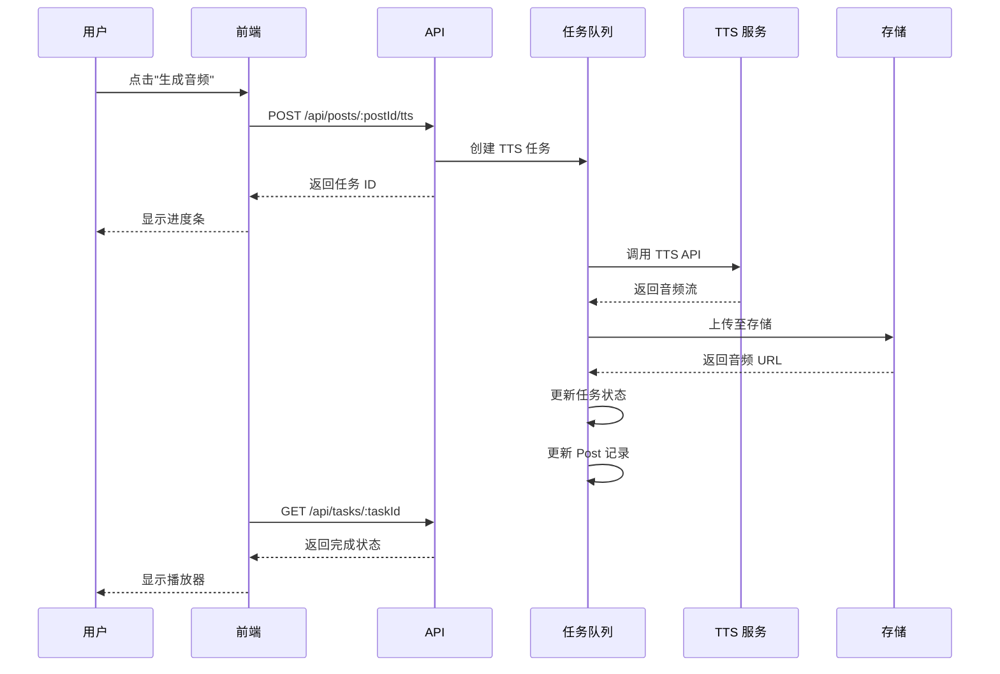

# 文章转语音 (TTS) 与音频化设计文档

本文档定义了墨梅博客中文章转语音 (Text-to-Speech, TTS) 与音频化 (Audio-ization) 功能的实现方案。该功能旨在为博客文章提供高质量的 AI 语音合成及播客内容生成，实现音频版内容的自动生成与分发。

## 1. 核心目标

- **多引擎支持**: 集成 OpenAI TTS、Azure TTS、火山引擎 (豆包) 等主流 AI 语音合成服务
- **多模式音频化**:
  - **标准 TTS**: 针对单人朗读正文。
  - **AI 播客 (Podcast)**: 针对双人对话式内容生成，提升听觉趣味性。
- **自动化工作流**: 文章发布时可选择自动生成音频版本
- **智能分段**: 支持长文本自动分段处理，确保语音连贯性
- **RSS 集成**: 生成的音频自动作为 RSS Enclosure 附件发布
- **成本可控**: 提供预估成本显示，支持用户选择语音模型

## 2. 技术方案

### 2.1 TTS 提供者架构

系统采用统一的 TTS Provider 接口，支持多种服务：

| 提供者 | 模型选项 | 适用模式 | 特点 | 成本等级 |
|:---|:---|:---|:---|:---|
| **OpenAI** | `tts-1`, `tts-1-hd` | 标准 TTS | 高质量、多音色 | 中 |
| **Azure** | 多种神经网络音色 | 标准 TTS | 专业级质量、SSML 支持 | 高 |
| **SiliconFlow** | 兼容 OpenAI API | 标准 TTS | 国内友好、成本较低 | 低 |
| **火山引擎 (豆包)** | `Podcast TTS` | AI 播客 | 双人对话、原生播客感 | 中 |
| **火山引擎 (豆包)** | `LLM TTS` | 标准 TTS | 极致性能、多情感支持 | 中 |

### 2.2 火山引擎 (豆包语音) 接入细节

针对火山引擎（豆包语音）提供的两种核心模型，采用 WebSocket v3 协议实现高性能流式接入：

#### 2.2.1 豆包语音播客大模型 (Podcast TTS)
- **协议**: `wss://openspeech.bytedance.com/api/v3/sami/podcasttts`
- **功能**: 将博文总结并转化为双人对话式的播客音频。
- **核心参数**:
  - `action`: 生成类型（0: 总结生成, 3: 给定对话文本, 4: Prompt 扩展）。
  - `speaker_info`: 指定双人音色组合（如：`zh_female_mizaitongxue_v2_saturn_bigtts` 与 `zh_male_dayixiansheng_v2_saturn_bigtts`）。
  - `use_head_music / use_tail_music`: 自动增加播客片头片尾曲。
- **应用场景**: 极客长文一键转播客。

#### 2.2.2 大模型语音合成 (LLM TTS)
- **协议**: `wss://openspeech.bytedance.com/api/v3/tts/unidirectional/stream` (推荐)
- **功能**: 高质量单人文本转语音。
- **优势**: 相比 V1 接口，V3 接口在延迟 (TTFB) 表现上更优，支持情感控制。
- **应用场景**: 标准文章朗读。

### 2.3 异步任务处理

TTS 生成是耗时操作，采用基于数据库的异步任务系统：



### 2.4 文本分段策略

针对长文本（超过单次 API 限制），采用智能分段：

1. **基于段落分割**: 保持 Markdown 段落完整性
2. **句子边界检测**: 在句子结束处分割，避免词语截断
3. **音频拼接**: 使用 FFmpeg 对多个音频片段进行无损拼接
4. **元数据保留**: 为每段音频添加时间戳标记

## 3. 数据库设计

### 3.1 TTS 任务表 (`TTSTask`)

记录每次 TTS 生成任务的详细信息：

| 字段 | 类型 | 说明 |
|:---|:---|:---|
| `id` | `uuid` | 主键 |
| `postId` | `uuid` | 关联文章 ID |
| `userId` | `uuid` | 触发用户 ID |
| `provider` | `varchar(50)` | TTS 提供者 (openai, azure, siliconflow, volcengine) |
| `mode` | `varchar(20)` | 音频化模式 (speech, podcast) |
| `model` | `varchar(100)` | 使用的模型 |
| `voice` | `varchar(150)` | 选择的音色（播客模式下可能为多个 ID 组合） |
| `status` | `varchar(20)` | 任务状态 (pending, processing, completed, failed) |
| `progress` | `integer` | 进度百分比 (0-100) |
| `errorMessage` | `text` | 失败错误信息 |
| `estimatedCost` | `decimal` | 预估成本 |
| `actualCost` | `decimal` | 实际成本 |
| `startedAt` | `datetime` | 开始时间 |
| `completedAt` | `datetime` | 完成时间 |

### 3.2 Post 实体扩展

在现有 `Post` 实体中新增 TTS 相关字段（已有部分字段，需补充）：

```typescript
@CustomColumn({ type: 'varchar', length: 50, nullable: true, comment: 'TTS 音色' })
ttsVoice: string | null

@CustomColumn({ type: 'varchar', length: 50, nullable: true, comment: 'TTS 提供者' })
ttsProvider: string | null

@CustomColumn({ type: 'datetime', nullable: true, comment: 'TTS 生成时间' })
ttsGeneratedAt: Date | null
```

## 4. API 设计

### 4.1 TTS 生成接口

```typescript
// POST /api/posts/:postId/tts
interface TTSGenerationRequest {
    provider: 'openai' | 'azure' | 'siliconflow' | 'volcengine'
    mode: 'speech' | 'podcast'
    model?: string  // 默认使用配置的默认模型
    voice: string | string[]  // 音色 ID 或音色 ID 列表（播客模式）
    autoAttach?: boolean  // 是否自动关联到文章
}

interface TTSGenerationResponse {
    taskId: string
    estimatedCost: number
    estimatedDuration: number  // 预估生成时间（秒）
}
```

### 4.2 任务状态查询

```typescript
// GET /api/tasks/tts/:taskId
interface TTSStatusResponse {
    taskId: string
    status: 'pending' | 'processing' | 'completed' | 'failed'
    progress: number
    audioUrl?: string
    audioDuration?: number
    audioSize?: number
    error?: string
}
```

### 4.3 音频管理接口

```typescript
// DELETE /api/posts/:postId/audio
// 删除文章关联的音频

// PUT /api/posts/:postId/audio
// 更新音频元数据（手动上传场景）
interface AudioUpdateRequest {
    url: string
    duration?: number
    size?: number
    mimeType?: string
}
```

## 5. 前端实现

### 5.1 文章编辑器集成

在文章编辑页面的"设置"侧边栏中增加 TTS 选项：

```vue
<Panel header="音频设置">
    <div class="tts-section">
        <Button
            label="AI 生成音频"
            icon="pi pi-microphone"
            :disabled="isGenerating"
            @click="showTTSDialog = true"
        />
        <div v-if="post.audioUrl" class="audio-preview">
            <AudioPlayer :src="post.audioUrl" :duration="post.audioDuration" />
            <Button
                label="重新生成"
                icon="pi pi-refresh"
                severity="secondary"
                @click="showTTSDialog = true"
            />
        </div>
    </div>
</Panel>
```

### 5.2 TTS 生成对话框

```vue
<Dialog v-model:visible="showTTSDialog" header="生成文章音频">
    <div class="tts-config">
        <div class="form-field">
            <label>语音服务</label>
            <Dropdown
                v-model="ttsConfig.provider"
                :options="availableProviders"
                optionLabel="name"
                optionValue="id"
            />
        </div>
        <div class="form-field">
            <label>音色选择</label>
            <Dropdown
                v-model="ttsConfig.voice"
                :options="availableVoices"
                optionLabel="name"
                optionValue="id"
            >
                <template #value="slotProps">
                    <div v-if="slotProps.value" class="voice-option">
                        <Avatar :label="slotProps.value.charAt(0)" />
                        <span>{{ slotProps.value }}</span>
                    </div>
                </template>
                <template #option="slotProps">
                    <div class="voice-option">
                        <Button
                            icon="pi pi-play"
                            size="small"
                            text
                            @click.stop="previewVoice(slotProps.option)"
                        />
                        <span>{{ slotProps.option.name }}</span>
                    </div>
                </template>
            </Dropdown>
        </div>
        <Message
            v-if="estimatedCost"
            severity="info"
            :closable="false"
        >
            预估成本: {{ estimatedCost }} | 预估时长: {{ estimatedDuration }}分钟
        </Message>
    </div>
    <template #footer>
        <Button label="取消" severity="secondary" @click="showTTSDialog = false" />
        <Button
            label="开始生成"
            :loading="isGenerating"
            @click="startTTSGeneration"
        />
    </template>
</Dialog>
```

### 5.3 生成进度显示

```typescript
// composables/use-tts-task.ts
export function useTTSTask(taskId: string) {
    const status = ref<TTSStatus>('pending')
    const progress = ref(0)
    const audioUrl = ref<string | null>(null)

    const { pause, resume } = useIntervalFn(async () => {
        const data = await $fetch<TTSStatusResponse>(`/api/tasks/tts/${taskId}`)
        status.value = data.status
        progress.value = data.progress
        if (data.status === 'completed') {
            audioUrl.value = data.audioUrl
            pause()
        } else if (data.status === 'failed') {
            pause()
            throw new Error(data.error)
        }
    }, 2000)

    return { status, progress, audioUrl, pause, resume }
}
```

## 6. 后端实现

### 6.1 TTS 服务抽象

```typescript
// server/services/tts.ts
interface TTSProvider {
    name: string
    availableVoices: TTSAudioVoice[]
    estimateCost(text: string, voice: string | string[]): number
    generateSpeech(
        text: string,
        voice: string | string[],
        options: TTSOptions
    ): Promise<ReadableStream<Uint8Array>>
}

interface TTSAudioVoice {
    id: string
    name: string
    language: string
    gender: 'male' | 'female' | 'neutral'
    mode?: 'speech' | 'podcast' // 某些音色仅适用于特定模式
    previewUrl?: string
}

interface TTSOptions {
    mode: 'speech' | 'podcast'
    speed?: number
        pitch?: number
    outputFormat?: 'mp3' | 'opus' | 'aac'
}
```

### 6.2 OpenAI TTS 实现

```typescript
// server/services/tts/openai.ts
export class OpenAITTSProvider implements TTSProvider {
    name = 'OpenAI'
    availableVoices = [
        { id: 'alloy', name: 'Alloy', language: 'en', gender: 'neutral' },
        { id: 'echo', name: 'Echo', language: 'en', gender: 'male' },
        { id: 'fable', name: 'Fable', language: 'en', gender: 'neutral' },
        { id: 'onyx', name: 'Onyx', language: 'en', gender: 'male' },
        { id: 'nova', name: 'Nova', language: 'en', gender: 'female' },
        { id: 'shimmer', name: 'Shimmer', language: 'en', gender: 'female' },
    ]

    async estimateCost(text: string, voice: string): Promise<number> {
        // OpenAI TTS 定价: $15/1M 字符
        const chars = text.length
        return (chars / 1000000) * 15
    }

    async generateSpeech(
        text: string,
        voice: string,
        options: TTSOptions
    ): Promise<ReadableStream<Uint8Array>> {
        const response = await fetch('https://api.openai.com/v1/audio/speech', {
            method: 'POST',
            headers: {
                'Authorization': `Bearer ${process.env.OPENAI_API_KEY}`,
                'Content-Type': 'application/json',
            },
            body: JSON.stringify({
                model: 'tts-1',
                input: text,
                voice,
                response_format: options.outputFormat || 'mp3',
                speed: options.speed || 1.0,
            }),
        })

        if (!response.ok) {
            throw new Error(`OpenAI TTS error: ${response.statusText}`)
        }

        return response.body!
    }
}
```

### 6.3 任务处理器

```typescript
// server/services/tts/processor.ts
export async function processTTSTask(task: TTSTask): Promise<void> {
    try {
        await taskRepo.update(task.id, { status: 'processing', startedAt: new Date() })

        const post = await postRepo.findOne({ where: { id: task.postId } })
        if (!post) throw new Error('Post not found')

        const provider = getTTSProvider(task.provider)
        const audioStream = await provider.generateSpeech(
            post.content,
            task.voice,
            { outputFormat: 'mp3' }
        )

        // 上传至存储
        const filename = `tts/${task.postId}/${Date.now()}.mp3`
        const audioUrl = await storageService.upload(filename, audioStream, {
            contentType: 'audio/mpeg',
        })

        // 更新文章
        await postRepo.update(post.id, {
            audioUrl,
            ttsProvider: task.provider,
            ttsVoice: task.voice,
            ttsGeneratedAt: new Date(),
        })

        // 标记任务完成
        await taskRepo.update(task.id, {
            status: 'completed',
            progress: 100,
            completedAt: new Date(),
        })
    } catch (error) {
        await taskRepo.update(task.id, {
            status: 'failed',
            errorMessage: error.message,
        })
        throw error
    }
}
```

## 7. RSS 集成

生成的音频自动作为 Enclosure 附件添加到 RSS Feed 中：

```typescript
// server/api/rss/feed.ts
function buildRSSEnclosure(post: Post): RSSEnclosure | null {
    if (!post.audioUrl) return null

    return {
        url: post.audioUrl,
        length: post.audioSize || 0,
        type: post.audioMimeType || 'audio/mpeg',
    }
}
```

## 8. 成本优化策略

### 8.1 缓存机制

- 已生成音频的文章不重复生成
- 支持内容变化检测：只有正文修改超过 10% 时才提示重新生成

### 8.2 分级策略

```typescript
// server/services/tts/strategy.ts
interface TTSGenerationStrategy {
    shouldGenerate(post: Post): boolean
    selectProvider(): TTSProvider
}

// 免费策略：仅生成摘要
class SummaryOnlyStrategy implements TTSGenerationStrategy {
    shouldGenerate(post: Post): boolean {
        return post.content.length > 500 // 仅长文生成
    }

    async generate(post: Post): Promise<string> {
        return post.summary || post.content.slice(0, 500)
    }
}

// 完整策略：生成全文
class FullContentStrategy implements TTSGenerationStrategy {
    shouldGenerate(): boolean {
        return true
    }

    async generate(post: Post): Promise<string> {
        return post.content
    }
}
```

## 9. 环境变量配置

```env
# OpenAI TTS
OPENAI_API_KEY=
OPENAI_TTS_DEFAULT_MODEL=tts-1
OPENAI_TTS_DEFAULT_VOICE=alloy

# Azure TTS (可选)
AZURE_TTS_API_KEY=
AZURE_TTS_REGION=
AZURE_TTS_DEFAULT_VOICE=

# SiliconFlow (可选)
SILICONFLOW_API_KEY=
```

## 10. UI/UX 设计细节

### 10.1 播放器组件

在文章详情页，如果存在音频，显示专业播放器：

```vue
<template>
    <div class="post-audio-player">
        <Card>
            <template #title>
                <div class="player-header">
                    <i class="pi pi-volume-up" />
                    <h3>{{ $t('post.audioVersion') }}</h3>
                </div>
            </template>
            <template #content>
                <div class="player-controls">
                    <Button
                        :icon="isPlaying ? 'pi pi-pause' : 'pi pi-play'"
                        rounded
                        raised
                        size="large"
                        @click="togglePlay"
                    />
                    <div class="timeline">
                        <ProgressBar :value="progress" :showValue="false" />
                        <span class="time">{{ currentTime }} / {{ duration }}</span>
                    </div>
                    <div class="speed-control">
                        <Dropdown
                            v-model="playbackSpeed"
                            :options="[0.5, 0.75, 1, 1.25, 1.5, 2]"
                            @change="setSpeed"
                        />
                    </div>
                </div>
            </template>
        </Card>
    </div>
</template>
```

### 10.2 移动端优化

- 支持后台播放（集成 Media Session API）
- 锁屏控制显示
- 耳机暂停/恢复支持

## 11. 技术调研结果

### 11.1 主流 TTS 服务对比

| 特性 | OpenAI TTS | Azure TTS | 火山引擎 (豆包) | SiliconFlow |
|:---|:---|:---|:---|:---|
| **神经网络模型** | ✅ | ✅ | ✅ | ✅ |
| **播客模式 (对话)** | ❌ | ❌ | ✅ (原生支持) | ❌ |
| **音色数量** | 6 | 100+ | 50+ | 10+ |
| **API 协议** | HTTP (Post) | HTTP | WebSocket (V3) | HTTP |
| **国内访问** | 需代理 | 需代理 | 原生支持 | 原生支持 |
| **价格** | $15/1M 字符 | 按字符计费 | 阶梯计费 (有免费额度) | 极低 |

**建议**:
- **标准阅读**: 首选 OpenAI TTS 或火山引擎 LLM TTS。
- **播客生成**: 必须使用火山引擎 Podcast TTS。

### 11.2 音频格式选择

| 格式 | 压缩率 | 质量 | 兼容性 | 建议 |
|:---|:---|:---|:---|:---|
| **MP3** | 高 | 好 | 最好 | 默认选择 |
| **Opus** | 很高 | 很好 | 好 | 移动端优先 |
| **AAC** | 高 | 很好 | 很好 | Apple 生态优先 |

**建议**: 默认使用 MP3 (128kbps)，在移动端自动切换为 Opus (64kbps)。

## 12. 实现路线图

### Phase 1: 核心功能与火山接入
- [ ] 实现 `TTSTask` 实体扩展（支持 `mode`）
- [ ] 实现 OpenAI TTS 提供者
- [ ] 实现 **火山引擎 (豆包) 提供者**（WebSocket V3 接入）
- [ ] 实现基础任务处理流程与流式数据处理
- [ ] 文章编辑器基础集成（支持模式选择）

### Phase 2: 播客体验与完整工作流
- [ ] 实现 **AI 播客对话生成** 逻辑
- [ ] 添加 Azure TTS 支持
- [ ] 实现进度追踪 UI
- [ ] RSS Enclosure 集成（播客专题 Feed 支持）
- [ ] 文章详情页播放器（UI 优化）

### Phase 3: 高级特性与优化
- [ ] 实现智能分段
- [ ] 添加成本优化策略
- [ ] 移动端 Media Session 集成
- [ ] SiliconFlow 国内友好提供者接入
