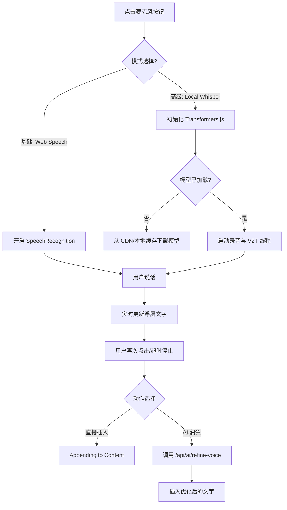

# AI 语音创作增强设计文档 (AI Voice Creative Enhancement)

本文档定义了墨梅博客中 AI 语音创作增强功能的实现方案。该功能旨在通过浏览器原生能力实现低成本、轻量化的语音转文字 (V2T) 创作体验，并结合后端 AI 进行内容润色。

## 1. 核心目标

- **轻量化**: 优先利用浏览器原生 Web Speech API，不引入重量级客户端 SDK。
- **低成本**: 第一阶段由浏览器完成识别，不产生额外的云服务费用。
- **高效率**: 适配移动端/碎片化场景，通过语音快速捕捉灵感。
- **质量可控**: 识别出的文本可通过 AI 助手进行二次润色，解决“识别准但不成文”的问题。

## 2. 技术方案

### 2.1 语音识别驱动 (Core V2T)

- **核心 API**: `window.SpeechRecognition` (及其供应商前缀版 `window.webkitSpeechRecognition`)。
- **降级处理**: 
    - 若浏览器不支持（如 Firefox、部分国产移动浏览器），UI 端隐藏或置灰相关按钮，并提示用户切换至 Chrome/Edge。
    - 未来若用户有高精度需求，可扩展支持 OpenAI Whisper 或其他高性能 API。

### 2.2 状态管理 (Composable Design)

新建 `composables/use-post-editor-voice.ts`，导出以下状态与方法：

- **State**:
    - `isListening`: 是否正在监听录音。
    - `isSupported`: 当前环境是否支持 Web Speech API。
    - `interimTranscript`: 临时识别结果（随着实时识别不断更新）。
    - `finalTranscript`: 已确认的识别结果。
    - `error`: 识别过程中的错误信息（如“无麦克风权限”、“网络中断”）。

- **Methods**:
    - `startListening(lang)`: 开启监听，指定识别语言。
    - `stopListening()`: 停止监听并返回最终文本。
    - `reset()`: 重置状态。

### 2.3 自动语言适配 (Language Logic)

- 系统将根据当前文章的 `post.language` 自动配置识别语言：
    - `zh-CN` -> `zh-CN`
    - `en-US` -> `en-US`
    - 其他语言按需映射。

### 2.4 前端高精度转录方案调研 (Client-side High-precision V2T)

针对“在不请求后端/云服务的前提下实现高精度转录”的需求，以下是前端可落地方案的对比：

| 方案 | 技术栈 | 优点 | 缺点 | 建议 |
| :--- | :--- | :--- | :--- | :--- |
| **Web Speech API** | 浏览器内置 | 零开销、无下载、支持流式输出。 | 严重依赖浏览器实现（Chrome 较好），部分浏览器需联网且隐私性存疑。 | **默认 baseline**。 |
| **Transformers.js** | ONNX Runtime + Whisper (Tiny/Base) | 纯本地运行、高隐私、模型可控、适配现代 JS。 | 需下载模型 (Tiny 约 75MB)，首屏加载有压力，低端设备 CPU 占用高。 | **推荐 (WebGPU 加速)**。 |
| **Whisper.cpp (Wasm)** | C++ 编译至 Wasm | 性能极致优化，内存占用低。 | 接入复杂度高，工程化门槛相对较高。 | 作为性能补丁。 |

#### 2.4.1 落地建议：Transformers.js + WebGPU

考虑到 Nuxt 4 的现代化技术栈，建议采用 **Transformers.js (v3+)** 作为高精度模式的首选：
1. **轻量化模型**: 默认使用 `openai/whisper-tiny` 或 `openai/whisper-base.en`。
2. **加速机制**: 检测 WebGPU 支持。若支持则开启性能加速，否则回退至 WASM/CPU。
3. **缓存策略**: 模型下载后存入 IndexedDB (Cache API)，后续使用无需重复下载。
4. **分片处理**: 对于长语音，在 Web Worker 中进行异步分片转写，避免阻塞 UI。

## 3. UI/UX 交互设计

### 3.1 挂载位置

- **PC 端**: 在 `PostEditorHeader.vue` 的工具栏部分（标题输入框右侧）增加一个麦克风按钮。
- **移动端**: 增加底部的快捷浮动动作条。

### 3.2 流程图

### 3.3 录制过程流

1. **唤起**: 点击麦克风按钮。
2. **状态反馈**: 
    - 按钮颜色变为红色并带有脉冲动画。
    - 页面底部弹出半透明浮层，显示 `interimTranscript` (实时更新的文字流)。
3. **完成**: 再次点击按钮或一段时间不说话（超时）。
4. **插入逻辑**:
    - 识别完成后，提供两个按钮：
        - **[直接插入]**: 将识别结果原封不动插入光标处。
        - **[AI 润色后插入]**: (推荐) 将文字发回后端，由 LLM 转换为符合 Markdown 规范、语气正式的博文片段。

## 4. 后续扩展计划 (Phase 2)

- **AI 对话式润色**: 允许用户通过语音发出指令，如“把这段改得幽默一点”或“给这段加个标题”。
- **模型热切换**: 支持在 Tiny / Base / Medium 不同精度的 Whisper 模型间根据设备性能自动或手动切换。
- **离线音频上传**: 支持上传现有的音频文件（MP3/WAV），通过 Local Whisper 进行批量转写。
- **WebGPU 专属加速**: 针对支持 WebGPU 的浏览器（如 Chrome 113+）提供毫秒级转录体验。

## 5. 安全与隐私

- **本地处理**: Local Whisper 模式下，所有音频数据均在用户浏览器内存中处理，**永不上传至任何服务器**，极大地保护了创作隐私。
- **权限管理**: 严禁在非录音状态下开启麦克风。
- **存储说明**: 首次使用下载的模型将占用约 75MB~200MB 的浏览器持久化存储空间 (Cache API)。
