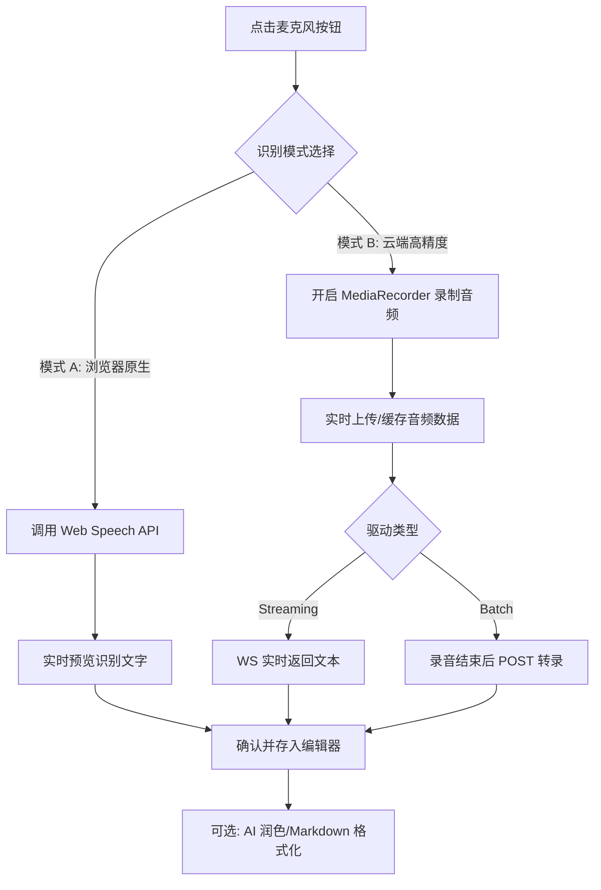

# AI 语音创作增强设计文档 (AI Voice Creative Enhancement)

本文档定义了墨梅博客中 AI 语音创作增强功能的实现方案。该功能旨在通过浏览器原生能力实现低成本、轻量化的语音转文字 (V2T) 创作体验，并结合后端 AI 进行内容润色。

## 1. 核心目标

- **轻量化**: 优先利用浏览器原生 Web Speech API，不引入重量级客户端 SDK。
- **低成本**: 第一阶段由浏览器完成识别，不产生额外的云服务费用。
- **高效率**: 适配移动端/碎片化场景，通过语音快速捕捉灵感。
- **质量可控**: 识别出的文本可通过 AI 助手进行二次润色，解决“识别准但不成文”的问题。

## 2. 技术方案

### 2.1 语音识别驱动矩阵 (ASR Drivers)

系统提供多种识别方式，按需使用：

1.  **Web Speech API (优先/默认)**: 利用浏览器原生能力，零开销，适合大多数现代浏览器。
2.  **Cloud ASR (高精度)**:
    *   **SiliconFlow (Batch)**: 采用 OpenAI 兼容接口，通过 `POST /v1/audio/transcriptions` 上传文件转写。需要配置 SiliconFlow API Key。
    *   **Volcengine (Streaming)**: 利用 WebSocket 实现流式语音转文字，支持毫秒级回显。需要配置火山引擎 AppID。

### 2.2 状态管理与抽象层

通过全局 Composable `use-post-editor-voice.ts` 隐藏底层驱动差异：
- **一致性输出**: 无论哪种模型，最终均输出格式化的识别文本。
- **配置检测**: 只有在后台配置了对应的 API 密钥时，才会显示云端高精度选项。

### 2.3 后端代理与鉴权 (Cloud Proxy)

为了保护 API Key 并不绕过 CORS 限制，所有云端请求由 Nitro 服务器转发：
- `POST /api/ai/asr/transcribe`: 接收音频 Blob，在内存中直接转发至 AI 厂商（Fast-Path），避免 OSS 转存导致的延时。
- `WS /api/ai/asr/stream`: WebSocket 隧道代理或签名发放，转发至火山引擎。

### 2.4 性能与规模优化 (未来规划)

对于超过 50MB-100MB 的超大音频文件，本版本采用“内存转发”可能导致云函数超时。未来优化方向：
1.  **直连厂商 (Cloud-Direct)**：后端生成针对 AI 厂商 API 的签名，由前端直接上传音频，彻底解放后端带宽。
2.  **分片处理 (Chunked Flow)**：前端将音频在本地进行切片，后端流式接收并拼装转发。
3.  **本地预压缩 (Client-side Compression)**：前端引入 WASM 版本的 FFmpeg/LAME，在上传前将录音压缩为低比特率 Opus/MP3，减少传输量。

### 2.4 前端高精度转录方案调研 (Client-side High-precision V2T)

针对“在不请求后端/云服务的前提下实现高精度转录”的需求，以下是前端可落地方案的对比：

| 方案 | 技术栈 | 优点 | 缺点 | 建议 |
| :--- | :--- | :--- | :--- | :--- |
| **Web Speech API** | 浏览器内置 | 零开销、无下载、支持流式输出。 | 严重依赖浏览器实现（Chrome 较好），部分浏览器需联网且隐私性存疑。 | **默认 baseline**。 |
| **Cloud ASR (Hub)** | 后端 API | 极致精度、稳定可靠、多设备一致。 | 产生 API 费用，依赖网络。 | **推荐 (默认开启)**。 |

---
*注：Local Whisper (Transformers.js) 曾作为离线冗余方案调研，但因加载包体过大 (Tiny 95MB+) 且对性能有一定要求，现已移除，专注提供稳定且高质量的云端/原生方案。*

### 2.4 云端高精度驱动方案对比

| 特性 | SiliconFlow (OpenAI 兼容) | Volcengine (火山/豆包 2.0) |
| :--- | :--- | :--- |
| **交互模式** | 后验式 (Batch) | 实时性 (Streaming) |
| **擅长场景** | 录完一段音频后，全文高精度转换 | 边说边出字，极致写作录入体验 |
| **核心优势** | 适配 SiliconCloud 多模型 | 200ms 极速响应，口语顺滑优化 |
| **开发难度** | 低 (标准 Multi-part HTTP) | 高 (WebSocket + 二进制协议) |
| **建议** | 用于录音文件转录 | 用于沉浸式语音写作 |

## 3. UI/UX 交互设计

### 3.1 挂载位置

- **PC 端**: 在 `PostEditorHeader.vue` 的工具栏部分增加麦克风按钮。
- **配置**: 在设置中允许设置 `ASR Provider` (Auto, Browser, Cloud)。

### 3.2 混合识别工作流

### 3.3 录制过程流

1. **唤起**: 点击麦克风按钮。
2. **状态反馈**: 
    - 按钮颜色变为红色并带有脉冲动画。
    - 页面底部弹出半透明浮层，显示 `interimTranscript` (实时更新的文字流)。
3. **完成**: 再次点击按钮或一段时间不说话（超时）。
4. **插入逻辑**:
    - 识别完成后，提供两个按钮：
        - **[直接插入]**: 将识别结果原封不动插入光标处。
        - **[AI 润色后插入]**: (推荐) 将文字发回后端，由 LLM 转换为符合 Markdown 规范、语气正式的博文片段。

## 4. 后续扩展计划 (Phase 2)

- **AI 对话式润色**: 允许用户通过语音发出指令，如“把这段改得幽默一点”或“给这段加个标题”。
- **多渠道 ASR 智能选路**: 根据网络状况和硬件环境，自动在 Web Speech 与不同云端服务间路由。

## 5. 安全与隐私

- **数据加密传输**: 所有上传至后端/云端的音频数据均通过 HTTPS/WSS 加密。
- **权限管理**: 严禁在非录音状态下开启麦克风。
- **隐私保护**: 云端 ASR 仅用于转录，数据处理遵循厂商隐私协议，不用于模型训练。
