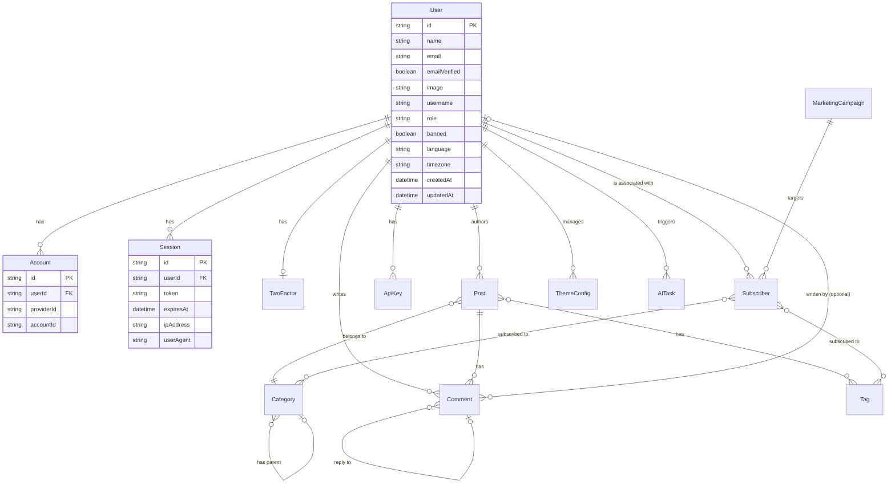

# Database Design

::: warning Translation Notice
This document has been translated from Chinese. In case of any discrepancy, the [original Chinese version](../../design/database.md) shall prevail.
:::

## 1. Overview

This document provides a detailed description of the Momei blog's database architecture. The project uses **TypeORM** for seamless multi-database support.

## 2. ER Diagram

## 3. Core Table Definitions

### 3.1 User System (via better-auth)

#### User
| Field | Type | Description |
| :--- | :--- | :--- |
| `id` | varchar | Primary Key (Snowflake). |
| `name` | text | Display name. |
| `email` | varchar | Unique email address. |
| `role` | varchar | User role: admin, author, user. |
| `banned` | boolean | Ban status. |

### 3.2 Blog Content

#### Post (Articles)
- **i18n Support**: Shared `translationId` for language variants.
- **Taxonomy**: Relations to `Category` and `Tag`.
- **Slugs**: Unique per language.

#### Category & Tag
- **Localization**: Supports multi-language translation.
- **Heirarchy**: Categories support parent-child relationships.

### 3.3 Messaging & Interaction

#### Comment
- **Threading**: Supports nested replies.
- **Anonymous**: Supports guest commenting with moderation.

#### Subscriber
- **Hub**: Manages email subscriptions synced with categories/tags.
